# 项目整体认识

## 1 游戏简介

一款动作类RPG游戏，在一张地图中，砍杀小怪。

### 1.1 角色

角色有血量和神力，受伤会掉血，神力则可以用来释放技能。可以从商店里面购买武器和技能，也可以购买恢复血量和神力的药物。等级越高的武器和药水，价格也越贵，但是玩家可以通过击杀怪物来赚钱。一个玩家可以有三种武器、一种技能和多种药水。武器可以使用鼠标滚轮进行切换，但是初始的经济只能购买一把武器。

角色背包：

购买技能列表：

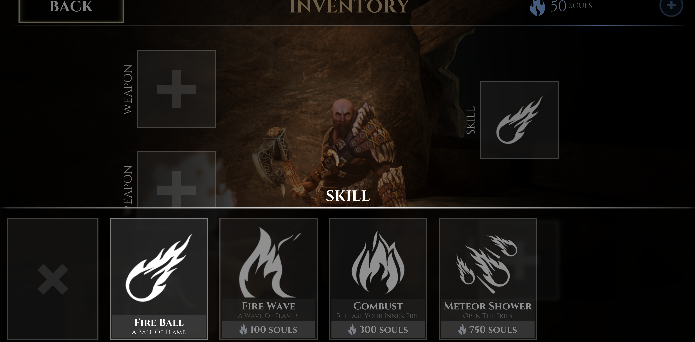

角色控制界面：

### 1.2 敌人

怪物也是有等级的，随着玩家不断的打败怪物，怪物的等级也越来越高

1. 近战小怪：只会拿着锤子和玩家近距离互殴的小怪，伤害较低

   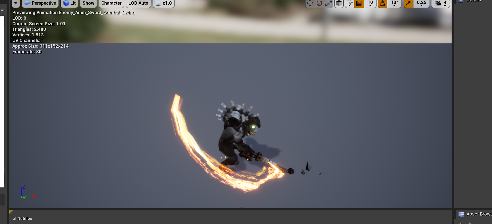

2. 远处小怪：会远距离喷射毒液，伤害较高

3. BOSS：应该是个蜘蛛，伤害应该很高，原谅我手残没有打到那关

   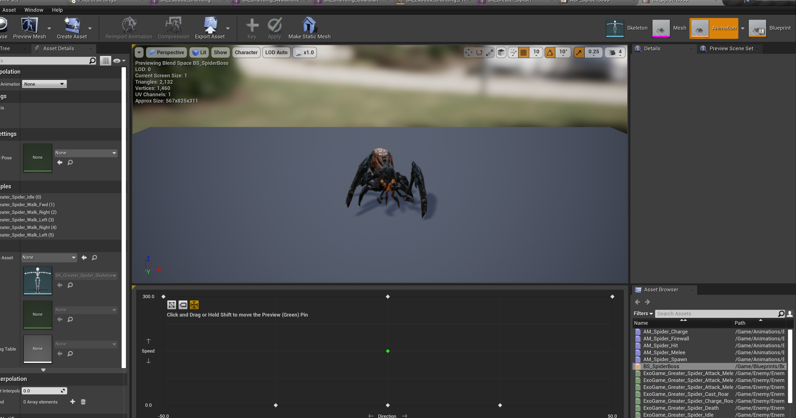

## 2 玩家输入（操作）

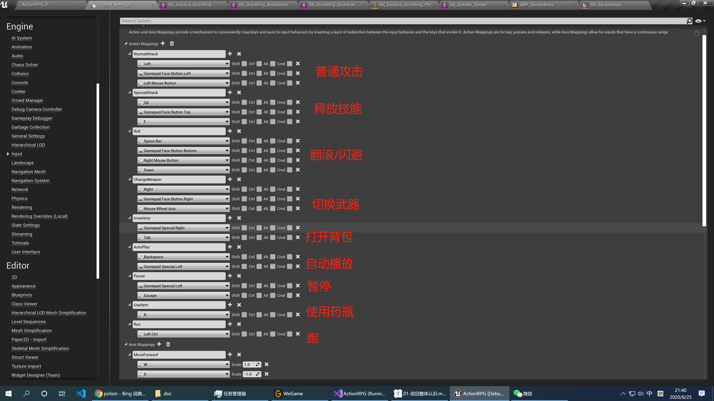

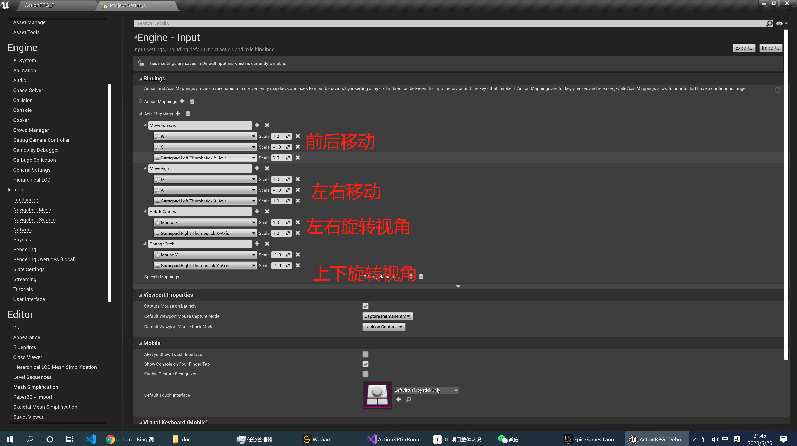

## 3 内容浏览器里面东西

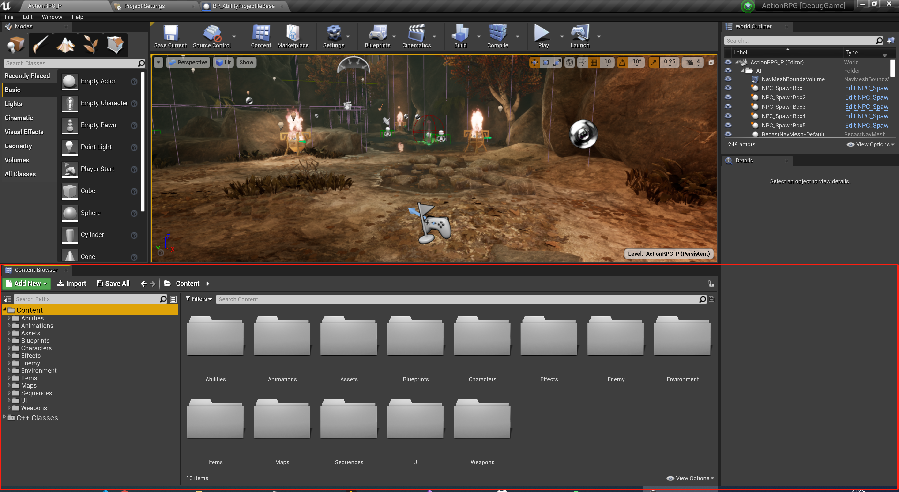

### 3.1 Abilities

其实我也没有搞懂这个文件夹里面放的是啥，应该是各自能力、技能什么的，例如攻击伤害等。

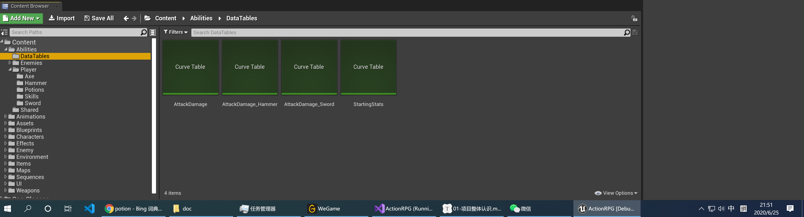

### 3.2 Animatations

BOSS和小怪的一些动画：

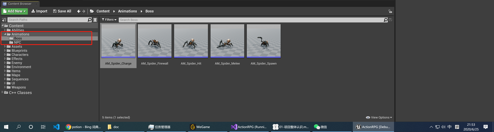

### 3.3 Assets

一些声音资源，例如武器的声音，打击的声音等。

### 3.4 Blueprints

各种蓝图，包括角色蓝图、武器蓝图、AI蓝图等

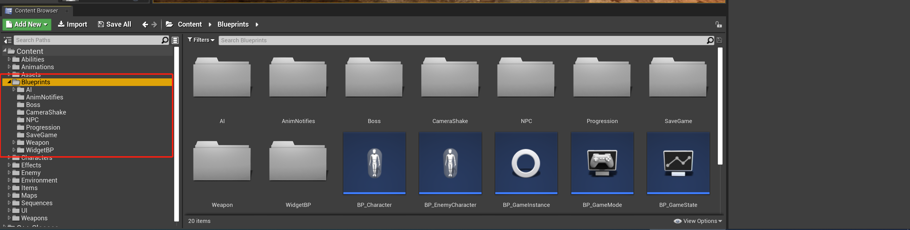

### 3.5 Characters

角色的动画和贴图

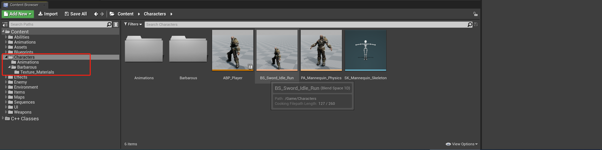

### 3.6 Effects

各种特效，技能特效，火焰特效等

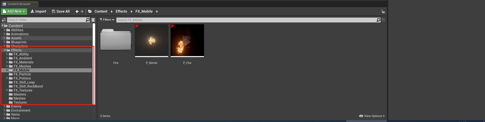

### 3.7 Enemy

敌人的各种动画和贴图

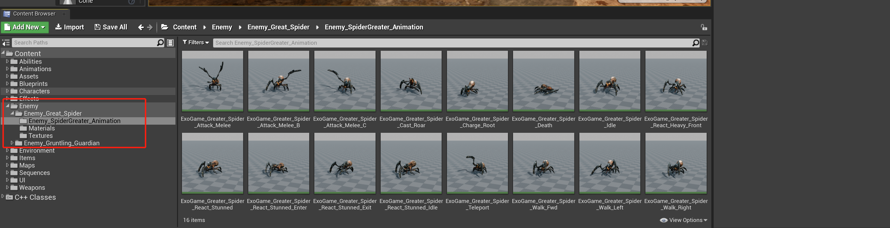

### 3.8 Environment

环境(地形)相关的材质和贴图

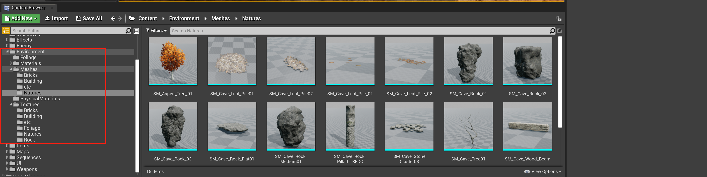

### 3.9 Items

不是很懂里面到底放的什么东西，好像是跟关卡里面可以**捡的东西**有关系

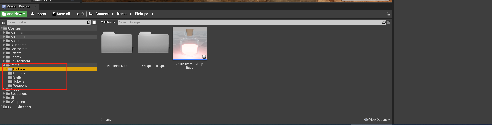

### 3.10 Maps 

地图

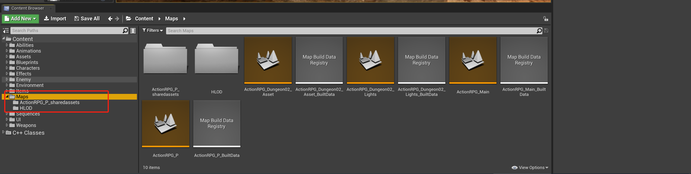

### 3.11 Sequences

一些和声音相关的混合

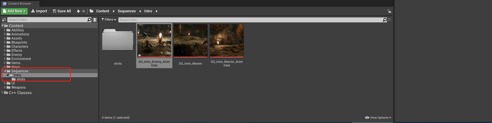

### 3.12 UI和材质

UI相关的贴图

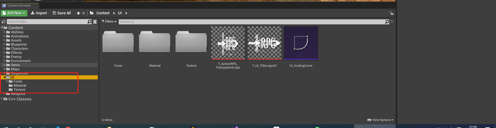

### 3.13 Weapons

各种武器的贴图和材质

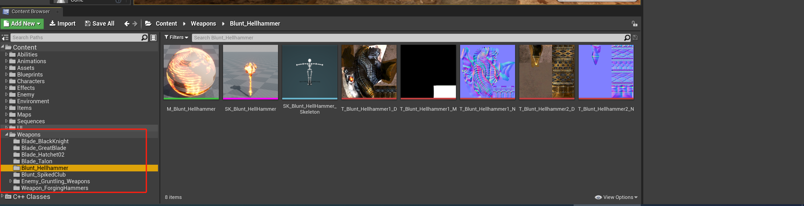

### 3.14 C++ Classes

一些基础的 C++ 类，例如`RPGCharacterBase`

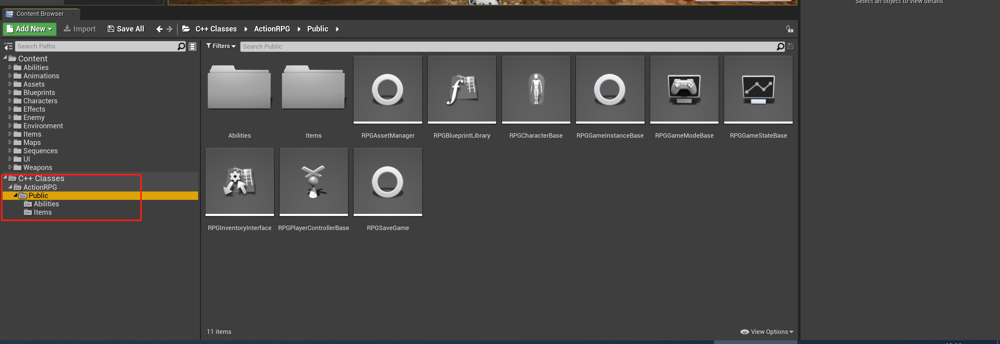