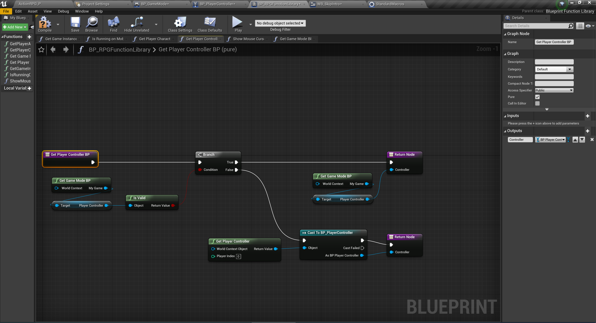

# 过场动画的过场UI

## 1 过场动画的播放

### 1.1 播放过场动画或者开始游戏

### 1.2 LevelSequenceActor

这似乎是一个控制关卡序列的对象

他里面有个属性：`SequcenPlayer`

### 1.3 ULevelSequencePlayer

一个被用来**真正**再运行时播放关卡序列的对象。

再他的父类`UMovieSceneSequencePlayer`中有一个用来专门负责播放的方法`Play`,我们后面会在蓝图中调用这个方法，该方法可以从当前时刻进行**向前、向后**播放，并且使用当前的播放速率。

### 1.4 BP_RPGFunctionLibrary

自定义的一个蓝图函数库，继承`UBlueprintFunctionLibrary`,用于实现各种本项目需要的函数

### 1.5 BP_RPGFunctionLibrary 中的 Get Game Mode BP

获取本项目中的`BP_GameMode`

### 1.6 获取本项目的 BP_PlayerController

### 1.7 播放以及跳过过场动画的逻辑

### 1.8 Show HUD

### 1.9 获取当前平台信息

## 2 过场动画跳过UI——WebSkipIntro

### 2.1 UI 界面

其中 `SkipButton`是一个全屏的按钮

### 2.2 让文字闪动的动画

该动画是通过 `Render Opacity` 来控制文字的隐藏和消失：

### 2.3 逻辑

