# 游戏开始和游戏界面

## 1 游戏开始执行逻辑

当过场动画结束或者跳过，就执行开始游戏的逻辑：

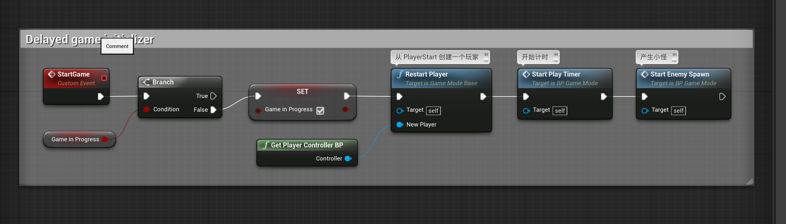

### 1.1 Resart Player

上图中的`Restart Player`方法是`GameMode`里面一个方法，我们可以去追一下他的源码。

#### 1.1.1 声明

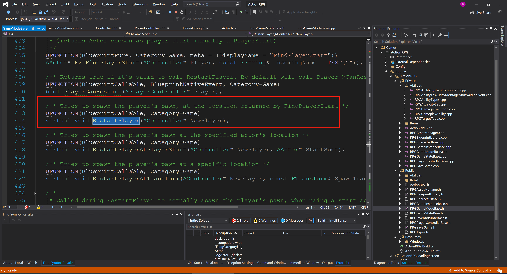

这里我们将`PlayerController` 传入进去。

#### 1.1.2 实现

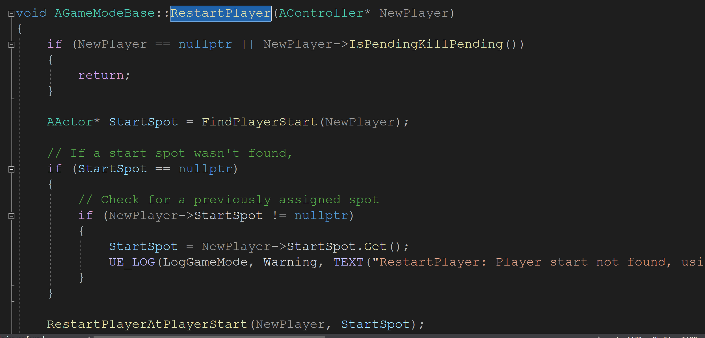


#### 1.1.3 继续跟踪`RestartPlayerAtPlayerStart`

```c++
void AGameModeBase::RestartPlayerAtPlayerStart(AController* NewPlayer, AActor* StartSpot)
{
	if (NewPlayer == nullptr || NewPlayer->IsPendingKillPending())
	{
		return;
	}

	if (!StartSpot)
	{
		UE_LOG(LogGameMode, Warning, TEXT("RestartPlayerAtPlayerStart: Player start not found"));
		return;
	}

	FRotator SpawnRotation = StartSpot->GetActorRotation();

	UE_LOG(LogGameMode, Verbose, TEXT("RestartPlayerAtPlayerStart %s"), (NewPlayer && NewPlayer->PlayerState) ? *NewPlayer->PlayerState->GetPlayerName() : TEXT("Unknown"));

	if (MustSpectate(Cast<APlayerController>(NewPlayer)))
	{
		UE_LOG(LogGameMode, Verbose, TEXT("RestartPlayerAtPlayerStart: Tried to restart a spectator-only player!"));
		return;
	}

	if (NewPlayer->GetPawn() != nullptr)
	{
		// If we have an existing pawn, just use it's rotation
		SpawnRotation = NewPlayer->GetPawn()->GetActorRotation();
	}
	else if (GetDefaultPawnClassForController(NewPlayer) != nullptr)
	{
		// Try to create a pawn to use of the default class for this player
		NewPlayer->SetPawn(SpawnDefaultPawnFor(NewPlayer, StartSpot));
	}

	if (NewPlayer->GetPawn() == nullptr)
	{
		NewPlayer->FailedToSpawnPawn();
	}
	else
	{
		// Tell the start spot it was used
		InitStartSpot(StartSpot, NewPlayer);

		FinishRestartPlayer(NewPlayer, SpawnRotation);
	}
}
```

#### 1.1.4 跟踪`FinishRestartPlayer`

这里我们发现他调用了`PlayerController`的`Process`方法

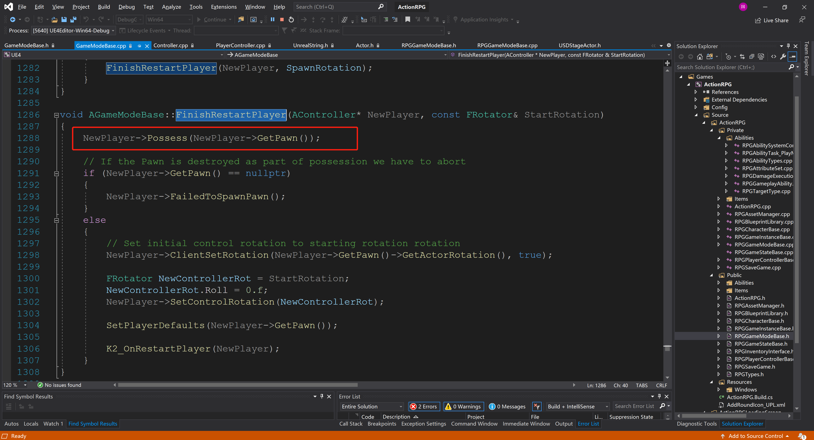


#### 1.1.5 追踪 `Controller->Possess`

```c++
void AController::Possess(APawn* InPawn)
{
	if (!bCanPossessWithoutAuthority && !HasAuthority())
	{
		FMessageLog("PIE").Warning(FText::Format(
			LOCTEXT("ControllerPossessAuthorityOnly", "Possess function should only be used by the network authority for {0}"),
			FText::FromName(GetFName())
			));
		UE_LOG(LogController, Warning, TEXT("Trying to possess %s without network authority! Request will be ignored."), *GetNameSafe(InPawn));
		return;
	}

	REDIRECT_OBJECT_TO_VLOG(InPawn, this);

	OnPossess(InPawn);

    // 这个方法很重要，继续追踪
	ReceivePossess(InPawn);
}
```


#### 1.1.6 追踪`Controller->ReceivePossess

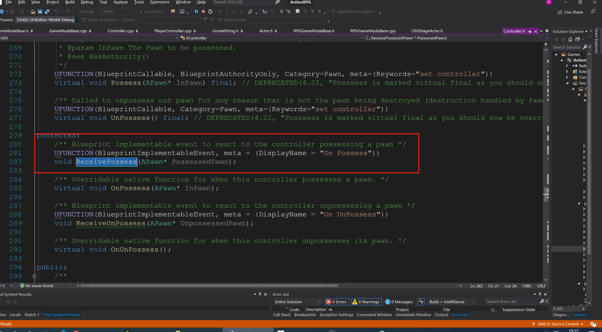

发现他只有一个生命，并没有具体的实现，但是我们可以去我们的`BP_PlayerController`中找一下，发现他在蓝图中竟然有定义：

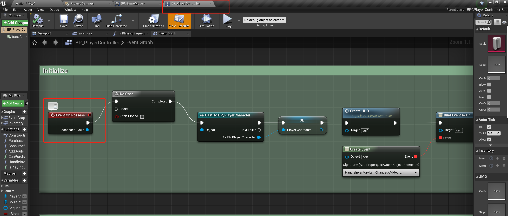


现在我们可以得出结论：在`GameMode`中调用`Resart Player`，会间接调用`PlayerController`中的`OnProcess`事件，下面我们就来看看`OnProcess`事件到底干了什么。

### 1.2 `PlayerController`中的`OnProcess`

这个事件有点复杂，我们先看前面的：

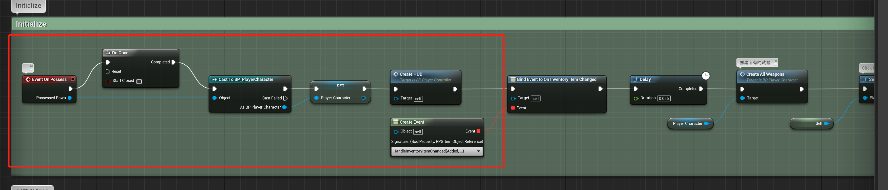

#### 1.2.1 Create HUD

这里我们发现他根据不同的平台创建不同的UI界面

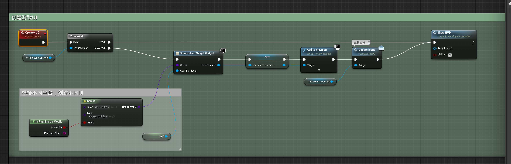

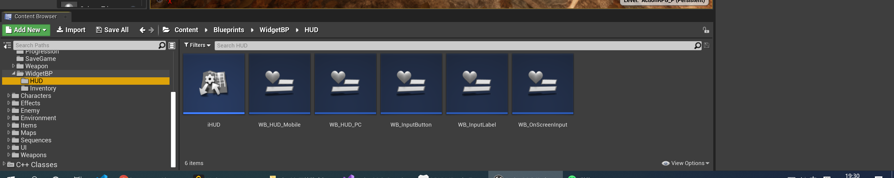

PC 端的UI 就是`WB_HUD_PC`

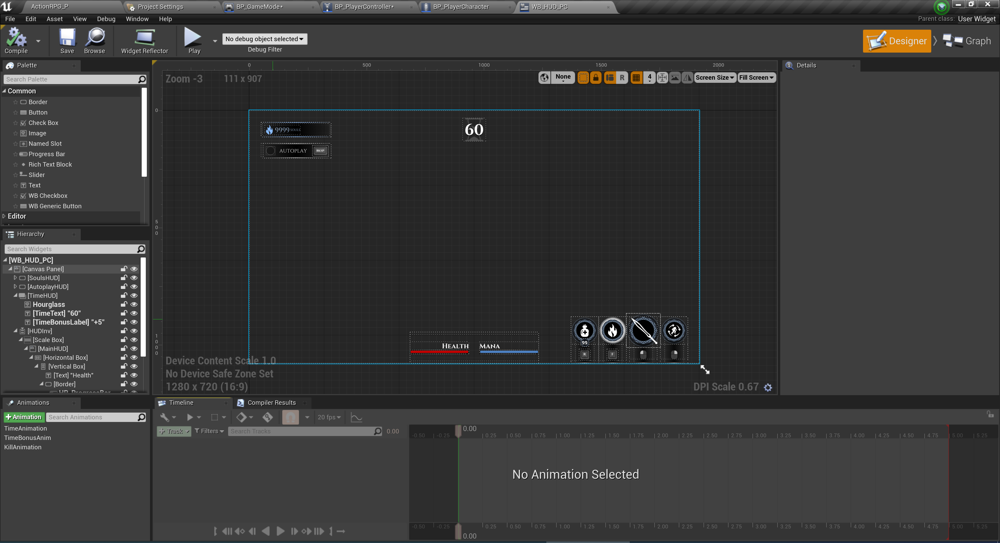

和游戏UI一模一样。

#### 1.2.2 Update Icons

在`WB_HUD_PC`，使用这个方法来修改技能和武器的图标

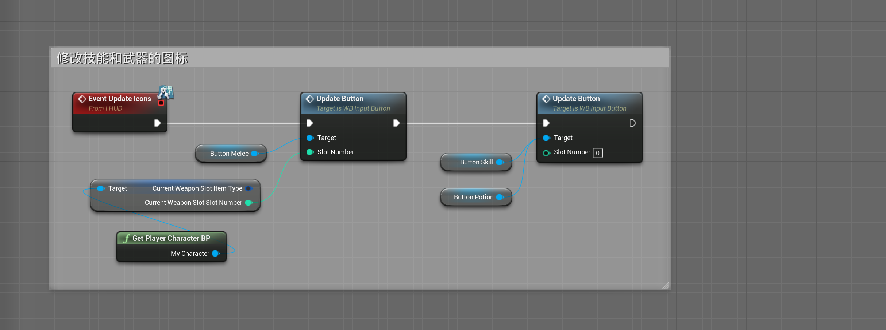

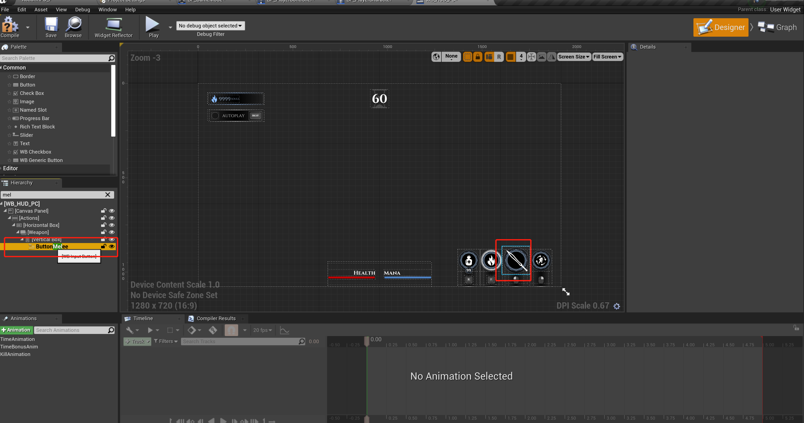


## 2 时间计数

再回到开始游戏的时间计数：

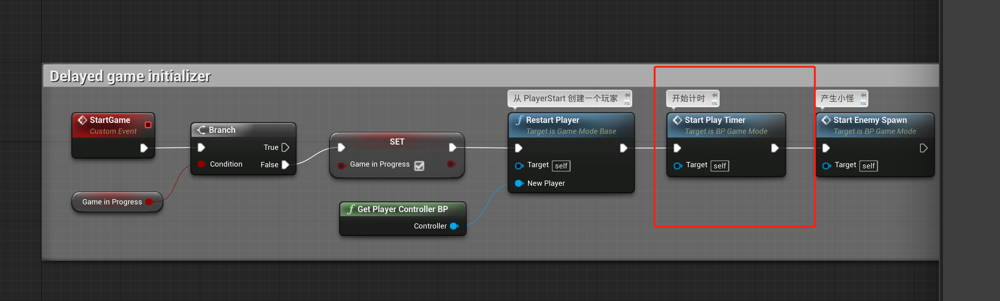

时间计数分为总时间计数和剩余时间计数，如果剩余时间(`battle Time`) 小于等于0，游戏也就结束了。

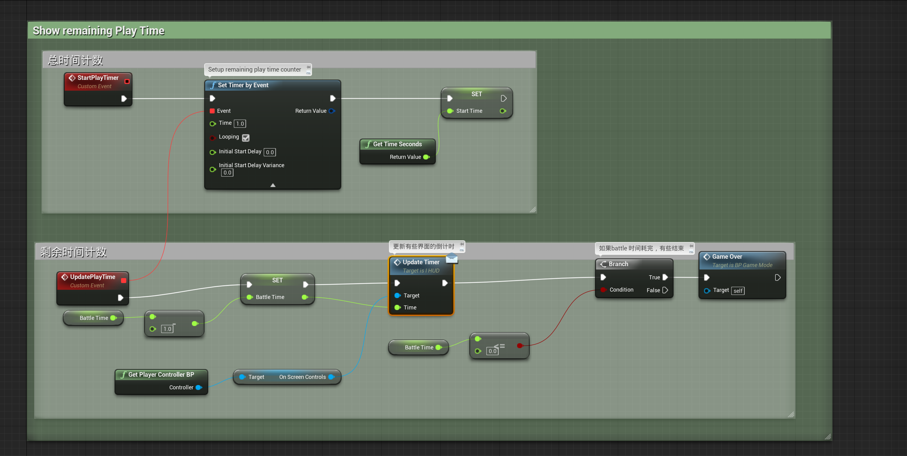

在游戏中分别做如下表现：

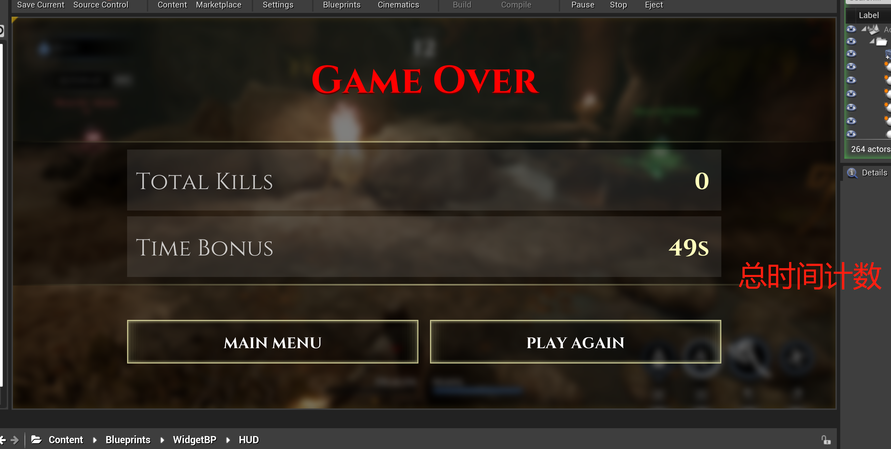

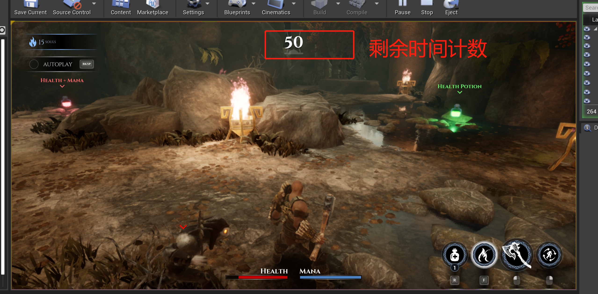

### 2.1 更新剩余时间计数(Update Timer)

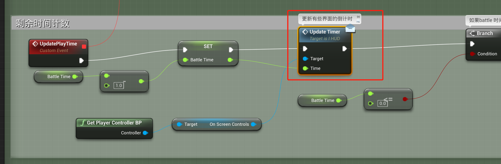

这个方法是`I HUD` 中的方法，但是我们的游戏UI`WB_HUD_PC` 实现了这个接口，重写了这个方法：

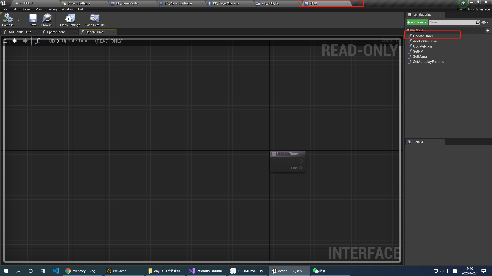

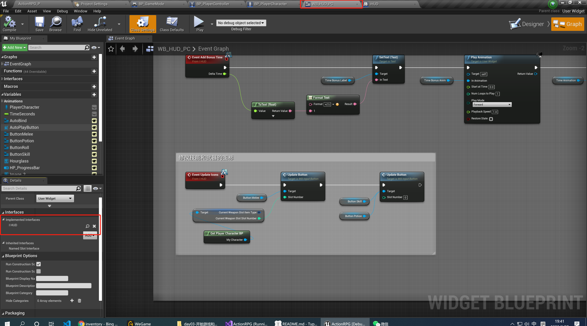

让我们看看这个方法都干了什么：

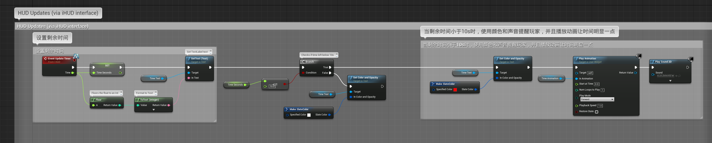