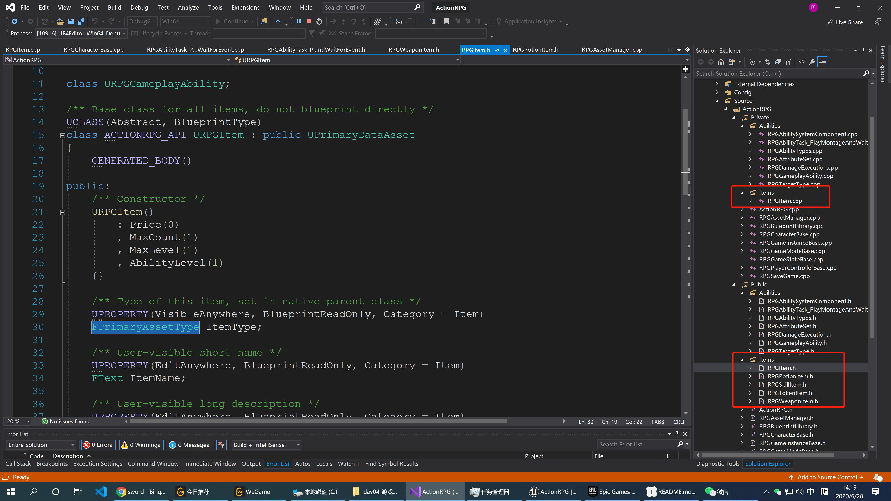
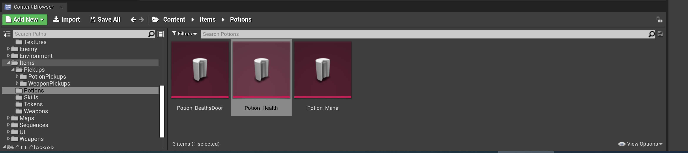
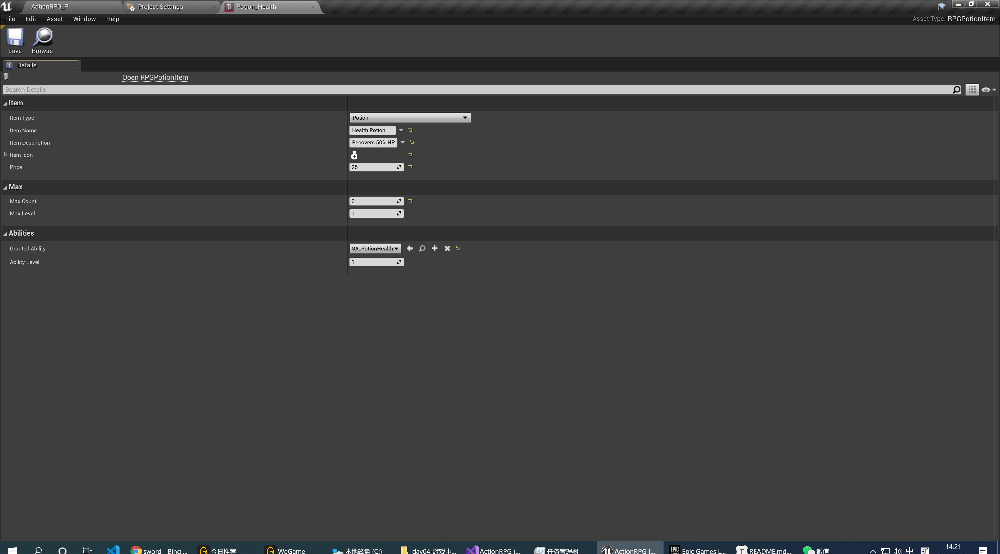
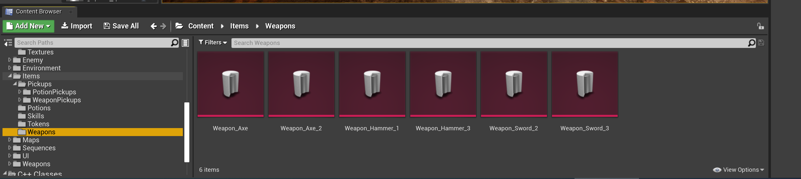
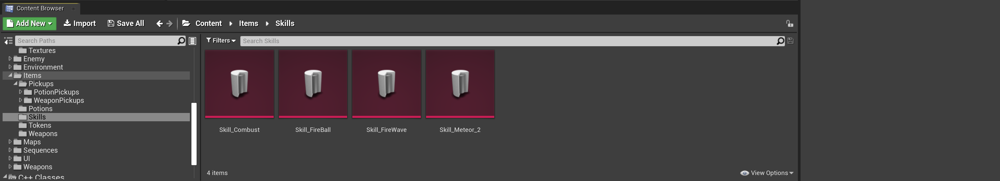
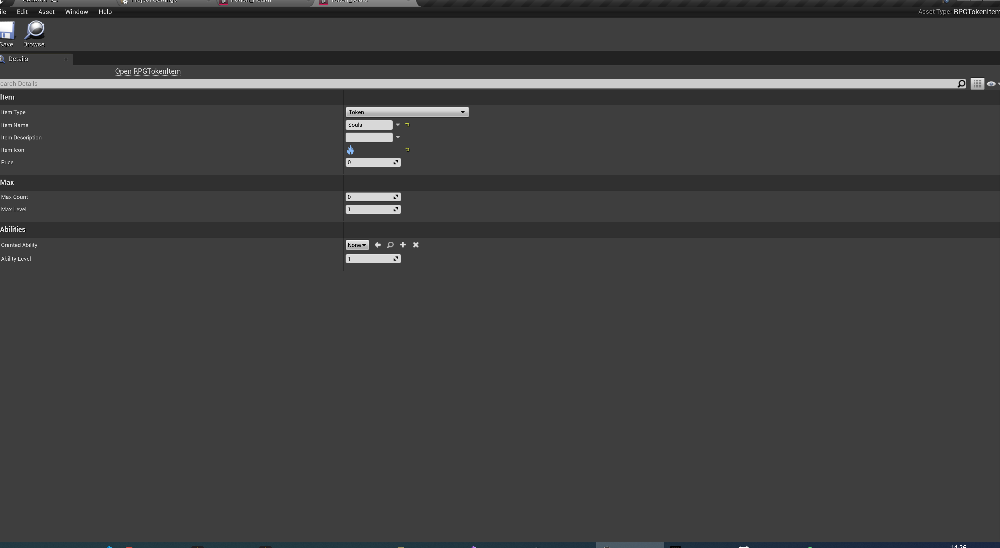

# 游戏中的物品系统

游戏中的物品包括：武器、药水、技能、金币



## 1 物品的基类

```c++
// Copyright 1998-2019 Epic Games, Inc. All Rights Reserved.

#pragma once

#include "ActionRPG.h"
#include "Engine/DataAsset.h"
#include "Styling/SlateBrush.h"
#include "RPGAssetManager.h"
#include "RPGItem.generated.h"

class URPGGameplayAbility;

/** Base class for all items, do not blueprint directly */
UCLASS(Abstract, BlueprintType)
class ACTIONRPG_API URPGItem : public UPrimaryDataAsset
{
	GENERATED_BODY()

public:
	/** Constructor */
	URPGItem()
		: Price(0)
		, MaxCount(1)
		, MaxLevel(1)
		, AbilityLevel(1)
	{}

	/** Type of this item, set in native parent class */
	UPROPERTY(VisibleAnywhere, BlueprintReadOnly, Category = Item)
	FPrimaryAssetType ItemType;

	/** User-visible short name */
	UPROPERTY(EditAnywhere, BlueprintReadOnly, Category = Item)
	FText ItemName;

	/** User-visible long description */
	UPROPERTY(EditAnywhere, BlueprintReadOnly, Category = Item)
	FText ItemDescription;

	/** Icon to display */
	UPROPERTY(EditAnywhere, BlueprintReadOnly, Category = Item)
	FSlateBrush ItemIcon;

	/** Price in game */
	UPROPERTY(EditAnywhere, BlueprintReadOnly, Category = Item)
	int32 Price;

	/** Maximum number of instances that can be in inventory at once, <= 0 means infinite */
	UPROPERTY(EditAnywhere, BlueprintReadOnly, Category = Max)
	int32 MaxCount;

	/** Returns if the item is consumable (MaxCount <= 0)*/
	UFUNCTION(BlueprintCallable, BlueprintPure, Category = Max)
	bool IsConsumable() const;

	/** Maximum level this item can be, <= 0 means infinite */
	UPROPERTY(EditAnywhere, BlueprintReadOnly, Category = Max)
	int32 MaxLevel;

	/** Ability to grant if this item is slotted */
	UPROPERTY(EditAnywhere, BlueprintReadOnly, Category = Abilities)
	TSubclassOf<URPGGameplayAbility> GrantedAbility;

	/** Ability level this item grants. <= 0 means the character level */
	UPROPERTY(EditAnywhere, BlueprintReadOnly, Category = Abilities)
	int32 AbilityLevel;

	/** Returns the logical name, equivalent to the primary asset id */
	UFUNCTION(BlueprintCallable, Category = Item)
	FString GetIdentifierString() const;

	/** Overridden to use saved type */
	virtual FPrimaryAssetId GetPrimaryAssetId() const override;
};

```


实现：

```c++
// Copyright 1998-2019 Epic Games, Inc. All Rights Reserved.

#include "Items/RPGItem.h"

bool URPGItem::IsConsumable() const
{
	if (MaxCount <= 0)
	{
		return true;
	}
	return false;
}

FString URPGItem::GetIdentifierString() const
{
	return GetPrimaryAssetId().ToString();
}

FPrimaryAssetId URPGItem::GetPrimaryAssetId() const
{
	// This is a DataAsset and not a blueprint so we can just use the raw FName
	// For blueprints you need to handle stripping the _C suffix
	return FPrimaryAssetId(ItemType, GetFName());
}
```

## 2 药水基类

```c++
// Copyright 1998-2019 Epic Games, Inc. All Rights Reserved.

#pragma once

#include "Items/RPGItem.h"
#include "RPGPotionItem.generated.h"

/** Native base class for potions, should be blueprinted */
UCLASS()
class ACTIONRPG_API URPGPotionItem : public URPGItem
{
	GENERATED_BODY()

public:
	/** Constructor */
	URPGPotionItem()
	{
		ItemType = URPGAssetManager::PotionItemType;
	}
};
```

 他们在蓝图中的具体子类：



例如下面的具体的某种药水可以回复50%的HP:



## 3 武器的基类

```c++
// Copyright 1998-2019 Epic Games, Inc. All Rights Reserved.

#pragma once

#include "Items/RPGItem.h"
#include "RPGWeaponItem.generated.h"

/** Native base class for weapons, should be blueprinted */
UCLASS()
class ACTIONRPG_API URPGWeaponItem : public URPGItem
{
	GENERATED_BODY()

public:
	/** Constructor */
	URPGWeaponItem()
	{
		ItemType = URPGAssetManager::WeaponItemType;
	}

	/** Weapon actor to spawn */
	UPROPERTY(EditAnywhere, BlueprintReadOnly, Category = Weapon)
	TSubclassOf<AActor> WeaponActor;
};
```

在蓝图的中具体定义：



这里有各种武器，例如斧头，剑以及锤子。


## 3 技能基类

```c++
// Copyright 1998-2019 Epic Games, Inc. All Rights Reserved.

#pragma once

#include "Items/RPGItem.h"
#include "RPGSkillItem.generated.h"

/** Native base class for skills, should be blueprinted */
UCLASS()
class ACTIONRPG_API URPGSkillItem : public URPGItem
{
	GENERATED_BODY()

public:
	/** Constructor */
	URPGSkillItem()
	{
		ItemType = URPGAssetManager::SkillItemType;
	}
};
```

在蓝图中的具体实现：



这里有火球、流行等。


## 4 金币基类

```c++
// Copyright 1998-2019 Epic Games, Inc. All Rights Reserved.

#pragma once

#include "Items/RPGItem.h"
#include "RPGTokenItem.generated.h"

/** Native base class for tokens/currency, should be blueprinted */
UCLASS()
class ACTIONRPG_API URPGTokenItem : public URPGItem
{
	GENERATED_BODY()

public:
	/** Constructor */
	URPGTokenItem()
	{
		ItemType = URPGAssetManager::TokenItemType;
		MaxCount = 0; // Infinite
	}
};
```



## 5 `URPGAssetManager`

声明:

```c++
// Copyright 1998-2019 Epic Games, Inc. All Rights Reserved.

#pragma once

#include "ActionRPG.h"
#include "Engine/AssetManager.h"
#include "RPGAssetManager.generated.h"

class URPGItem;

/**
 * Game implementation of asset manager, overrides functionality and stores game-specific types
 * It is expected that most games will want to override AssetManager as it provides a good place for game-specific loading logic
 * This is used by setting AssetManagerClassName in DefaultEngine.ini
 */
UCLASS()
class ACTIONRPG_API URPGAssetManager : public UAssetManager
{
	GENERATED_BODY()

public:
	// Constructor and overrides
	URPGAssetManager() {}
	virtual void StartInitialLoading() override;

	/** Static types for items */
	static const FPrimaryAssetType	PotionItemType;
	static const FPrimaryAssetType	SkillItemType;
	static const FPrimaryAssetType	TokenItemType;
	static const FPrimaryAssetType	WeaponItemType;

	/** Returns the current AssetManager object */
	static URPGAssetManager& Get();

	/**
	 * Synchronously loads an RPGItem subclass, this can hitch but is useful when you cannot wait for an async load
	 * This does not maintain a reference to the item so it will garbage collect if not loaded some other way
	 *
	 * @param PrimaryAssetId The asset identifier to load
	 * @param bDisplayWarning If true, this will log a warning if the item failed to load
	 */
	URPGItem* ForceLoadItem(const FPrimaryAssetId& PrimaryAssetId, bool bLogWarning = true);
};


```

实现：

```c++
// Copyright 1998-2019 Epic Games, Inc. All Rights Reserved.

#include "RPGAssetManager.h"
#include "Items/RPGItem.h"
#include "AbilitySystemGlobals.h"

const FPrimaryAssetType	URPGAssetManager::PotionItemType = TEXT("Potion");
const FPrimaryAssetType	URPGAssetManager::SkillItemType = TEXT("Skill");
const FPrimaryAssetType	URPGAssetManager::TokenItemType = TEXT("Token");
const FPrimaryAssetType	URPGAssetManager::WeaponItemType = TEXT("Weapon");

URPGAssetManager& URPGAssetManager::Get()
{
	URPGAssetManager* This = Cast<URPGAssetManager>(GEngine->AssetManager);

	if (This)
	{
		return *This;
	}
	else
	{
		UE_LOG(LogActionRPG, Fatal, TEXT("Invalid AssetManager in DefaultEngine.ini, must be RPGAssetManager!"));
		return *NewObject<URPGAssetManager>(); // never calls this
	}
}

void URPGAssetManager::StartInitialLoading()
{
	Super::StartInitialLoading();

	UAbilitySystemGlobals::Get().InitGlobalData();
}


URPGItem* URPGAssetManager::ForceLoadItem(const FPrimaryAssetId& PrimaryAssetId, bool bLogWarning)
{	
	FSoftObjectPath ItemPath = GetPrimaryAssetPath(PrimaryAssetId);

	// This does a synchronous load and may hitch
	URPGItem* LoadedItem = Cast<URPGItem>(ItemPath.TryLoad());

	if (bLogWarning && LoadedItem == nullptr)
	{
		UE_LOG(LogActionRPG, Warning, TEXT("Failed to load item for identifier %s!"), *PrimaryAssetId.ToString());
	}

	return LoadedItem;
}
```

