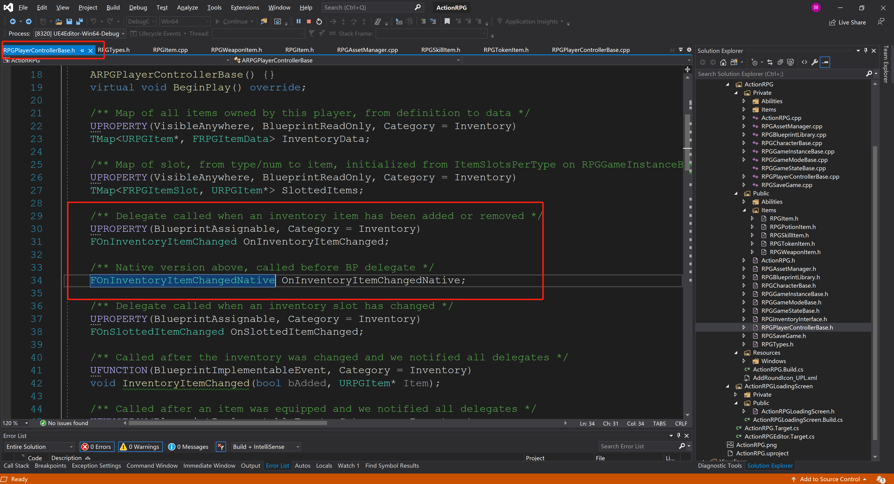
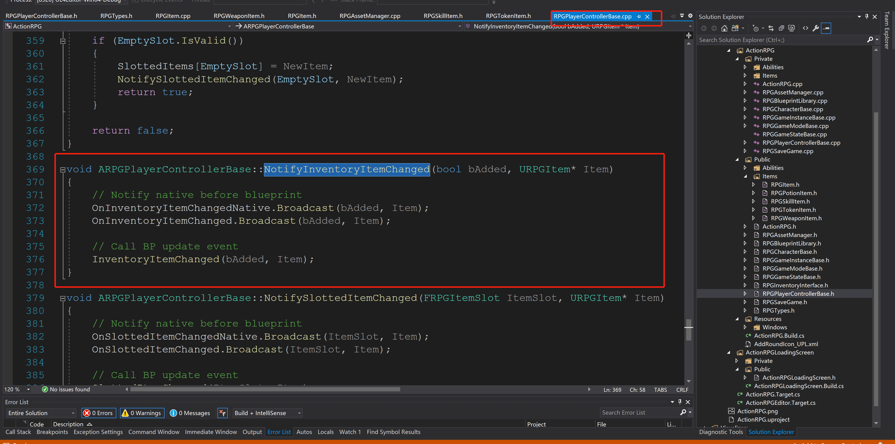
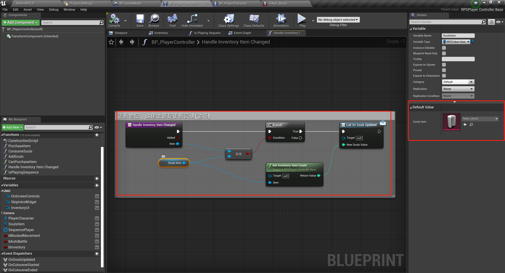
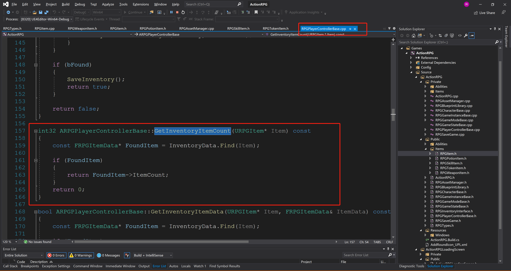
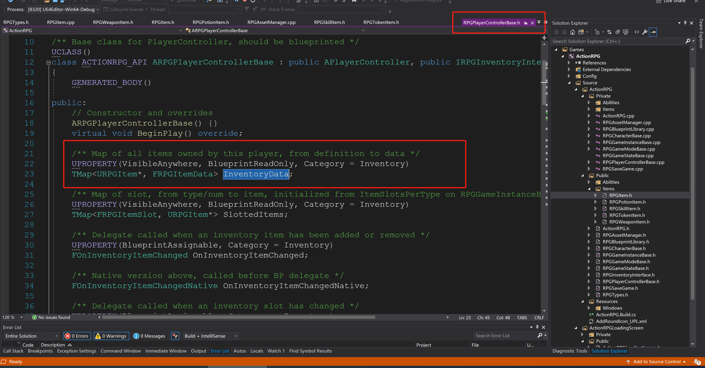

# 物品数据和委托

## 1 FRPGItemSlot

一个显示在UI里面的物品插槽

```c++
/** Struct representing a slot for an item, shown in the UI */
USTRUCT(BlueprintType)
struct ACTIONRPG_API FRPGItemSlot
{
	GENERATED_BODY()

	/** Constructor, -1 means an invalid slot */
	FRPGItemSlot()
		: SlotNumber(-1)
	{}

	FRPGItemSlot(const FPrimaryAssetType& InItemType, int32 InSlotNumber)
		: ItemType(InItemType)
		, SlotNumber(InSlotNumber)
	{}

	/** The type of items that can go in this slot */
	UPROPERTY(EditAnywhere, BlueprintReadWrite, Category = Item)
	FPrimaryAssetType ItemType;

	/** The number of this slot, 0 indexed */
	UPROPERTY(EditAnywhere, BlueprintReadWrite, Category = Item)
	int32 SlotNumber;

	/** Equality operators */
	bool operator==(const FRPGItemSlot& Other) const
	{
		return ItemType == Other.ItemType && SlotNumber == Other.SlotNumber;
	}
	bool operator!=(const FRPGItemSlot& Other) const
	{
		return !(*this == Other);
	}

	/** Implemented so it can be used in Maps/Sets */
	friend inline uint32 GetTypeHash(const FRPGItemSlot& Key)
	{
		uint32 Hash = 0;

		Hash = HashCombine(Hash, GetTypeHash(Key.ItemType));
		Hash = HashCombine(Hash, (uint32)Key.SlotNumber);
		return Hash;
	}

	/** Returns true if slot is valid */
	bool IsValid() const
	{
		return ItemType.IsValid() && SlotNumber >= 0;
	}
};
```

# 2 FRPGItemData

物品在背包里面的额外信息

```c++
/** Extra information about a URPGItem that is in a player's inventory */
USTRUCT(BlueprintType)
struct ACTIONRPG_API FRPGItemData
{
	GENERATED_BODY()

	/** Constructor, default to count/level 1 so declaring them in blueprints gives you the expected behavior */
	FRPGItemData()
		: ItemCount(1)
		, ItemLevel(1)
	{}

	FRPGItemData(int32 InItemCount, int32 InItemLevel)
		: ItemCount(InItemCount)
		, ItemLevel(InItemLevel)
	{}

	/** The number of instances of this item in the inventory, can never be below 1 */
	UPROPERTY(EditAnywhere, BlueprintReadWrite, Category = Item)
	int32 ItemCount;

	/** The level of this item. This level is shared for all instances, can never be below 1 */
	UPROPERTY(EditAnywhere, BlueprintReadWrite, Category = Item)
	int32 ItemLevel;

	/** Equality operators */
	bool operator==(const FRPGItemData& Other) const
	{
		return ItemCount == Other.ItemCount && ItemLevel == Other.ItemLevel;
	}
	bool operator!=(const FRPGItemData& Other) const
	{
		return !(*this == Other);
	}

	/** Returns true if count is greater than 0 */
	bool IsValid() const
	{
		return ItemCount > 0;
	}

	/** Append an item data, this adds the count and overrides everything else */
	void UpdateItemData(const FRPGItemData& Other, int32 MaxCount, int32 MaxLevel)
	{
		if (MaxCount <= 0)
		{
			MaxCount = MAX_int32;
		}

		if (MaxLevel <= 0)
		{
			MaxLevel = MAX_int32;
		}

		ItemCount = FMath::Clamp(ItemCount + Other.ItemCount, 1, MaxCount);
		ItemLevel = FMath::Clamp(Other.ItemLevel, 1, MaxLevel);
	}
};
```

## 3 一些委托

### 3.1 物品改变时的委托

```c++
/** Delegate called when an inventory item changes */
DECLARE_DYNAMIC_MULTICAST_DELEGATE_TwoParams(FOnInventoryItemChanged, bool, bAdded, URPGItem*, Item);
DECLARE_MULTICAST_DELEGATE_TwoParams(FOnInventoryItemChangedNative, bool, URPGItem*);
```

#### 3.1.1 在 PlayerControllerBase 中声明并广播



广播：



#### 3.1.2 在蓝图中绑定(PlayerController 中的 OnPress )


#### 3.1.3 Handle Inventory Item Changed



#### 3.1.4 GetInventoryItemCount





### 3.2 插槽内容改变时的委托

```c++
/** Delegate called when the contents of an inventory slot change */
DECLARE_DYNAMIC_MULTICAST_DELEGATE_TwoParams(FOnSlottedItemChanged, FRPGItemSlot, ItemSlot, URPGItem*, Item);
DECLARE_MULTICAST_DELEGATE_TwoParams(FOnSlottedItemChangedNative, FRPGItemSlot, URPGItem*);
```

### 3.3 当整个背包被加载时的委托

```c++
/** Delegate called when the entire inventory has been loaded, all items may have been replaced */
DECLARE_DYNAMIC_MULTICAST_DELEGATE(FOnInventoryLoaded);
DECLARE_MULTICAST_DELEGATE(FOnInventoryLoadedNative);
```

### 3.4 当 SaveGame 被加载或者重置的委托

```c++
/** Delegate called when the save game has been loaded/reset */
DECLARE_DYNAMIC_MULTICAST_DELEGATE_OneParam(FOnSaveGameLoaded, URPGSaveGame*, SaveGame);
DECLARE_MULTICAST_DELEGATE_OneParam(FOnSaveGameLoadedNative, URPGSaveGame*);
```

