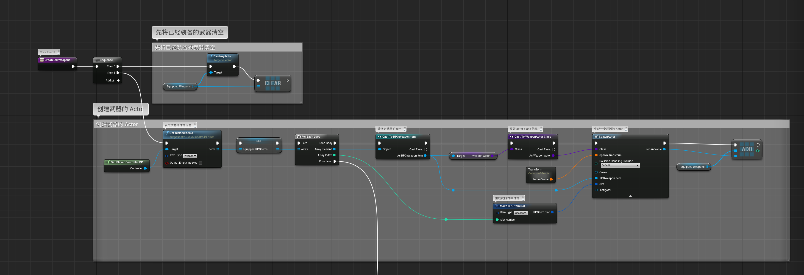
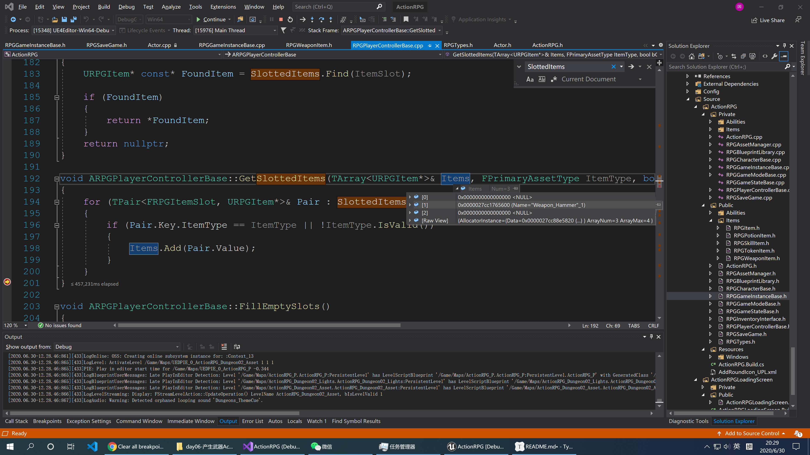

# 初始化武器（一）

## 1 在蓝图中初始化武器信息



其中`GetSlottedItems`的代码在`ARPGPlayerControllerBase`

```c++
void ARPGPlayerControllerBase::GetSlottedItems(TArray<URPGItem*>& Items, FPrimaryAssetType ItemType, bool bOutputEmptyIndexes)
{
	for (TPair<FRPGItemSlot, URPGItem*>& Pair : SlottedItems)
	{
		if (Pair.Key.ItemType == ItemType || !ItemType.IsValid())
		{
			Items.Add(Pair.Value);
		}
	}
}
```

`SlottedItems`的声明：

```C++
/** Map of slot, from type/num to item, initialized from ItemSlotsPerType on RPGGameInstanceBase */
	UPROPERTY(VisibleAnywhere, BlueprintReadOnly, Category = Inventory)
	TMap<FRPGItemSlot, URPGItem*> SlottedItems;
```

通过断点调试，我们发现：`SlottedItems`竟然有初始值，那名这些值到底从哪来的呢？答案是从`GameInstance`和`SaveGame`中来的。



## 2 LoadInventory 加载背包

```C++
bool ARPGPlayerControllerBase::LoadInventory()
{
	// 将背包数据和插槽数据清空
	InventoryData.Reset();
	SlottedItems.Reset();

	// 获取 GameInstance
	UWorld* World = GetWorld();
	URPGGameInstanceBase* GameInstance = World ? World->GetGameInstance<URPGGameInstanceBase>() : nullptr;

	if (!GameInstance)
	{
		return false;
	}

	// 如果 gameInstance 没有绑定加载事件，这里做绑定
	if (!GameInstance->OnSaveGameLoadedNative.IsBoundToObject(this))
	{
		GameInstance->OnSaveGameLoadedNative.AddUObject(this, &ARPGPlayerControllerBase::HandleSaveGameLoaded);
	}
	
	// 获取 GameInstace 中的 ItemSlotsPerType，初始化 SlottedItems
	for (const TPair<FPrimaryAssetType, int32>& Pair : GameInstance->ItemSlotsPerType)
	{
		for (int32 SlotNumber = 0; SlotNumber < Pair.Value; SlotNumber++)
		{
			SlottedItems.Add(FRPGItemSlot(Pair.Key, SlotNumber), nullptr);
		}
	}
	
	// 获取当前的 SaveGame
	URPGSaveGame* CurrentSaveGame = GameInstance->GetCurrentSaveGame();
	// 获取当前的资源管理器
	URPGAssetManager& AssetManager = URPGAssetManager::Get();
	if (CurrentSaveGame)
	{
		// 用 SaveGanme 中 InventoryData 数据更新 InventoryData
		bool bFoundAnySlots = false;
		for (const TPair<FPrimaryAssetId, FRPGItemData>& ItemPair : CurrentSaveGame->InventoryData)
		{
			URPGItem* LoadedItem = AssetManager.ForceLoadItem(ItemPair.Key);

			if (LoadedItem != nullptr)
			{
				InventoryData.Add(LoadedItem, ItemPair.Value);
			}
		}

		// 用 SaveGanme 中 SlottedItems 数据更新 SlottedItems

		for (const TPair<FRPGItemSlot, FPrimaryAssetId>& SlotPair : CurrentSaveGame->SlottedItems)
		{
			if (SlotPair.Value.IsValid())
			{
				URPGItem* LoadedItem = AssetManager.ForceLoadItem(SlotPair.Value);
				if (GameInstance->IsValidItemSlot(SlotPair.Key) && LoadedItem)
				{
					SlottedItems.Add(SlotPair.Key, LoadedItem);
					bFoundAnySlots = true;
				}
			}
		}

		if (!bFoundAnySlots)
		{
			// Auto slot items as no slots were saved
			FillEmptySlots();
		}

		// 通知背包加载完成
		NotifyInventoryLoaded();

		return true;
	}

	// Load failed but we reset inventory, so need to notify UI
	NotifyInventoryLoaded();

	return false;
}
```

明天我们再来进一步研究细节。