# Day07-资源类型和资源管理器

## 1 FPrimaryAssetType 和 FPrimaryAssetId

### 1.1 FPrimaryAssetType 

一个初始的资源类型，使用一个`FName`来表示并且可以隐式的向前和向后转换。这个东西的存在的意义在于蓝图可以把他当作一个类型而不仅仅是`FName`

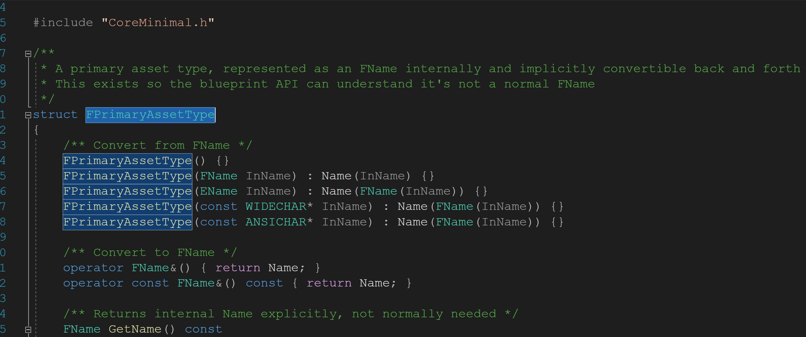

### 1.2 FPrimaryAssetId

他是一个明确对象作为一个初始的资源可以被`AssetManager`,并且可以被使用在多种工具中，他又两个属性：

* PrimaryAssetType：初始的资源类型，其实是一个描述该类型的一个逻辑明此，经常使用`UClass`的名字，举个例子，任何由`APawn`所衍生的资源都有一个初始资源类型为:`Pawn`。`PrimaryAssetType::PrimaryAssetName`在全局中应该尽可能保持唯一在你的工程中
* PrimaryAssetName 初始资源名称：一个用来描述该资源的名字，这经常是一个关于对象的短名字，当然，对于地图等资源，也可以使用完整的路径作为名称，或者是一个对象的`GetPrimaryId()`重写方法。`PrimaryAssetType::PrimaryAssetName`在全局中应该尽可能保持唯一在你的工程中

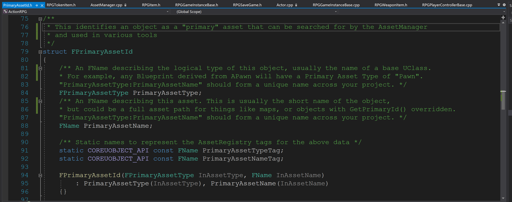

### 1.3 游戏中的每个物品都有一个`FPrimaryAssetType`

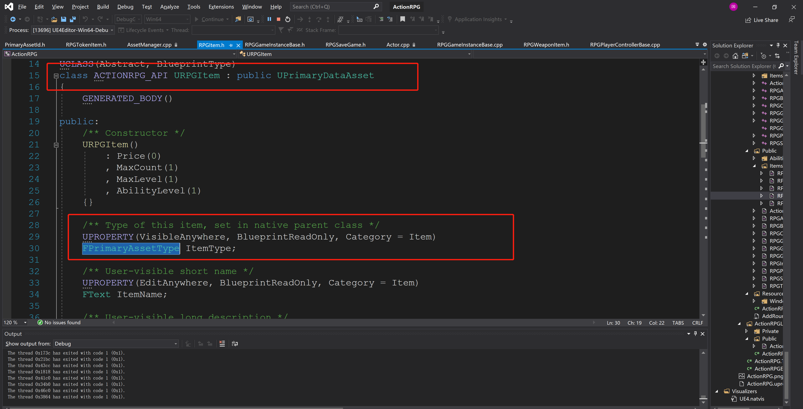

针对不同的物品，例如武器和技能，就使用不同的`FPrimaryAssetType`：

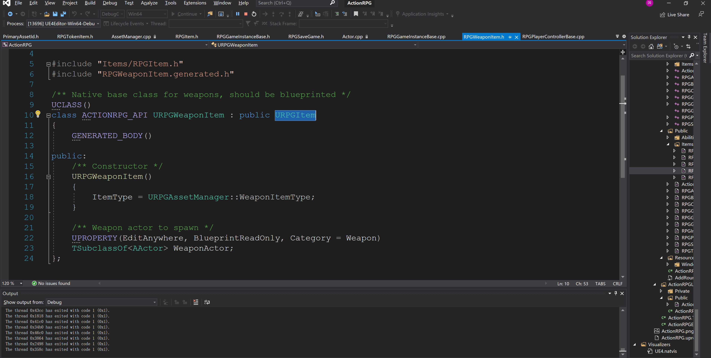

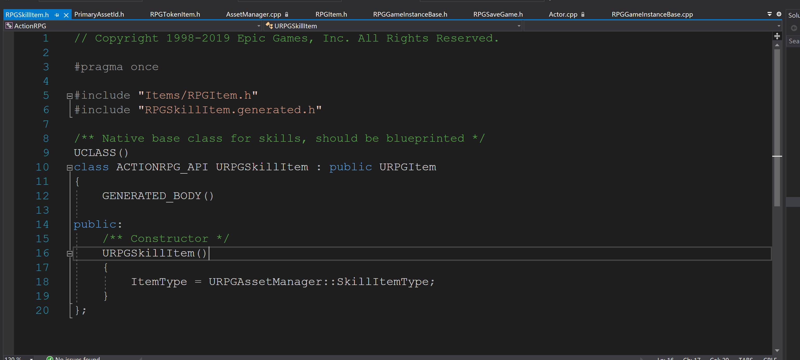

这些类型都在`URPGAssetManager` 有定义：

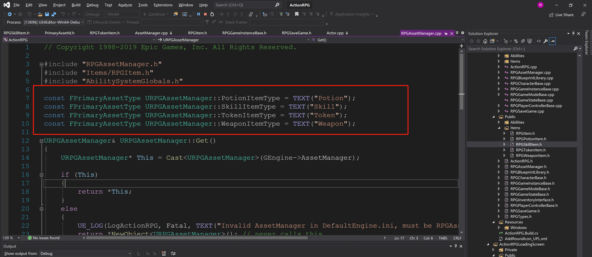

根据`PrimaryAssetType`来获取`PrimaryAssetId`的方法在`ItemRPG`中早就已经定义好：

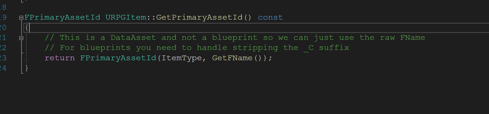

其中的`GetFName`代码如下：

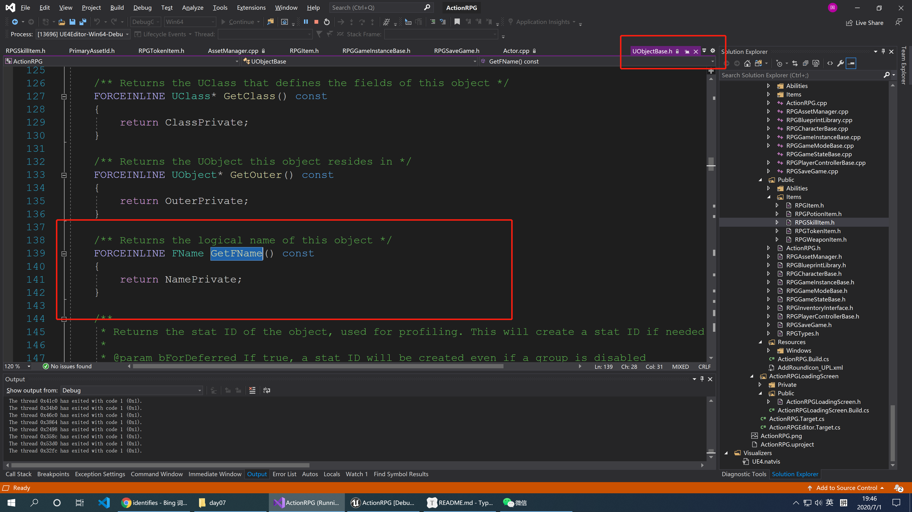

这里我们尝试获取`RPGPlayerController`的`GetName`方法，发现是这个样子的：

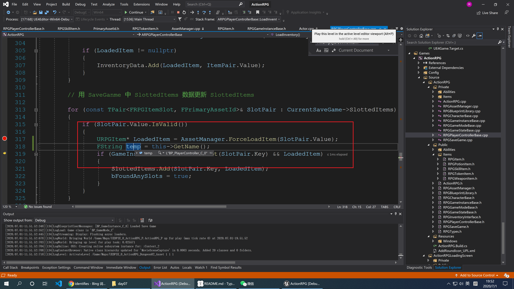

### 1.4 根据`FPrimaryAssetId` 获取资源

在`RPGAssetManager`中有一个强制获取资源的方法：

```c++
/**
	 * Synchronously loads an RPGItem subclass, this can hitch but is useful when you cannot wait for an async load
	 * This does not maintain a reference to the item so it will garbage collect if not loaded some other way
	 *
	 * @param PrimaryAssetId The asset identifier to load
	 * @param bDisplayWarning If true, this will log a warning if the item failed to load
	 */
	/**
	* 一个同步的方法去加载一个 RPGItem, 这个方法可能会被阻塞的但是他是有用的当你不能等待一个资源的异步加载。
	* 这个将不会去持有一个 item 的引用以至于他就将会被 GC 回收如果没有加载其它的东西
	* @参数 PrimaryAssetId 需要被加载的资源 ID
	* @参数 bDisplayWarning true 的话，在加载失败的时候会打印警告日志
	*/
	URPGItem* ForceLoadItem(const FPrimaryAssetId& PrimaryAssetId, bool bLogWarning = true);
```

他的具体实现：

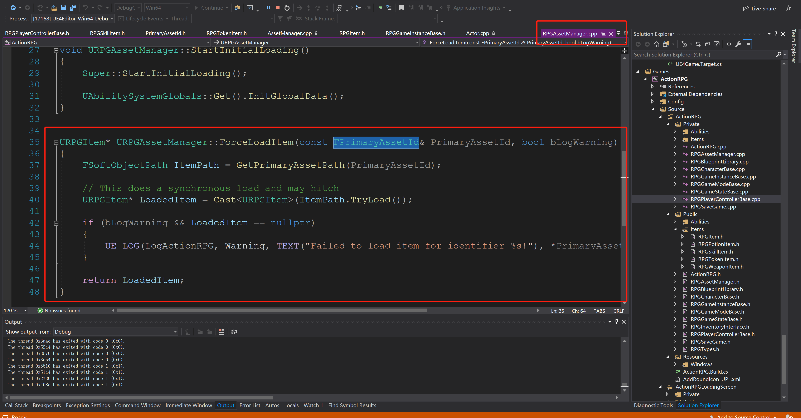

这里的 `GetPrimaryAssetPath`是`UAssetManager`内置方法，这里我们就不深追了，只有知道这个方法可以拿到`RPGItem`就可以了。

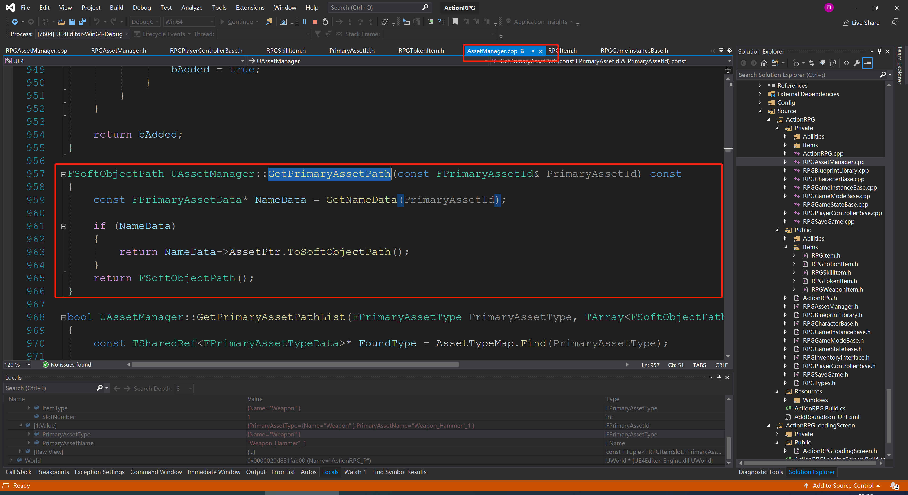

### 1.5 在初始化武器的时候使用

我们在初始化武器资源和UI插槽的时候，经常会使用这样的方法来加载资源

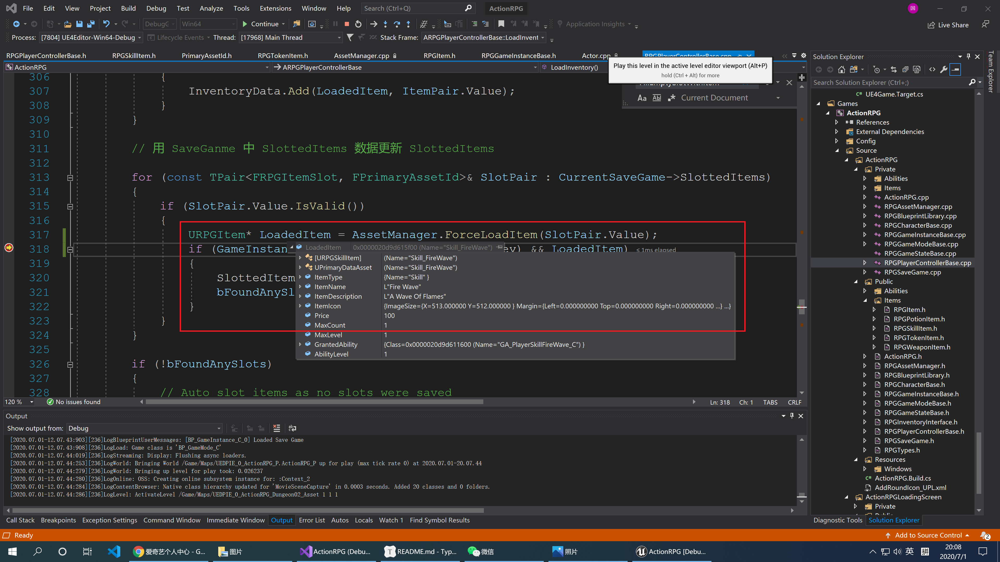

再来看一眼内存中的`FPrimaryAssetId`,包含`PrimaryAssetType`和`PrimaryAssetName`，他们在过程中都有唯一的。

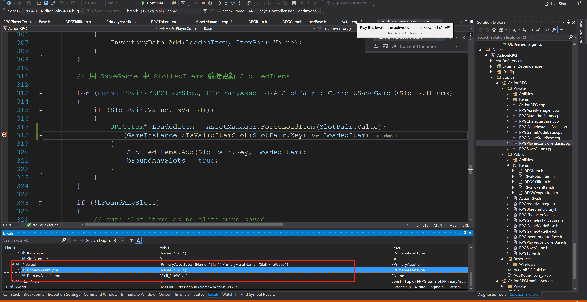