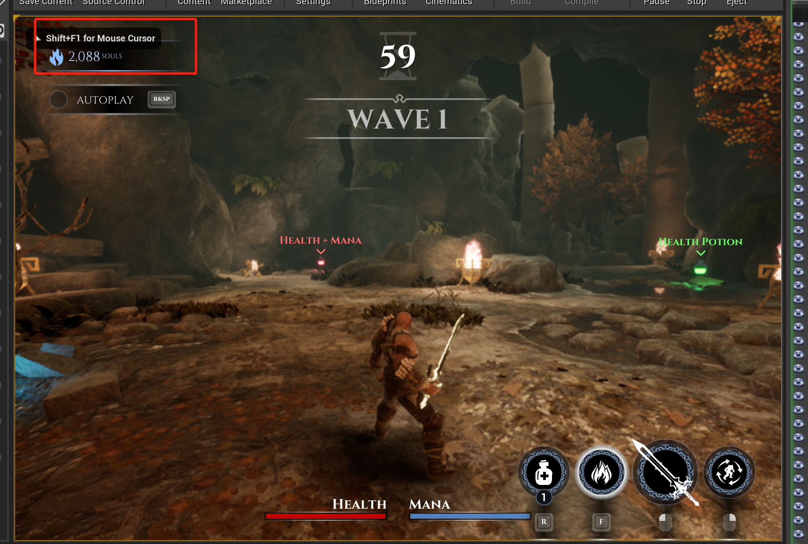

# 保存背包数据

## 1 FillEmptySlots


### 1.1 FillEmptySlotWithItem


### 1.2 NotifySlottedItemChanged


### 1.3 SaveInventory（保存背包数据）

```c++
bool ARPGPlayerControllerBase::SaveInventory()
{
	UWorld* World = GetWorld(); // 获取世界上下文对象
	// 获取 gameInstance
	URPGGameInstanceBase* GameInstance = World ? World->GetGameInstance<URPGGameInstanceBase>() : nullptr;

	if (!GameInstance)
	{
		return false;
	}

	// 获取SaveGame
	URPGSaveGame* CurrentSaveGame = GameInstance->GetCurrentSaveGame();
	if (CurrentSaveGame)
	{
		// 在保存之前先清空数据
		CurrentSaveGame->InventoryData.Reset();
		CurrentSaveGame->SlottedItems.Reset();

		// 遍历当前背包数据，保存到 currentSaveGame 中
		for (const TPair<URPGItem*, FRPGItemData>& ItemPair : InventoryData)
		{
			FPrimaryAssetId AssetId;

			if (ItemPair.Key)
			{
				AssetId = ItemPair.Key->GetPrimaryAssetId();
				CurrentSaveGame->InventoryData.Add(AssetId, ItemPair.Value);
			}
		}

		// 遍历当前的插槽数据，保存到 currentSave 中
		for (const TPair<FRPGItemSlot, URPGItem*>& SlotPair : SlottedItems)
		{
			FPrimaryAssetId AssetId;

			if (SlotPair.Value)
			{
				AssetId = SlotPair.Value->GetPrimaryAssetId();
			}
			CurrentSaveGame->SlottedItems.Add(SlotPair.Key, AssetId);
		}

		// 将数据写入到磁盘中
		GameInstance->WriteSaveGame();
		return true;
	}
	return false;
}
```

### 1.4 做个演示

当我获得金币的时候，就会调用上面的`SaveInventory`方法，此时我们有227个金币，游戏里面叫灵魂，这里


上图是刚准备收取灵魂的画面，此时还没有写入磁盘，所有在界面里面的数据是227，而代码中已经是228个了，此时我们不妨来修改一下这个数据。


我们修改一下这部分的代码，如果保存背包是灵魂的时候，就直接保存2800,


然后你会发现你有钱了，然后什么武器技能随便买。




# 