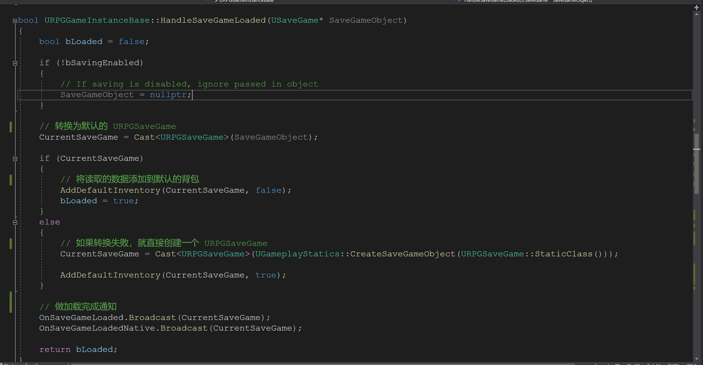

# 聊聊保存和加载

## 1 WriteSaveGame

写入磁盘的操作


## 2 HandleAsyncSave

写入完成后执行的操作


## 3 AsyncSaveGameToSlot

UE4 自带的异步保存的算法

```c++

	/** 
	 * Schedule an async save to a specific slot. UAsyncActionHandleSaveGame::AsyncSaveGameToSlot is the blueprint version of this.
	 * This will do the serialize on the game thread, the platform-specific write on a worker thread, then call the complete delegate on the game thread.
	 * The passed in delegate will be copied to a worker thread so make sure any payload is thread safe to copy by value.
	 *
	 * @param SaveGameObject	Object that contains data about the save game that we want to write out.
	 * @param SlotName			Name of the save game slot to load from.
	 * @param UserIndex			For some platforms, master user index to identify the user doing the loading.
	 * @param SavedDelegate		Delegate that will be called on game thread when save succeeds or fails.
	 */
	static void AsyncSaveGameToSlot(USaveGame* SaveGameObject, const FString& SlotName, const int32 UserIndex, FAsyncSaveGameToSlotDelegate SavedDelegate = FAsyncSaveGameToSlotDelegate());
```

翻译一下：

```c++
/**
* 执行一个异步保存的调度吗，UAsyncActionHandleSaveGame::AsyncSaveGameToSlot 是这个方法的蓝图版本。
* 这个将会在游戏线程中发起执行序列化（保存磁盘）的操作，但是会使用系统指定的读写工作线程。在执行完写入磁盘后，使用会话（delegate）通知游戏线程。
* 执行完成的通知会话会被复制一份到工作线程中，以至于去确保线程中的载体都是安全的通过值的拷贝。
* @param SaveGameObject saveGame 对象，我们需要保存的数据
* @param SlotName 插槽的名称
* @param UserIndex 对于一些平台来说，主用户的索引用来表示用户正在做加载操作
* @param SavedDelegate 当保存完成(成功或者失败)，会通知游戏线程会话
*/
	static void AsyncSaveGameToSlot(USaveGame* SaveGameObject, const FString& SlotName, const int32 UserIndex, FAsyncSaveGameToSlotDelegate SavedDelegate = FAsyncSaveGameToSlotDelegate());
```

该算法的实现是由引擎实现的，我们就不深追了：


## 4 SaveGame

```c++
/** 
 *	This class acts as a base class for a save game object that can be used to save state about the game. 
 *	When you create your own save game subclass, you would add member variables for the information that you want to save.
 *	Then when you want to save a game, create an instance of this object using CreateSaveGameObject, fill in the data, and use SaveGameToSlot, providing a slot name.
 *	To load the game you then just use LoadGameFromSlot, and read the data from the resulting object.
 *
 *	@see https://docs.unrealengine.com/latest/INT/Gameplay/SaveGame
 */
UCLASS(abstract, Blueprintable, BlueprintType)
class ENGINE_API USaveGame : public UObject
{
	/**
	 *	@see UGameplayStatics::CreateSaveGameObject
	 *	@see UGameplayStatics::SaveGameToSlot
	 *	@see UGameplayStatics::DoesSaveGameExist
	 *	@see UGameplayStatics::LoadGameFromSlot
	 *	@see UGameplayStatics::DeleteGameInSlot
	 */

	GENERATED_UCLASS_BODY()
};
```

翻译一下：

```c++
/**
* 这是一个基类关于保存游戏的对象可以被用来去存储游戏状态。当你创建你自己的 saveGame 子类时，你需要去添加一些你想要保存数据的成员变量
* 当你想要保存游戏时，可以使用`CreateSaveGameObject` 来创建一个游戏实例，然后填充想要保存的数据，
* 在使用`SaveGameToSlot`来保存游戏，前提你需要提供一个插槽的名称。
* 如果你要加载保存的数据，可以使用`LoadGameFromSlot`
*/
UCLASS(abstract, Blueprintable, BlueprintType)
class ENGINE_API USaveGame : public UObject
{
	/**
	 *	@see UGameplayStatics::CreateSaveGameObject
	 *	@see UGameplayStatics::SaveGameToSlot
	 *	@see UGameplayStatics::DoesSaveGameExist
	 *	@see UGameplayStatics::LoadGameFromSlot
	 *	@see UGameplayStatics::DeleteGameInSlot
	 */

	GENERATED_UCLASS_BODY()
};
```

和推荐的`SaveGameToSlot`相比，项目中使用`AsyncSaveGameToSlot`虽然损失了一定的可靠性，但是让游戏不因保存而卡顿，其实是完全正确做法。

我们保存的数据：

```C++
** Object that is written to and read from the save game archive, with a data version */
UCLASS(BlueprintType)
class ACTIONRPG_API URPGSaveGame : public USaveGame
{
	GENERATED_BODY()

public:
	/** Constructor */
	URPGSaveGame()
	{
		// Set to current version, this will get overwritten during serialization when loading
		SavedDataVersion = ERPGSaveGameVersion::LatestVersion;
	}

	/** Map of items to item data (背包数据) */
	UPROPERTY(VisibleAnywhere, BlueprintReadWrite, Category = SaveGame)
	TMap<FPrimaryAssetId, FRPGItemData> InventoryData;

	/** Map of slotted items  (插槽数据)*/
	UPROPERTY(VisibleAnywhere, BlueprintReadWrite, Category = SaveGame)
	TMap<FRPGItemSlot, FPrimaryAssetId> SlottedItems;

	/** User's unique id (用户Id) */
	UPROPERTY(VisibleAnywhere, BlueprintReadWrite, Category = SaveGame)
	FString UserId;

protected:
	/** Deprecated way of storing items, this is read in but not saved out */
	UPROPERTY()
	TArray<FPrimaryAssetId> InventoryItems_DEPRECATED;

	/** What LatestVersion was when the archive was saved */
	UPROPERTY()
	int32 SavedDataVersion;

	/** Overridden to allow version fixups */
	virtual void Serialize(FArchive& Ar) override;
};
```

重新的序列化的方法：


## 5 LoadOrCreateSaveGame

```c++

	/** Synchronously loads a save game. If it fails, it will create a new one for you. Returns true if it loaded, false if it created one */
	UFUNCTION(BlueprintCallable, Category = Save)
	bool LoadOrCreateSaveGame();
```

具体实现：


这里使用的是同步的加载，我们可以看一下他有一个异步的方法：


## 6 HandleSaveGameLoaded

```c++
/** Handle the final setup required after loading a USaveGame object using AsyncLoadGameFromSlot. Returns true if it loaded, false if it created one */
	UFUNCTION(BlueprintCallable, Category = Save)
	bool HandleSaveGameLoaded(USaveGame* SaveGameObject);
```

其实注释解释的有问题，这里没有使用异步加载（AsyncLoadGameFromSlot），而是使用同步加载。

具体实现：



## 7 AddDefaultInventory

将默认的背包添加到当前的背包系统中，这个只好被被执行当游戏第一次开始的时候(背包没有武器，默认添加一把)

```c++
/**
	 * Adds the default inventory to the inventory array
	 * @param InventoryArray Inventory to modify
	 * @param RemoveExtra If true, remove anything other than default inventory
	 */
	UFUNCTION(BlueprintCallable, Category = Inventory)
	void AddDefaultInventory(URPGSaveGame* SaveGame, bool bRemoveExtra = false);
```

