# 	GameInstace中读取存档并且初始化商城信息

## 1 读取存档并初始背包信息

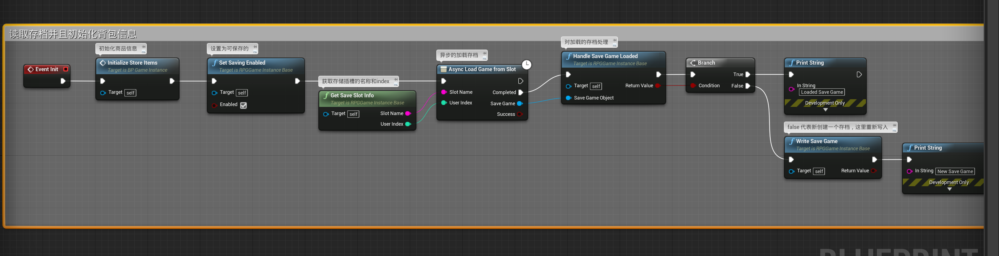

### 1.1 SetSavingEnabled

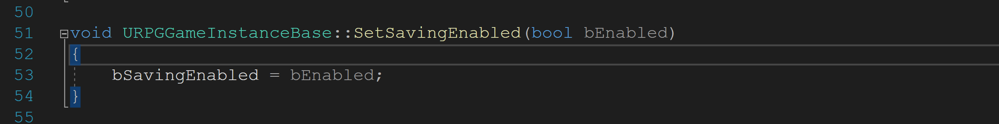

### 1.2 GetSaveSlotInfo

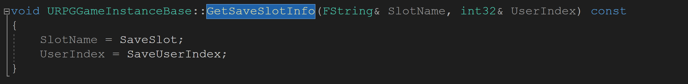

其中`SaveSlot`和`UseIndex`的信息在`URPGGameInstanceBase`的构造函数中初始化：

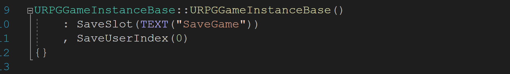

### 1.3 `HandleSaveGameLoaded` 和`WriteSaveGame`

这两个方法在之前讲过，都在`URPGGameInstanceBase`中，这里给给出部分截图：

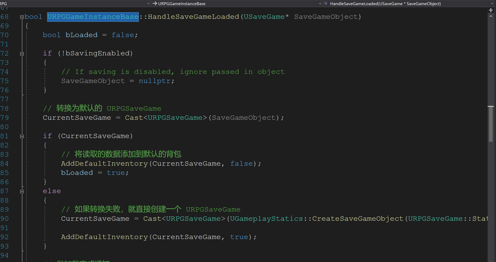

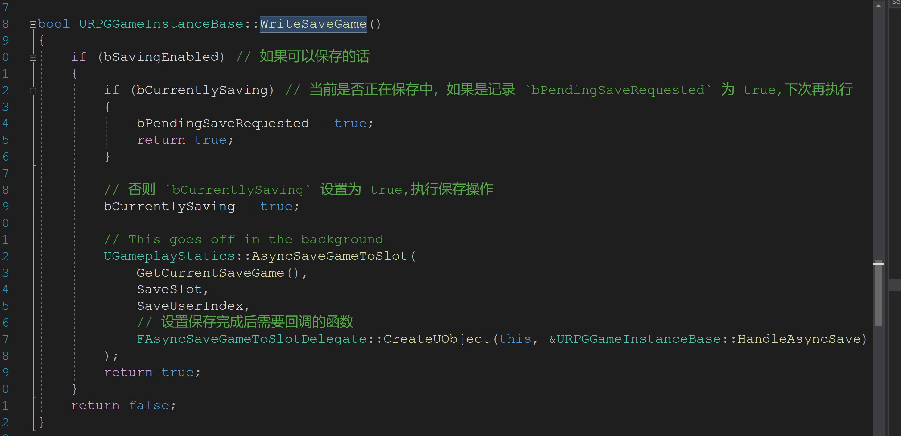

## 2 加载商品信息

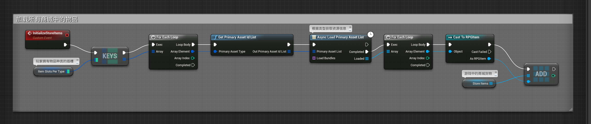

### 2.1 ItemSlotsPerType

商场中的物品种类，定义在`URPGGameInstanceBase`中，在`BP_GameInstance`中做初始化：

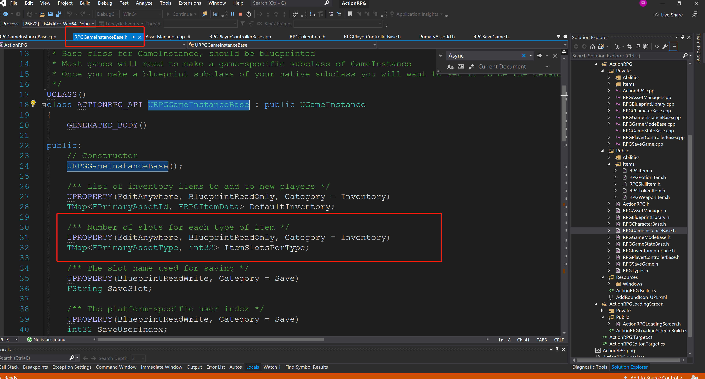

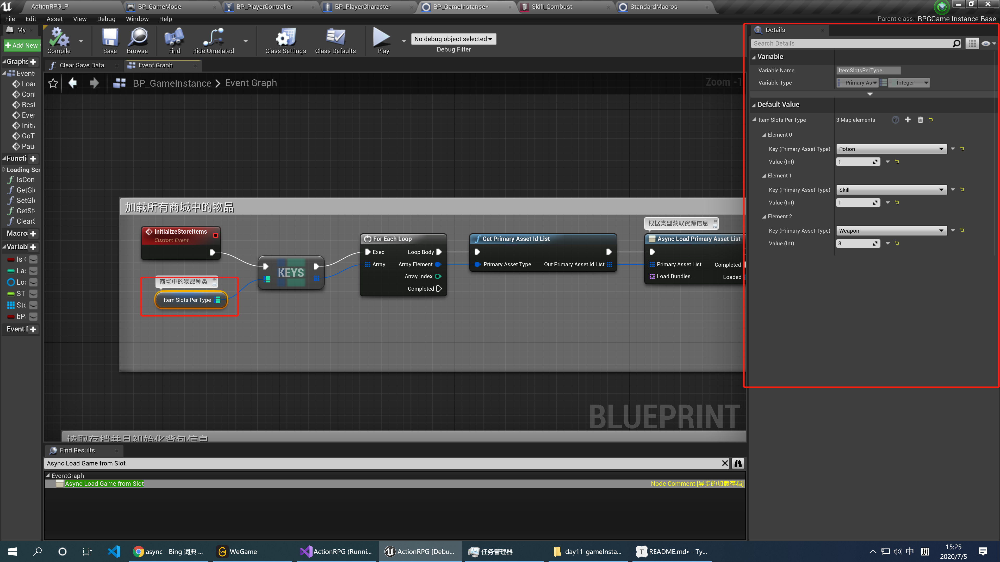

### 2.2 资源的真正位置

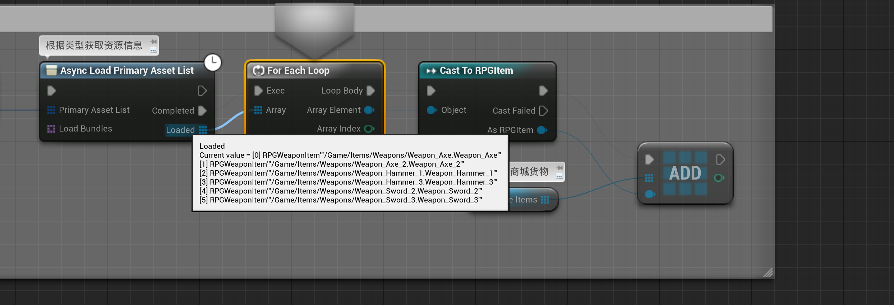

尝试断点追着武器信息，发现加载出六种武器，其实这些资源(包括武器)真正位置存储在这里:

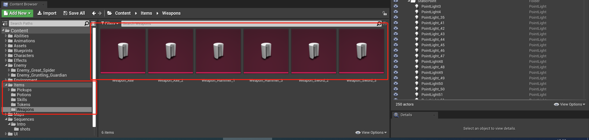

### 2.3 StoreItems

商城中的物品信息，一个`RPGItem`的数组，在蓝图中定义。

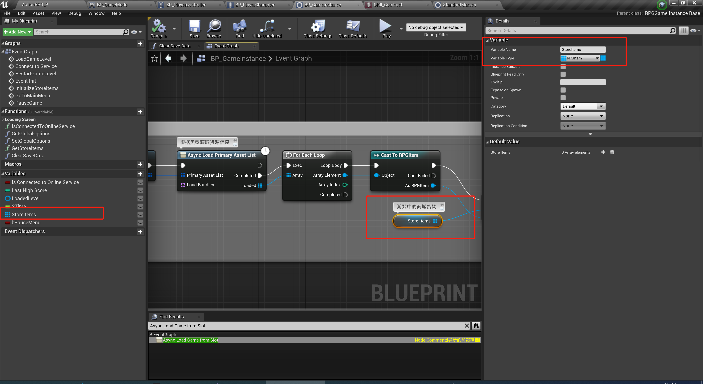