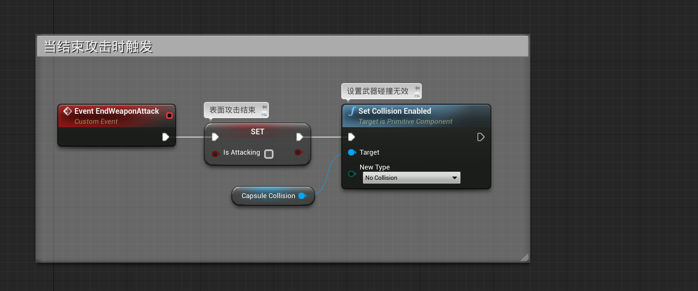

# 游戏中的武器基类——WeapActor

我们让游戏暂停，便可以看到玩家持有的武器


## 1 Weapon Actor

所有的武器在场景中都是一个`Actor`,玩家可以持有他，他们都有一个共同的基类为`WeaponActor`


项目中的武器的碰撞是胶囊体：


### 1.1 BeginPlaye


### 1.2 Event BeginWeaponAttack


### 1.3 Event EndWeaponAttack



### 1.4 ActorBeginOverlap 和 ActorEndOverlap


#### 1.4.1 ConsumeWeapon


#### 1.4.2 HitPause


#### 1.4.3 ConsumeWeapon 中的 RemoveInventoryItem

```c++
bool ARPGPlayerControllerBase::RemoveInventoryItem(URPGItem* RemovedItem, int32 RemoveCount)
{
	if (!RemovedItem)
	{
		UE_LOG(LogActionRPG, Warning, TEXT("RemoveInventoryItem: Failed trying to remove null item!"));
		return false;
	}

	// Find current item data, which may be empty
	FRPGItemData NewData;
	GetInventoryItemData(RemovedItem, NewData);

	if (!NewData.IsValid())
	{
		// Wasn't found
		return false;
	}

	// If RemoveCount <= 0, delete all
	if (RemoveCount <= 0)
	{
		NewData.ItemCount = 0;
	}
	else
	{
		NewData.ItemCount -= RemoveCount;
	}

	if (NewData.ItemCount > 0)
	{
		// Update data with new count
		InventoryData.Add(RemovedItem, NewData);
	}
	else
	{
		// Remove item entirely, make sure it is unslotted
		InventoryData.Remove(RemovedItem);

		for (TPair<FRPGItemSlot, URPGItem*>& Pair : SlottedItems)
		{
			if (Pair.Value == RemovedItem)
			{
				Pair.Value = nullptr;
				NotifySlottedItemChanged(Pair.Key, Pair.Value);
			}
		}
	}

	// If we got this far, there is a change so notify and save
	NotifyInventoryItemChanged(false, RemovedItem);

	SaveInventory();
	return true;
}
```

#### 1.4.4 GetInventoryItemData


#### 1.4.5 GetInventoryItemCount

