# GamePlayTag初步和游戏中的各种武器

记得昨天的蓝图里出现了这个东西：

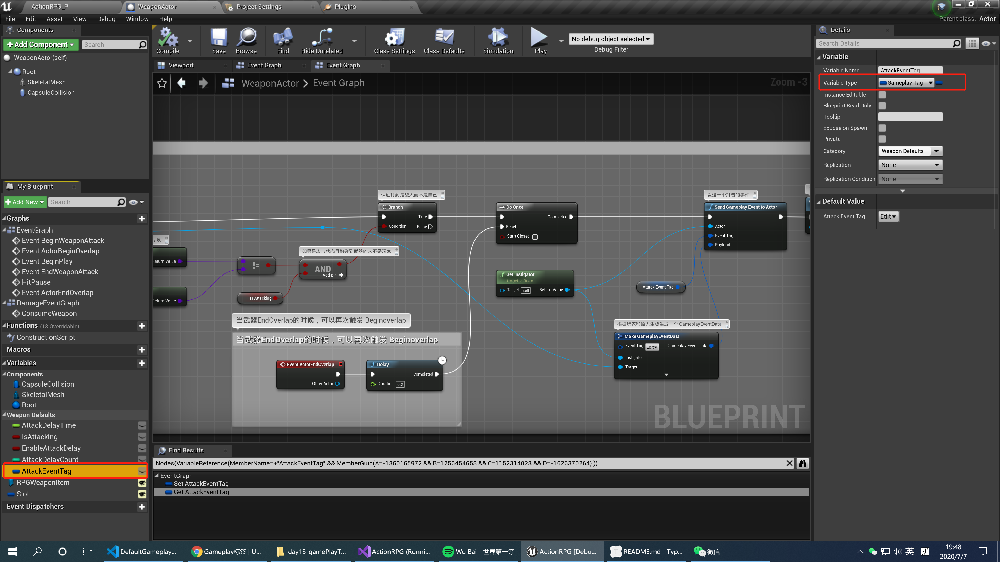

这个`GamePlayTag`是个什么东西，老师好像没说过，赶快去看文档。

## 1 GamePlayTag

### 1.1 文档解释

https://docs.unrealengine.com/zh-CN/Gameplay/Tags/index.html

以上是文档的链接，反正我们看的迷迷糊糊，大概知道他是用来区分层级用的。

**Gameplay标记** 是概念性分层标签，使用用户定义的名称。这些标记可以有任意数量的分层级别，以“.”符号分隔，例如，有三个级别的Gameplay标记将采用形式“Family.Genus.Species”，其中“Family”是这个层级中最广泛的标识符，而“Species”是最具体的标识符。请注意，“Family.Genus.Species”的存在暗示着“Family.Genus”和“Family”Gameplay标记也存在。单个标记是轻量级的，使用类型[`FGameplayTag`](https://api.unrealengine.com/INT/API/Runtime/GameplayTags/FGameplayTag/index.html) 。由于游戏对象经常有多个标记，因此提供了 **Gameplay标记容器**（使用类型[`FGameplayTagContainer`](https://api.unrealengine.com/INT/API/Runtime/GameplayTags/FGameplayTagContainer/index.html) ），它可以处理多种附加查询。Gameplay标记（或Gameplay标记容器）可以添加到任意项目，将对象与概念标签关联起来，继而使用标签来为您的项目识别、匹配、分类或过滤对象（根据需要）。

### 1.2 游戏中的配置

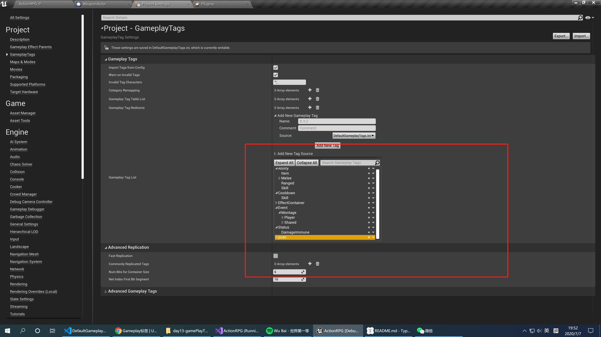

其中`yuan`是我自己添加的，大家忽略掉，这里似乎定义了不少分层，我们来翻译一下：

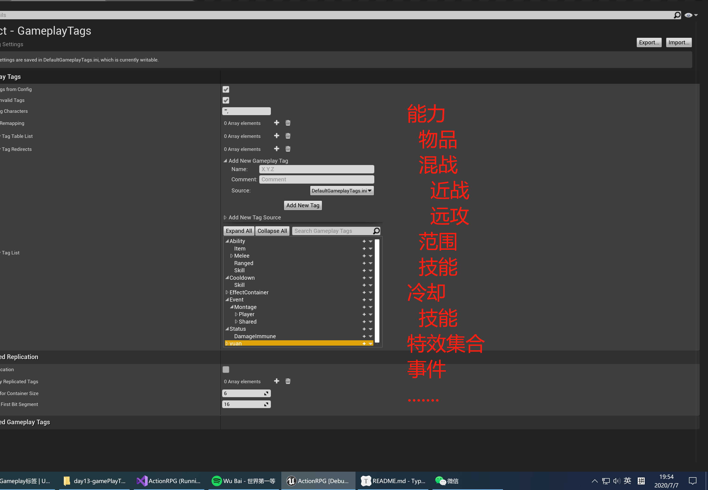

粗略的一看，好像和游戏中的技能、特效、攻击有关系，就先研究到这里吧，反正后面总会找到的。

## 2 游戏中的各种武器

完了这么久的游戏，一只不知道游戏在武器放在哪里，今晚我们就去开开眼。这些武器都继承我们昨天讲的`WeaponActor`

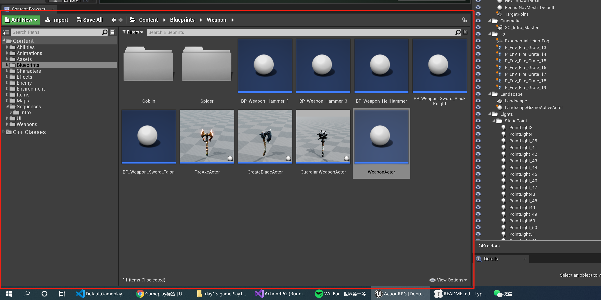

### 2.1 Hammer（锤子）

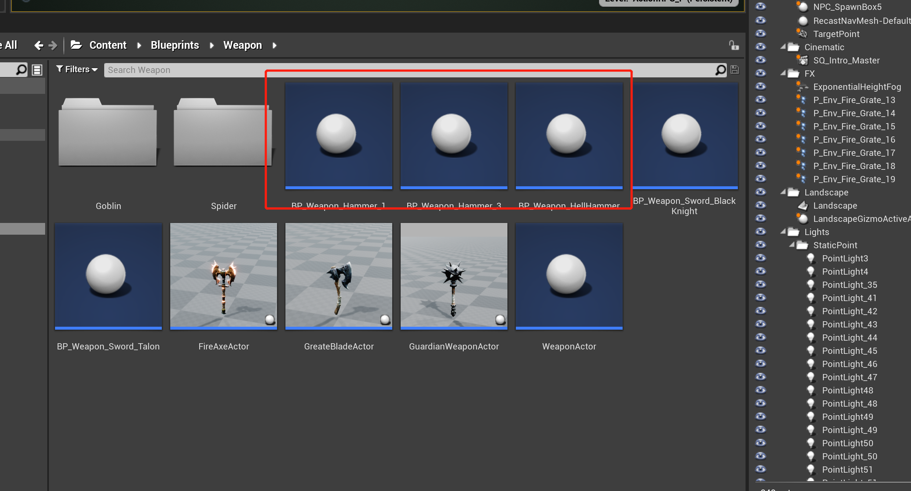

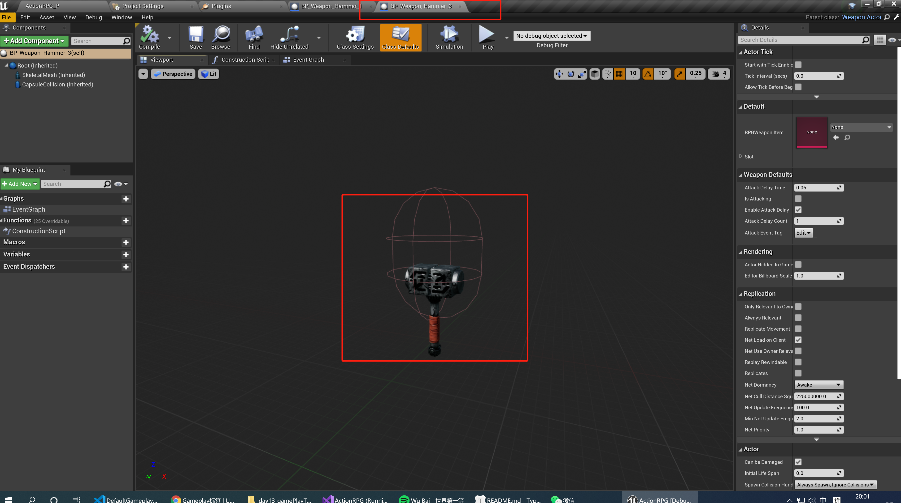

### 2.2 Sword(剑)

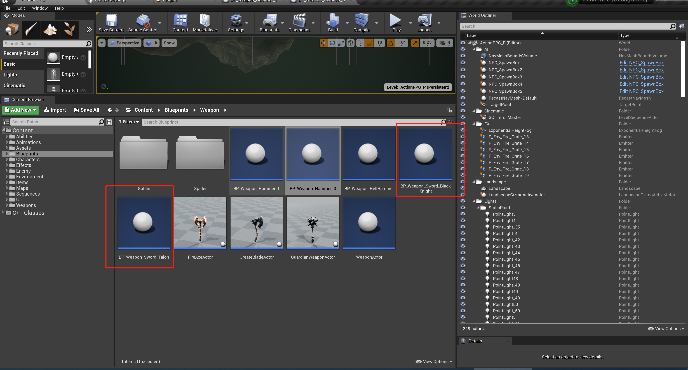

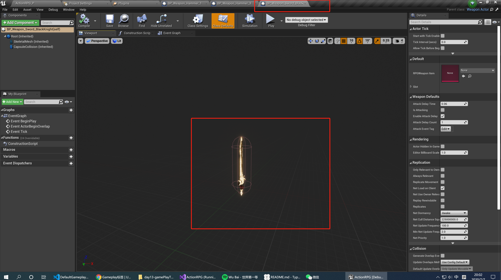

### 2.3 Axe(斧头)

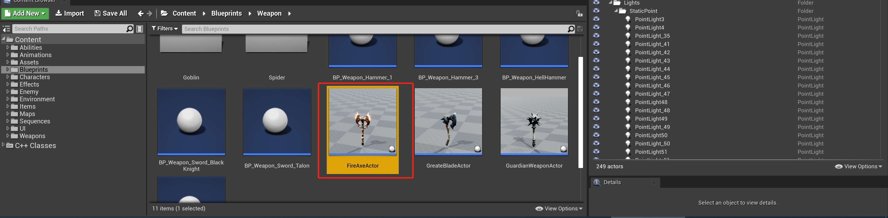

### 3 武器是数据

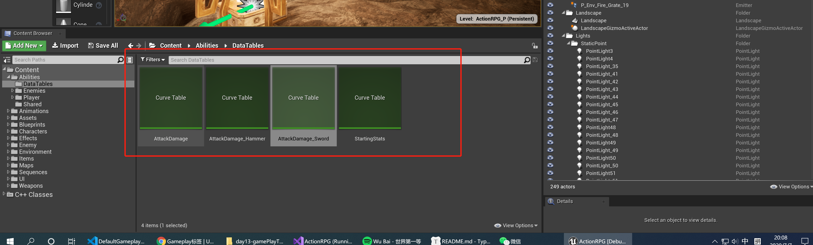

### 3.1 剑的伤害数据

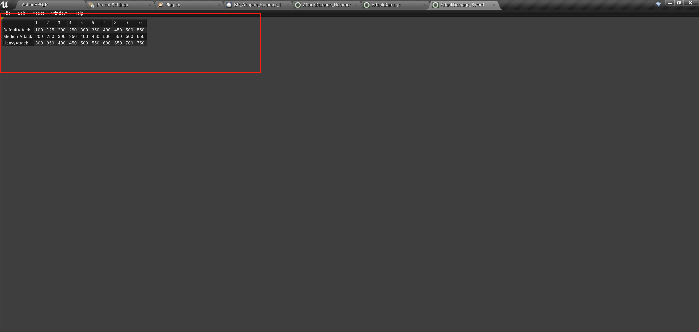

这里我们似乎只能区分普通攻击、中度攻击和重型攻击的各种数值，但我想我们稍后可以在游戏中使用他们（现在还不不知道他们怎么用的）。

## 3 技能插件

今天在搜索`GamePlayerTag`的时候发现，我们竟然使用这个插件：

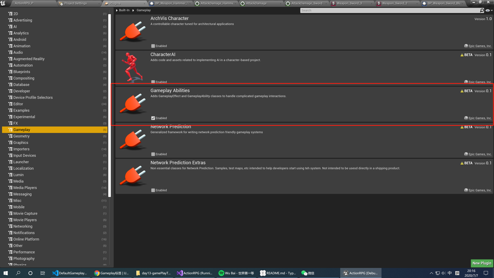

然后看一下文档：

https://docs.unrealengine.com/zh-CN/Gameplay/GameplayAbilitySystem/index.html

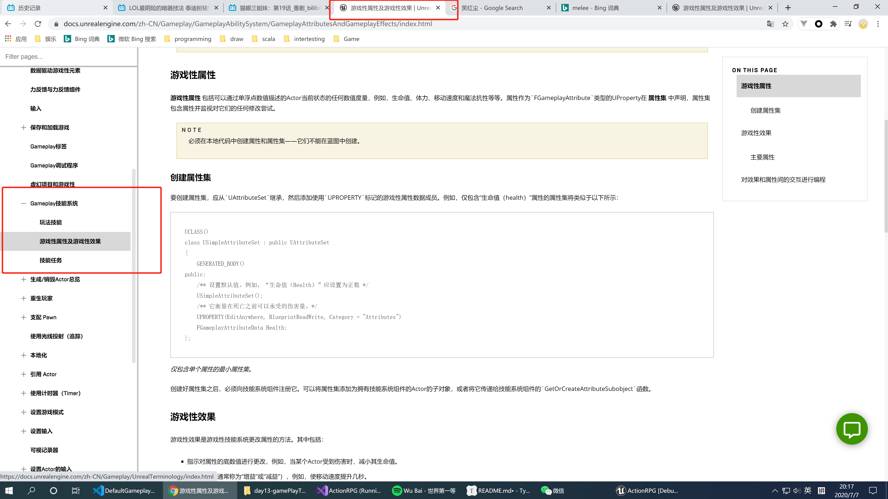

然后再C++ 就有这么一大堆代码：

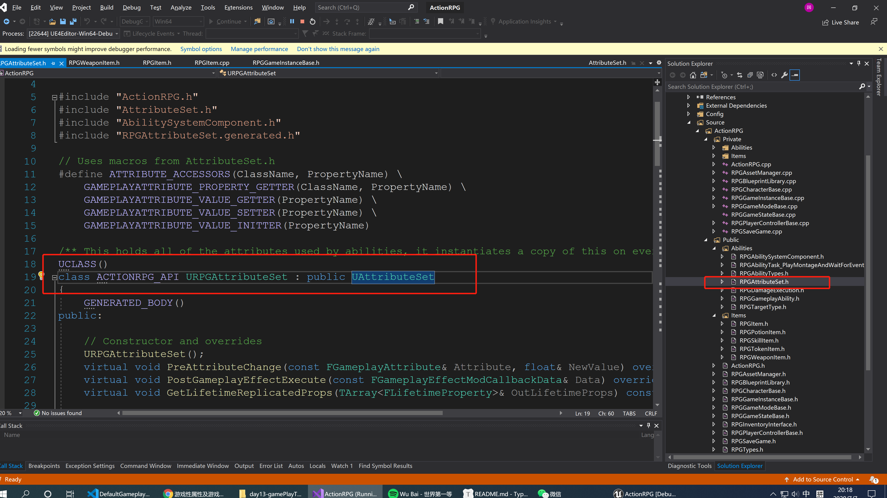

是不是和文档的很类似？开心吗，兴奋吗？

我们还是以后在研究吧