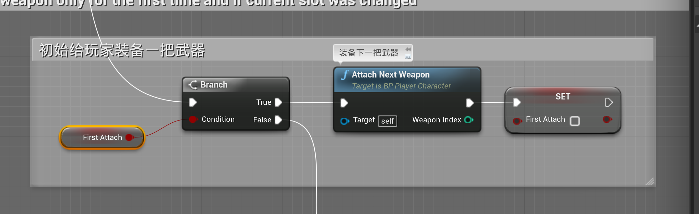
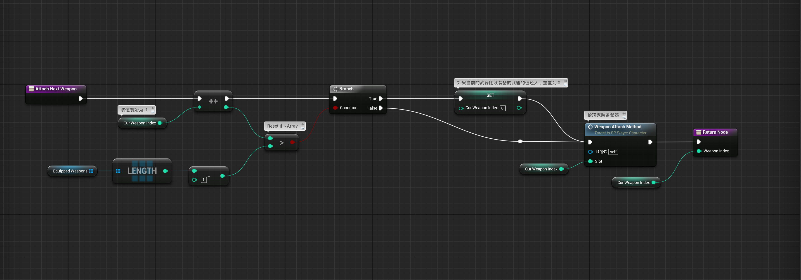
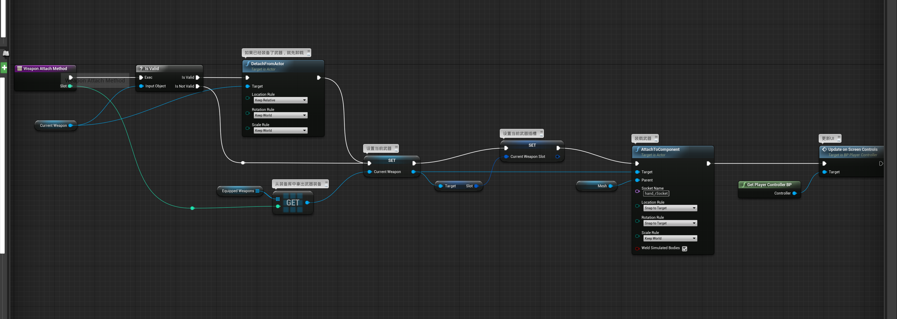
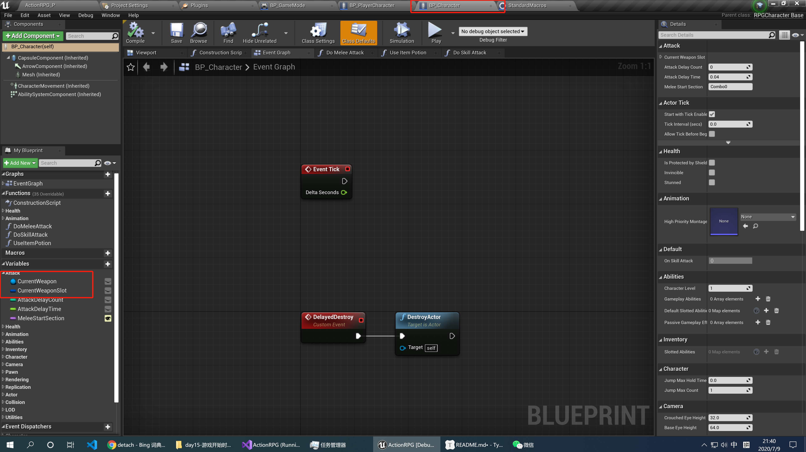

# 游戏开始时默认给玩家装备一把武器

## 1 Attack Next Weapon(装备下一把武器)

## 2 给当前的 slot 装备武器

## 3 继承关系的说明

在上面的蓝图中，我们看见`currentWeapon`和`currentWeaponSlot`等属性，他们但是在`BP_PlayerCharacter` 中找不到，他们在父类`BP_Character`中定义。

