# 怪物生成和关卡加载

## 1 加载关卡

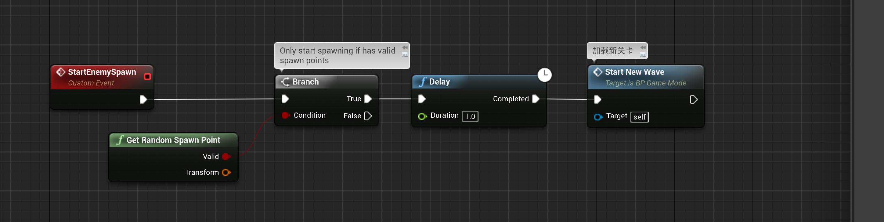

### 1.1 GetRandomSpawnPoint

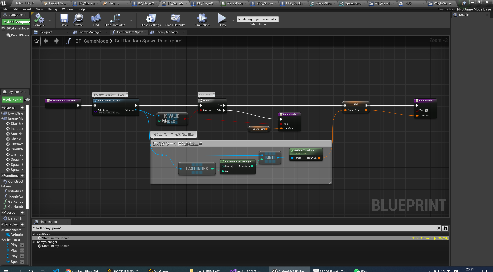

### 1.2 StartNewLevel

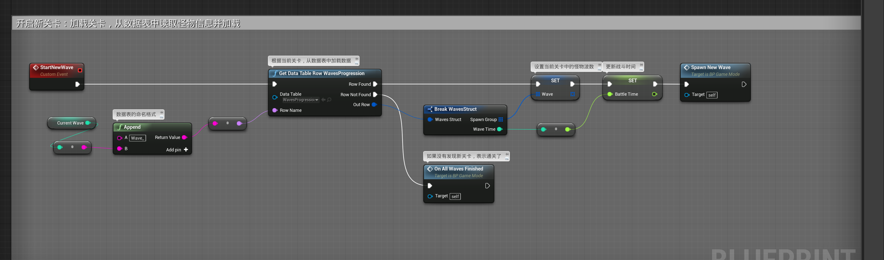

### 1.3 SpawnNewWave

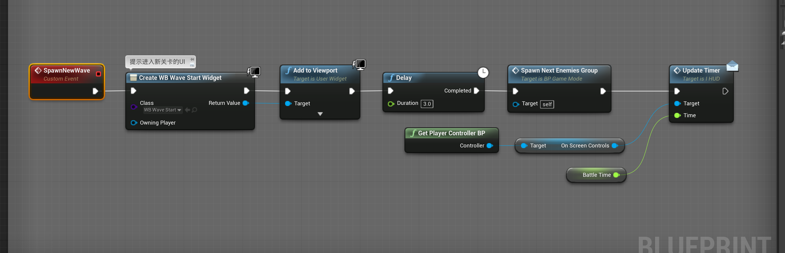

### 1.4 通关

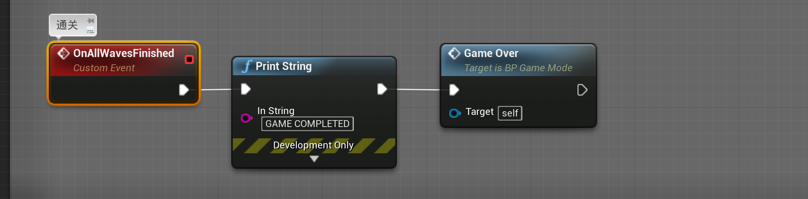

### 1.5 GameOver

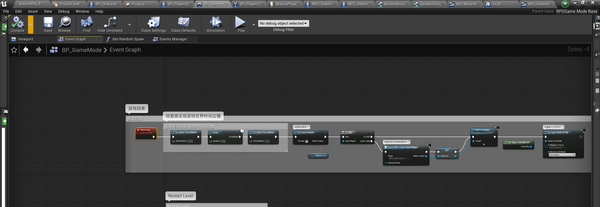

产生的UI:

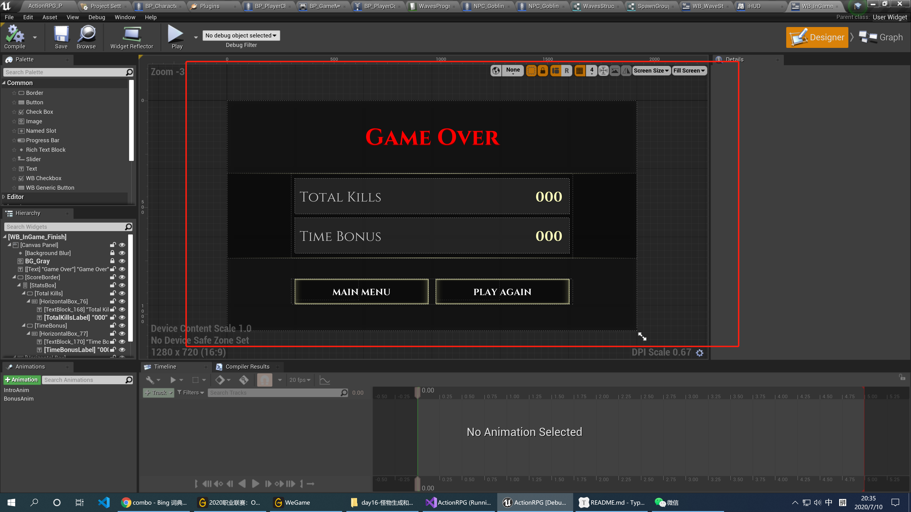

### 1.5 SpawnNewWave

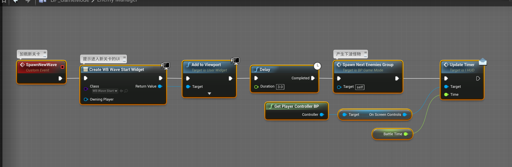

显示的UI:

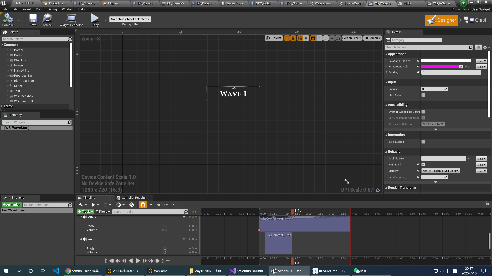

### 1.6 SpawnNextEnemiesGroup( 产生下一组野怪)

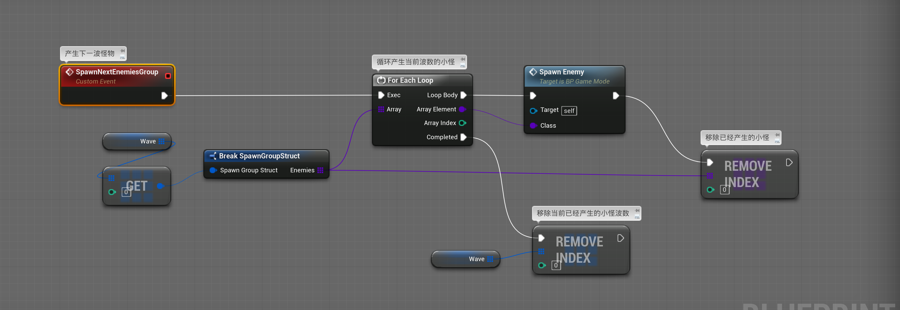

### 1.7 Spawn Enemy

产生具体的某一只野怪

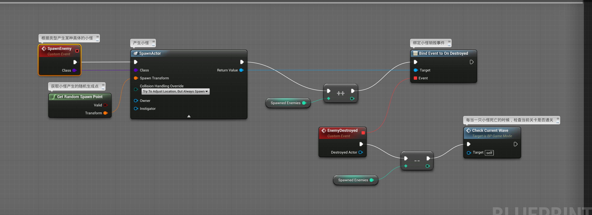

### 1.8 CheckCurrentWave

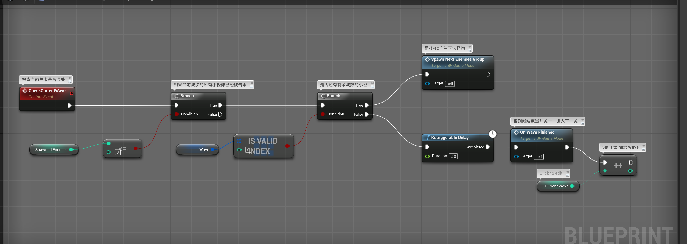

### 1.9 OnWaveFinish

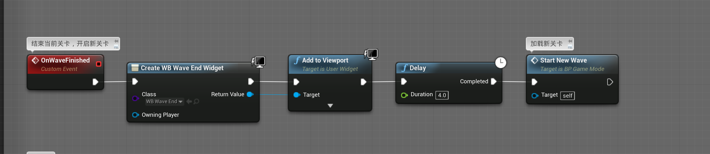

对应的UI:

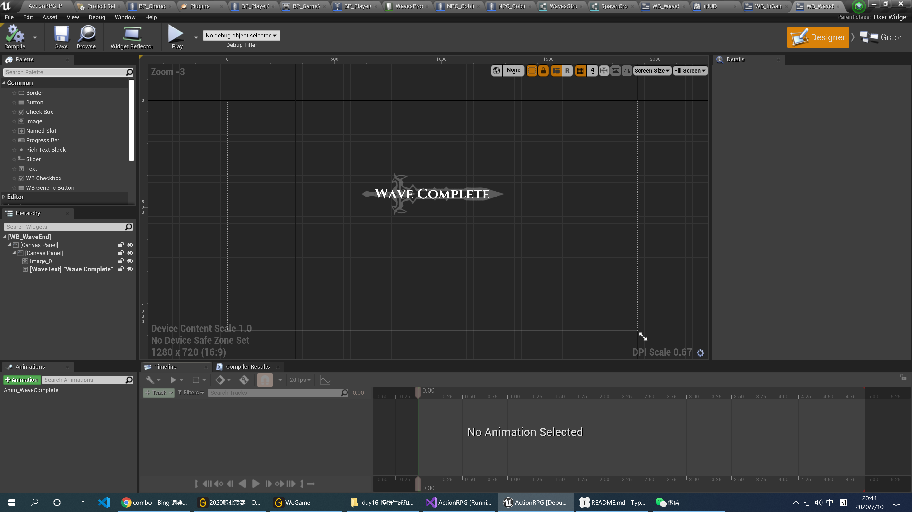

### 1.10 Increase NPC Kill Count

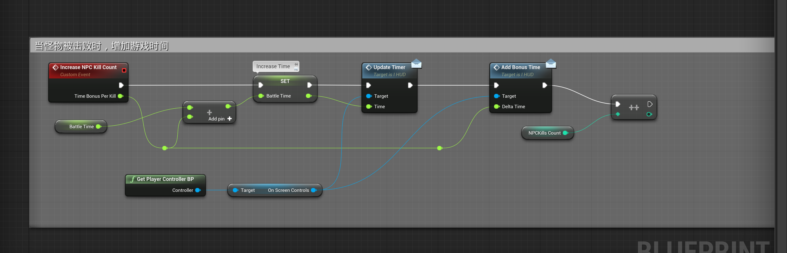

UI中的add Bonus Time ：

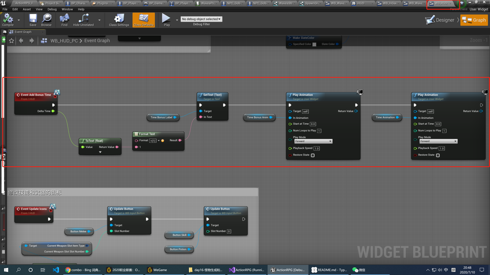