# 怪物波数数据表格

在上一天产生怪物的蓝图中，我们发现怪物的数据全部从这里读取，我们今天就来看看具体的怪物数据

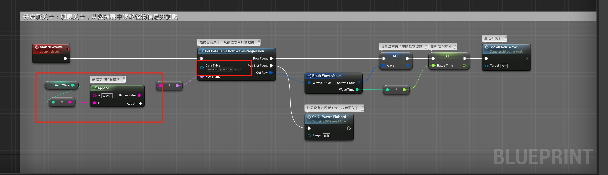

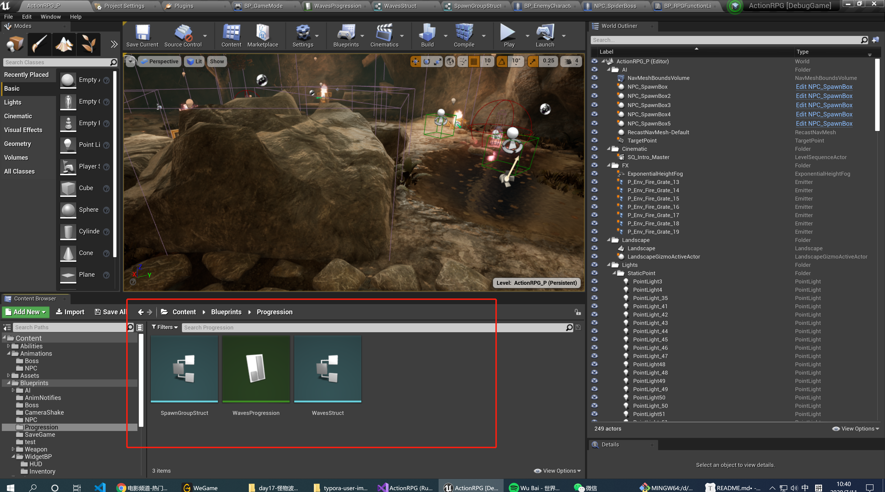

## 1 WavesProgression

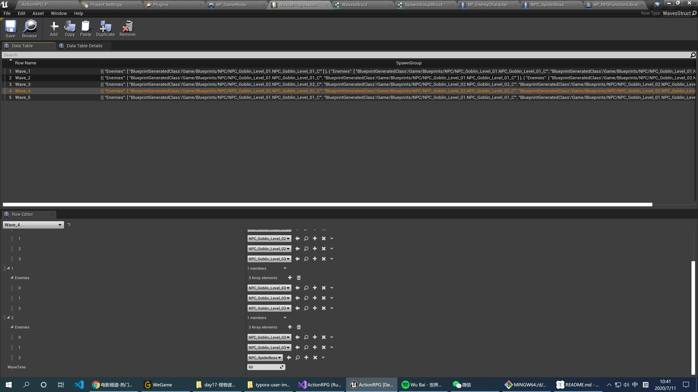

所有怪物生成的数据表，`Wave_xx` 代表第几关，每关又会分`波数`产生怪物，途中的`Wave_4`的三个数组分别代表每波怪物的类型，可以看到最后一个怪物是`SpideBoss`

在看一下这个数据表的类型，是`WaveStruct`的结构体

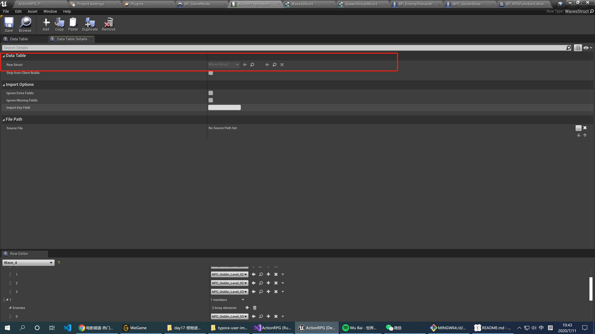

## 2 WaveStruct

这里面定义了每关的怪物波次的数字以及每关给的通关时间，而`SpawnGroup`又使用了`SpawnGroupStruct`的结构体。

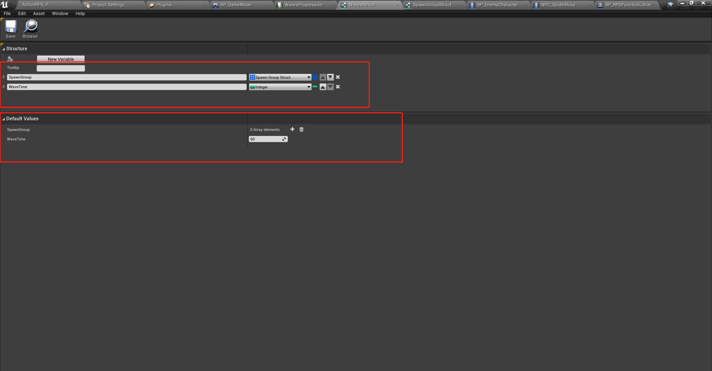

## 3 SpawnGroupStruct

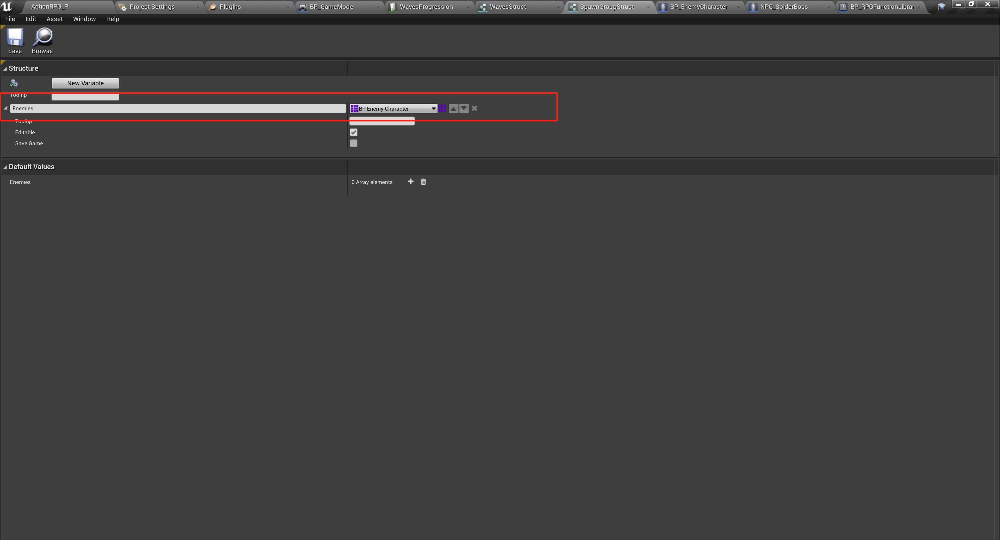

这个结构体很简单，只是一个怪物角色的数组。

## 4 游戏中的怪物角色

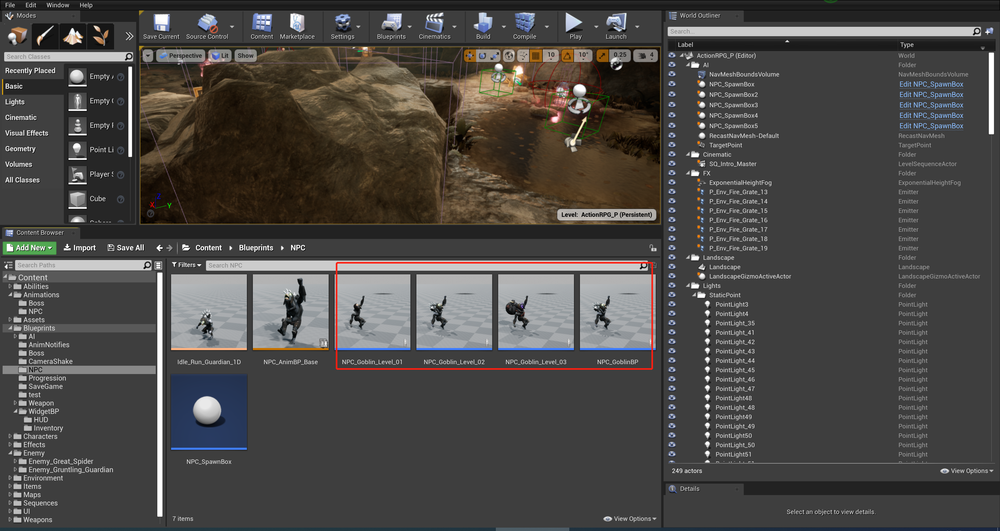

上面都是不同关卡产生的怪物类型，他们的父类是`NPC_GobinBP`:

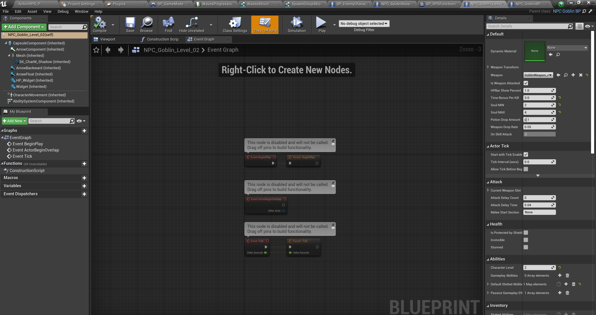

而`NPC_GobinBP`的父类是`BPEnemyCharacter`

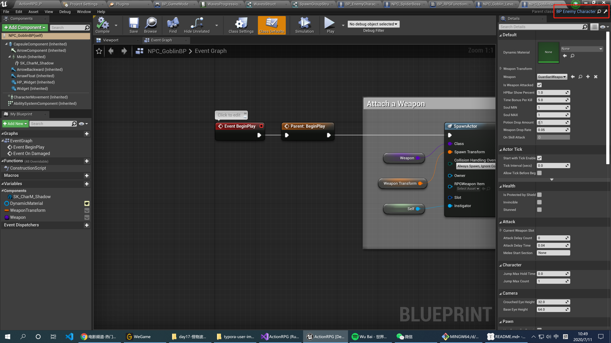

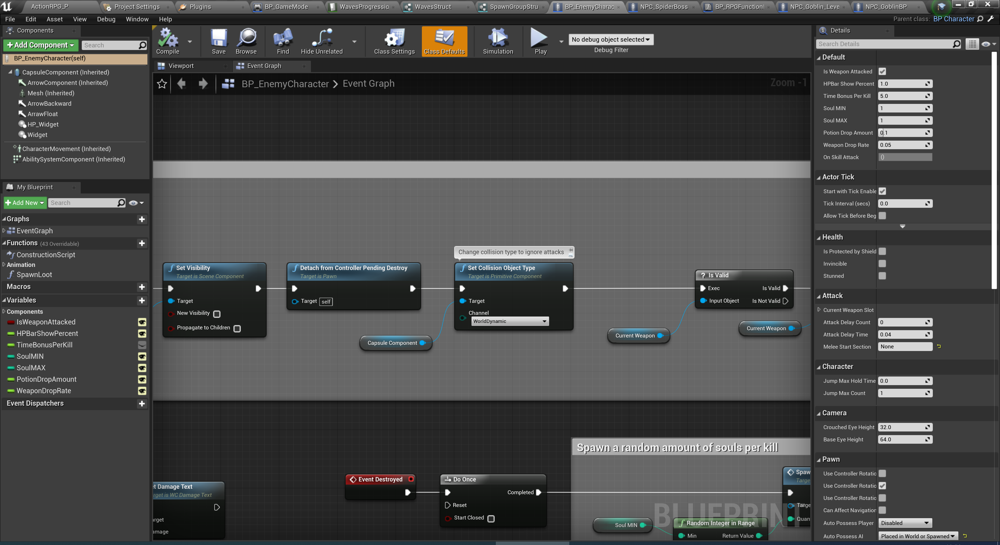

这个东西我们下回再研究，再来看看最后的蜘蛛BOSS：

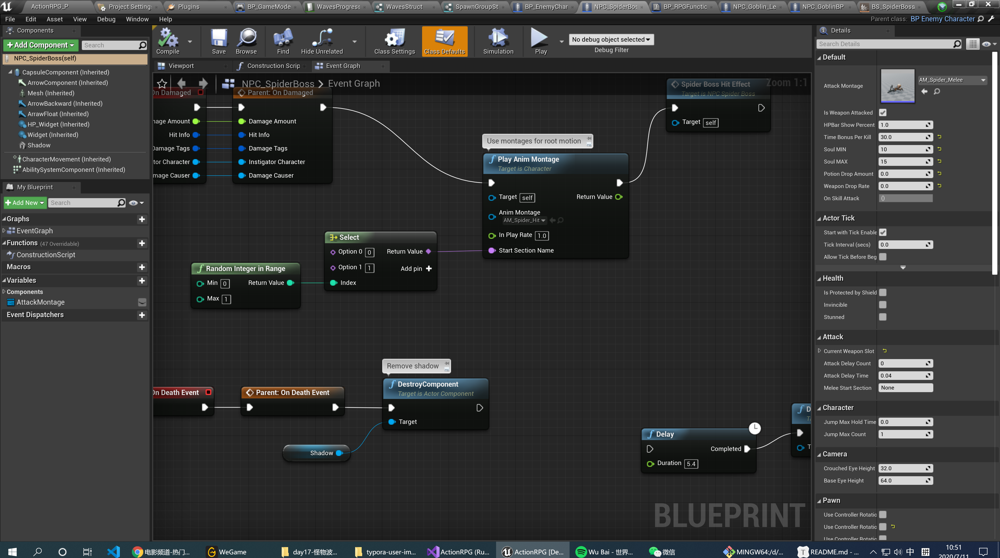