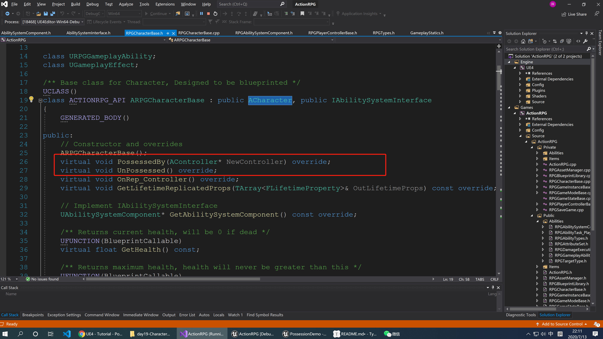
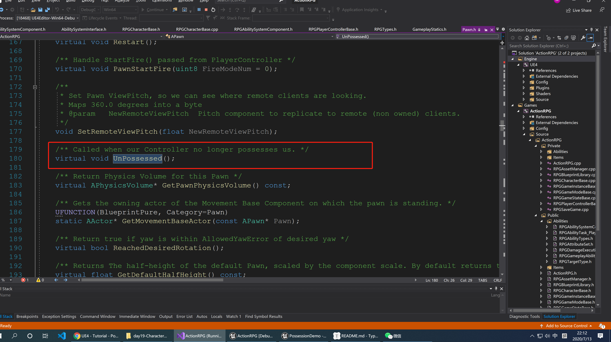
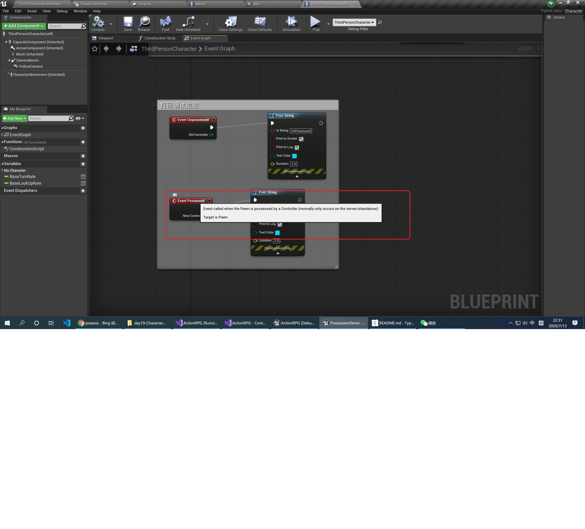
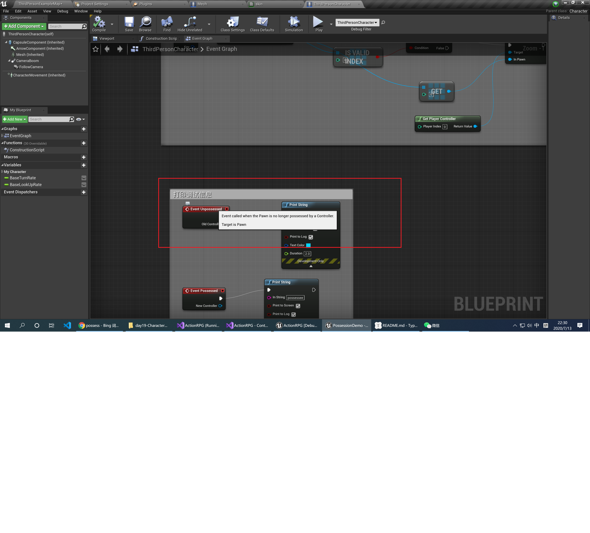
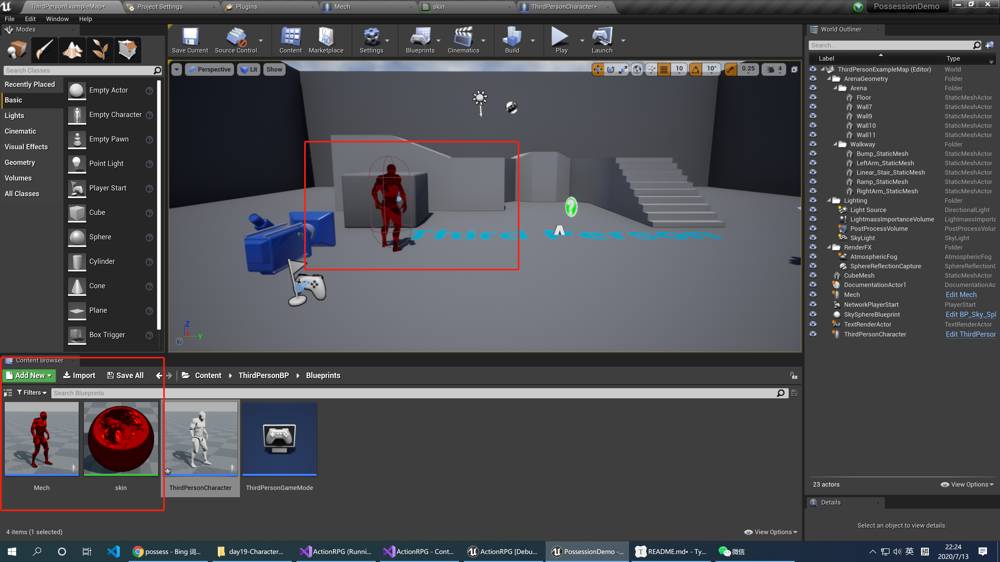
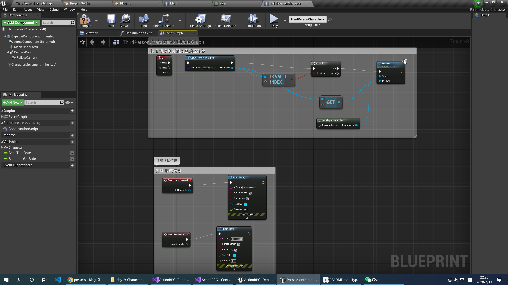
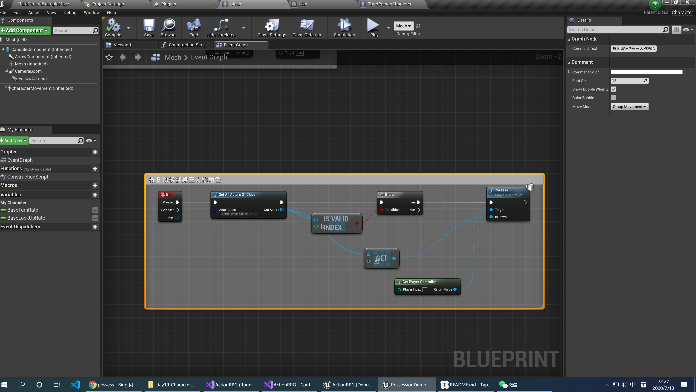
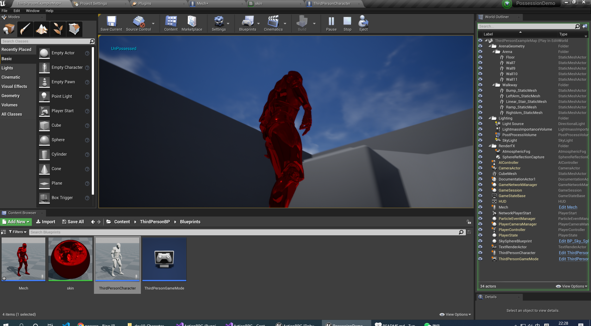
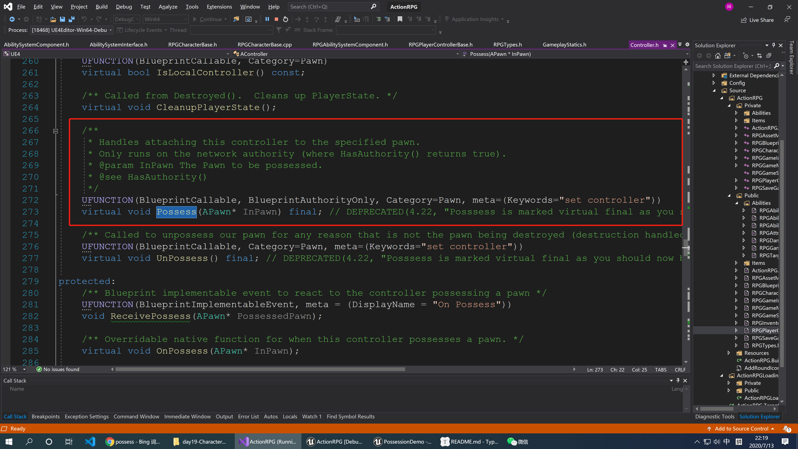
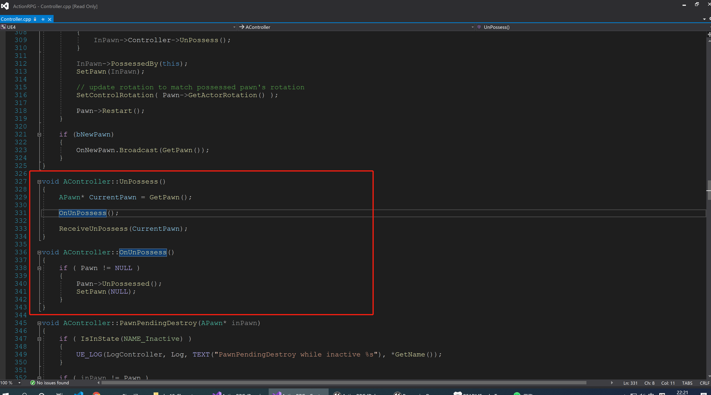

# Character 中的 Possessed 和 UnPossessed

昨天分析代码中，发现这两个函数，一直不知道他们是如何运行的，今天我们来实际测试一下：

其实这两个函数来自与`Pawn`：

根据注释的解释，这两个函数应该是当玩家控制/不控制当前角色的时候调用。我们可以使用蓝图演示一下，他们在蓝图中对应的节点：

## 1 蓝图效果演示

建立一个第三人称模板，将第三人称角色复制一份，改个名字，加一个不同的材质：

### 1.1 再第三人称角色中按E切换到复制角色

### 1.2 在复制的角色中按 E 切换到第三人称角色

### 1.3 验证调试结果

切换到复制角色时调用了`UnPossessed`

切换到第三人称角色时调用`Possessed`

结论：和注释说明的一样，在控制角色调用`Possessed`,在离开控制时调用`UnPossessed`。

## 2 源码追踪

我们追一下他的实现：

发现她手动的调用了`pawn`中的`ProcessBy`方法，而`UnPossess`也是一样的

