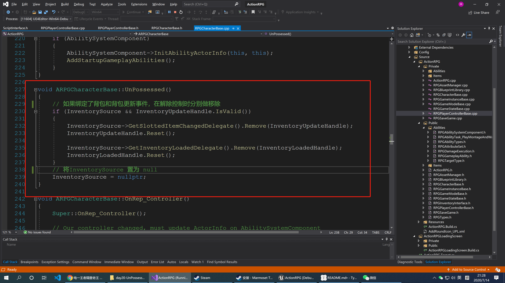
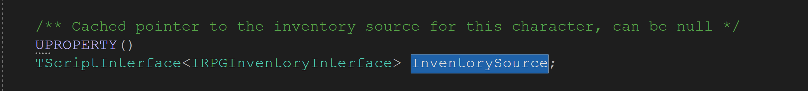
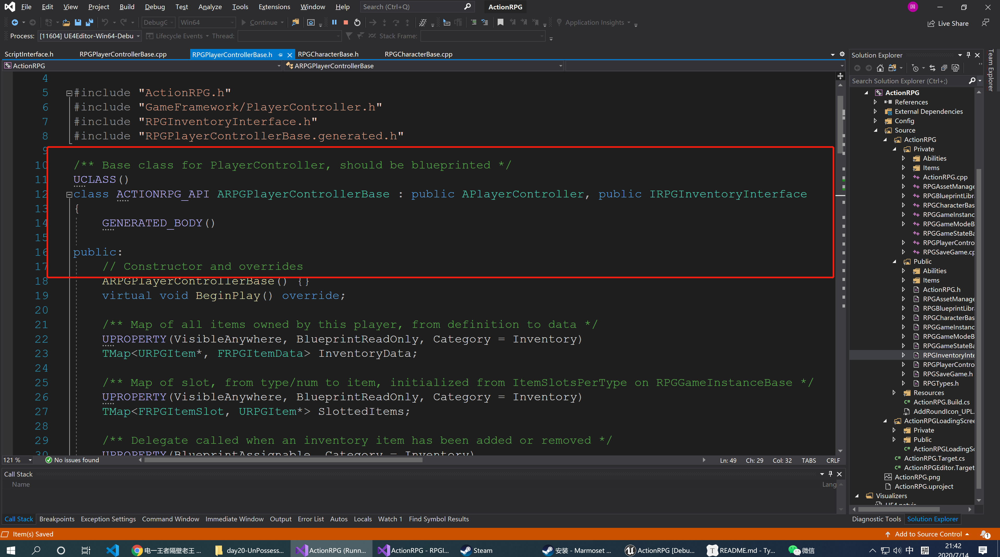
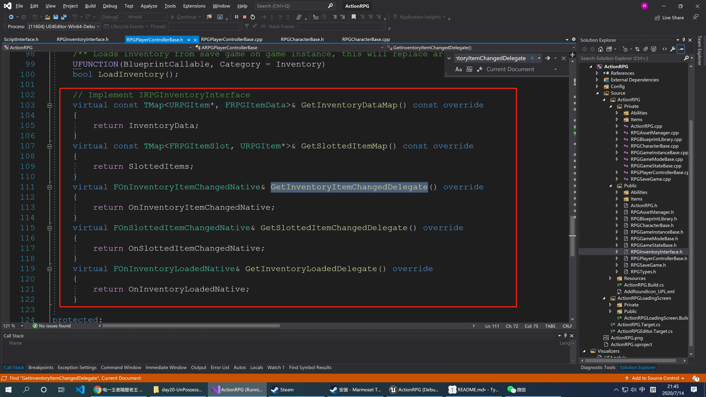
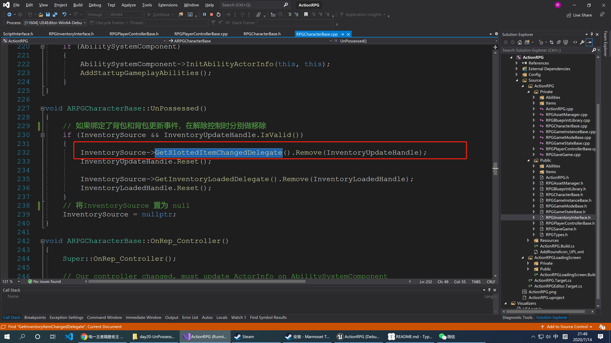
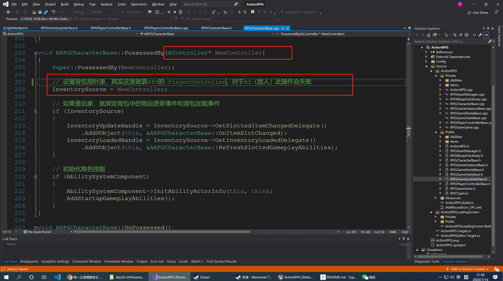
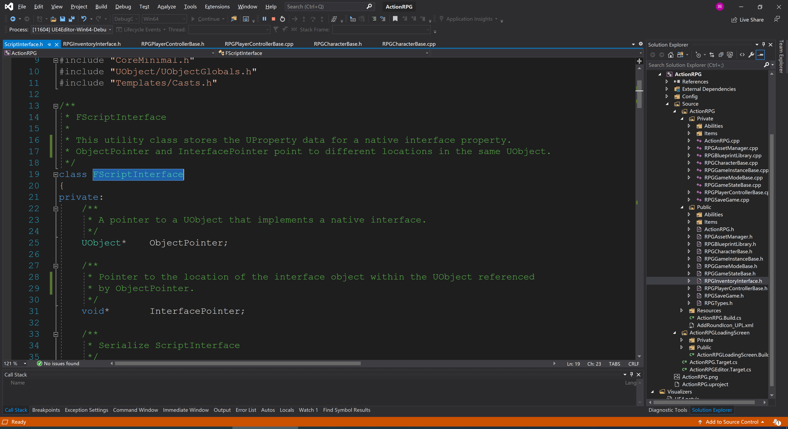
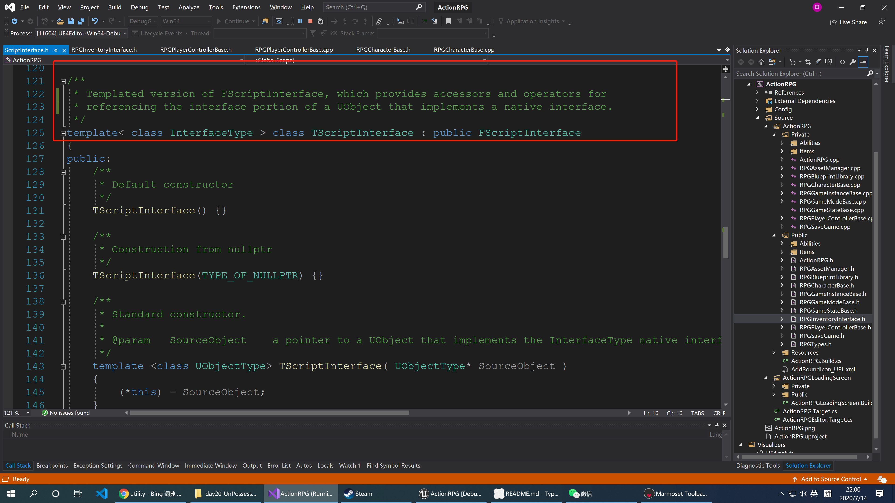

# UnPossessed的实现和TScriptInterface



实现的原理其实很简单，就是如果之前绑定了背包相关指针源和背包更新事件，这里做解绑和置空处理。但是这里我们需要注意`InventorySource`的类型，她竟然是：



这是一个脚本接口类型，并且还带了`IRPGInventoryInterface`类型，我们逐步来分析一下


## 1 URPGInventoryInterface

```c++
// Copyright 1998-2019 Epic Games, Inc. All Rights Reserved.

#pragma once

#include "ActionRPG.h"
#include "RPGInventoryInterface.generated.h"

/**
 * Interface for actors that provide a set of RPGItems bound to ItemSlots
 * This exists so RPGCharacterBase can query inventory without doing hacky player controller casts
 * It is designed only for use by native classes
 * 
 * 对Actor 来说提供了一些列 RPGItes 绑定到 ItemsSlots 的方法
 * 这个接口存在的目的在于 `RPGCharacterBase` 不需要做任何关于 `PlayerController`的转换就可以去查询背包
 * 该接口被设计只针对C++代码有效
 */
UINTERFACE(MinimalAPI, meta = (CannotImplementInterfaceInBlueprint))
class URPGInventoryInterface : public UInterface
{
	GENERATED_BODY()
};

class ACTIONRPG_API IRPGInventoryInterface
{
	GENERATED_BODY()

public:
	/** 
	* Returns the map of items to data 
	* 
	* 返回商品信息和商品数据的 map 映射
	*/
	virtual const TMap<URPGItem*, FRPGItemData>& GetInventoryDataMap() const = 0;

	/**
	* Returns the map of slots to items
	*
	* 返回 UI 插槽和商品信息的 map 映射
	**/
	virtual const TMap<FRPGItemSlot, URPGItem*>& GetSlottedItemMap() const = 0;

	/**
	* Gets the delegate for inventory item changes
	*
	* 获取商品改变的会话
	*/
	virtual FOnInventoryItemChangedNative& GetInventoryItemChangedDelegate() = 0;

	/** 
	* Gets the delegate for inventory slot changes 
	*
	* 获取商品插槽变更的会话
	*/
	virtual FOnSlottedItemChangedNative& GetSlottedItemChangedDelegate() = 0;

	/**
	* Gets the delegate for when the inventory loads
	* 
	* 获取背包被加载的会话
	*/
	virtual FOnInventoryLoadedNative& GetInventoryLoadedDelegate() = 0;
};

```


## 2 URPGInventoryInterface 的实现

而在实际的项目中，实现`URPGInventoryInterface `接口的是`ARPGPlayerControllerBase`



对应方法的实现：



在这里我们就明白了在`UnPossessed`方法中调用的`GetSlottedItemChangedDelegate` 方法，实际上是`ARPGPlayerControllerBase`里面的`GetSlottedItemChangedDelegate` 方法。



而在`PossessBy`方法中，我们清楚发现`InventorySource`其实就算被赋值为`RPGController`




## 3 对 TScriptInterface 类型的探究

 在探究`TScriptInterface `之前，我们先探究`TScriptInterface `

### 3.1 FScriptInterface



这是一个存储了C++接口中属性的功能类，对于同一个`UObject`(对象)而言，对象指针`ObjectPointer`(对象指针)和`InterfacePointer`(接口指针)会处在不同的位置。该类又两个属性对象指针`ObjectPointer`和接口指针`InterfacePointer`

### 3.2 TScriptInterface



我们的`TScriptInterface` 继承了`FScriptInterface`,而且提供了一个模板参数，代表他比`FScriptInterface` 更加通用一些。