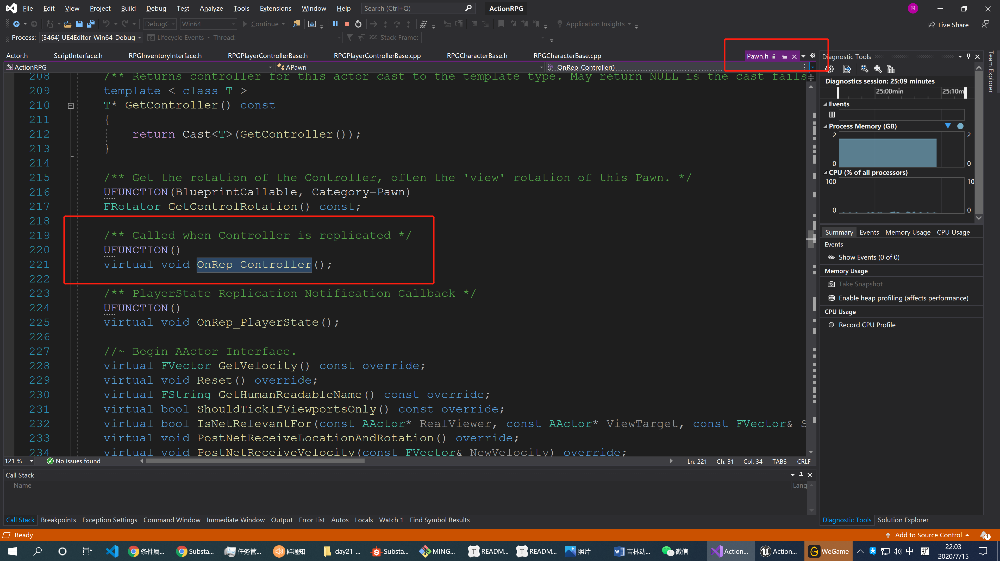
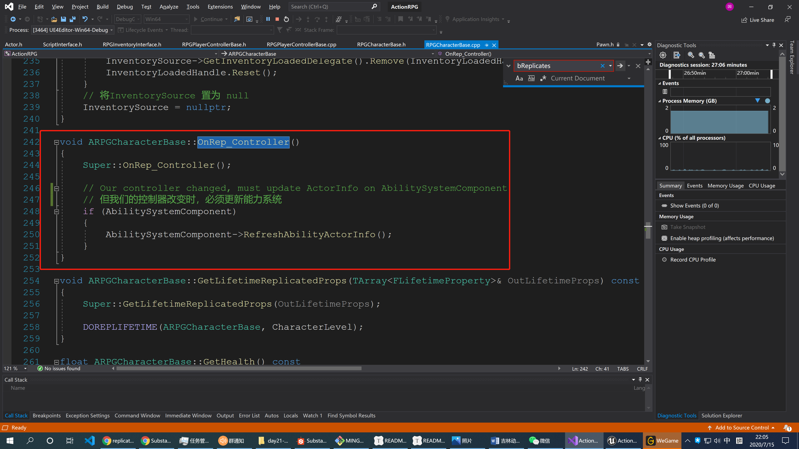
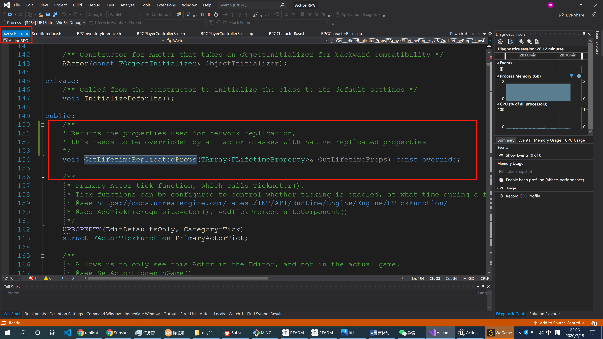
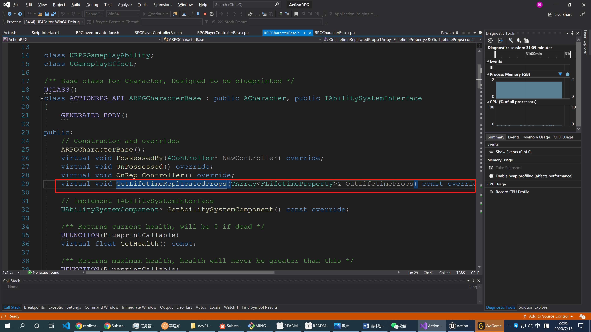
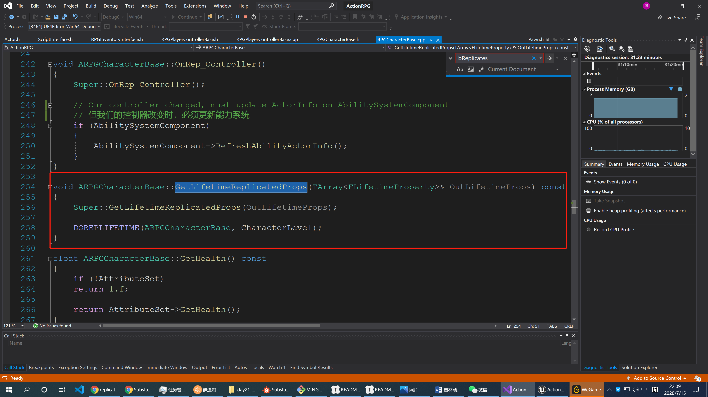
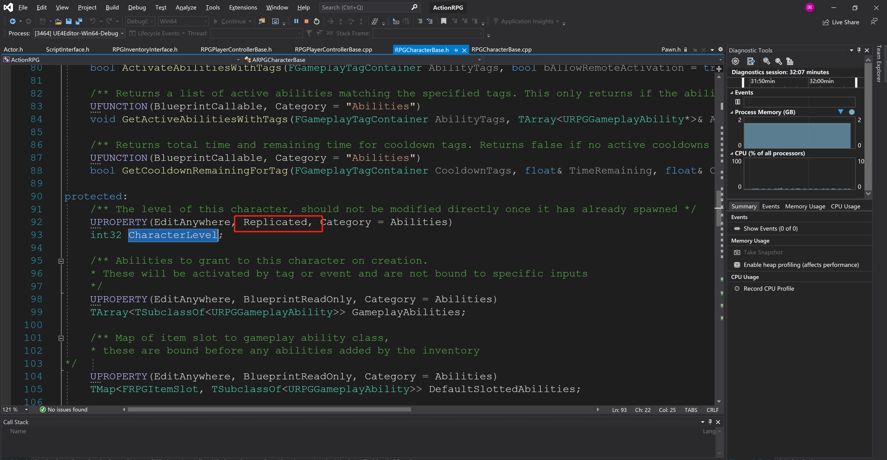
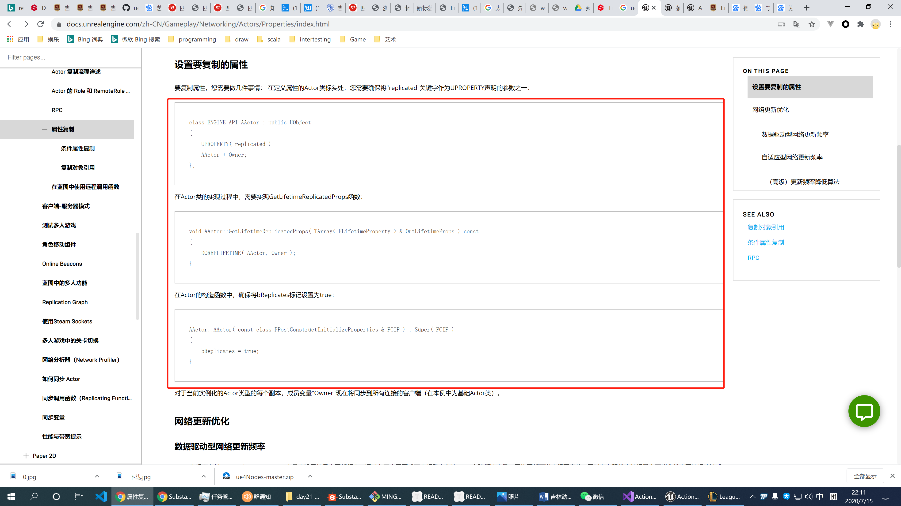
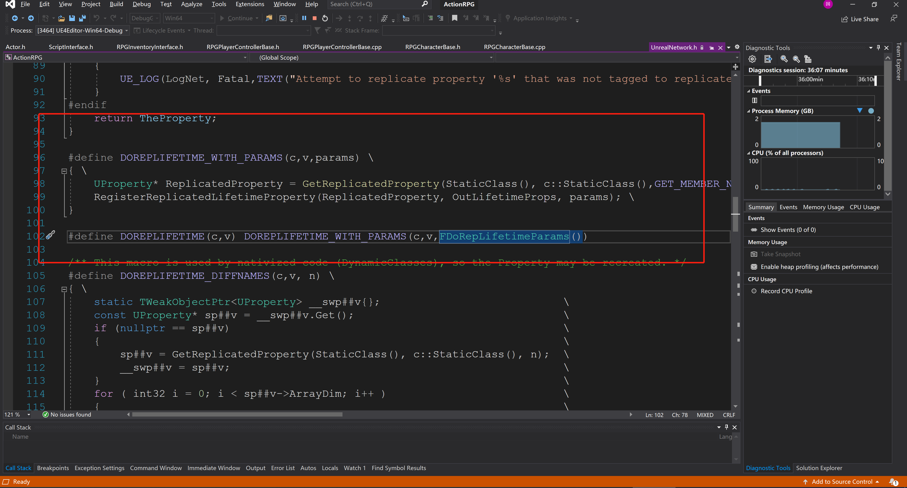

# OnRep_Controller和GetLifetimeReplicatedProps

## 1 OnRep_Controller

该方法的声音是在`pawn`里面，当控制器被复制的时候调用

下面该方法在 `ARPGCharacterBase` 声明和实现：

## 2 GetLifetimeReplicatedProps

该方法在UObject中声明，但是`Actor`中的声明更具体一点：此方法返回被用于网络复制的属性，此方法应该被所有需要网络复制的Actor 所重写。

在`ARPGCharacterBase` 我们看到此方法的重写声明和实现：

我们再看一眼`CharacterLevel`这个属性，发现他是被声明为网络复制的，因此这里需要做处理。

## 3 官方文档关于 GetLifetimeReplicatedProps 的说明

文档链接：https://docs.unrealengine.com/zh-CN/Gameplay/Networking/Actors/Properties/index.html

似乎官方文档就算这么做的：

关于`DOREPLIFETIME`，她其实是一个宏，源码如下，应该是关于网络复制这块的，这里我们不深究了。

