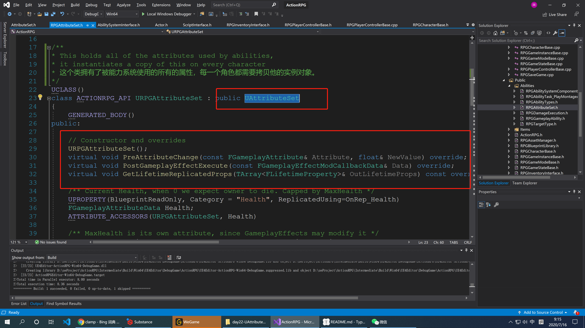
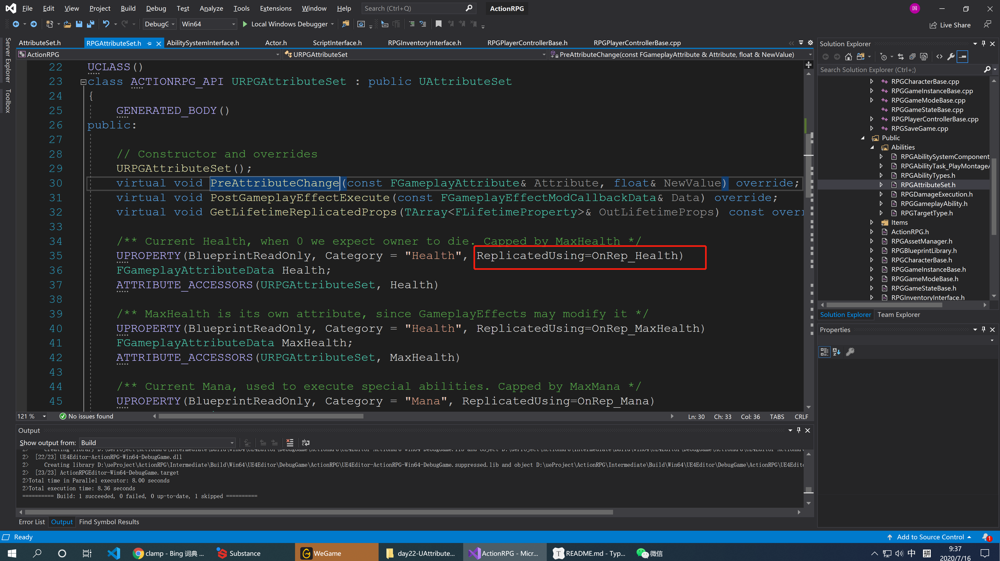

# URPGAttributeSet 初探（一）



这个类继承了`UAttributeSet`，并且重写了他的三个方法，我们来分析一下。

## 1 UAttributeSet

```c++
/**
 * Defines the set of all GameplayAttributes for your game
 * Games should subclass this and add FGameplayAttributeData properties to represent attributes like health, damage, etc
 * AttributeSets are added to the actors as subobjects, and then registered with the AbilitySystemComponent
 * It often desired to have several sets per project that inherit from each other
 * You could make a base health set, then have a player set that inherits from it and adds more attributes
 */
UCLASS(DefaultToInstanced, Blueprintable)
class GAMEPLAYABILITIES_API UAttributeSet : public UObject
{
	GENERATED_UCLASS_BODY()
}
```

我简单翻译了一些注释：

```c++
/**

 * Defines the set of all GameplayAttributes for your game
 * 在这里你可以定义一些游戏中的属性
   *
 * Games should subclass this and add FGameplayAttributeData properties to represent 
 * attributes like health, damage, etc
   *
 * 在你的游戏中，你应该去实现一个该类的子类，并且添加 FGameplayAttributeData 类型的属性去代表着你在
 * 游戏中想要定义的血量，伤害等信息。
 * 
 * AttributeSets are added to the actors as subobjects, and then registered with 
 * the AbilitySystemComponent
 * 这些属性会被添加到对于的 Actor 中作为子对象，并且稍后会被注册到能力系统中
 * 
 * It often desired to have several sets per project that inherit from each other
 * 
 * 最常见是对于每个项目来说，都要很多这样的属性集合，他们都是从彼此继承而来的。
   *
 * You could make a base health set, then have a player set that 
 * inherits from it and adds more attributes
 * 
 * 你可能会有一个基础的血量属性，然后一个玩家会继承这个基本的血量属性，并且会在他的类添加更多额外的属性。
  */
```

## 2 PreAttributeChange

```c++
/**
	 *	Called just before any modification happens to an attribute. This is lower level than PreAttributeModify/PostAttribute modify.
	 *	There is no additional context provided here since anything can trigger this. Executed effects, duration based effects, effects being removed, immunity being applied, stacking rules changing, etc.
	 *	This function is meant to enforce things like "Health = Clamp(Health, 0, MaxHealth)" and NOT things like "trigger this extra thing if damage is applied, etc".
	 *	
	 *	NewValue is a mutable reference so you are able to clamp the newly applied value as well.
	 */
	virtual void PreAttributeChange(const FGameplayAttribute& Attribute, float& NewValue) { }

```

翻译一下：

```
在某个属性被修改之前会调用此方法，并且此方法的优先级低于`PreAttributeModify`和`PostAttribute`.
这里没用额外的上下文对象被提供任何人都可以调用此方法，例如：执行特效，特效时常，特效被删除，添加护盾，改变当前的游戏规则，等等。
这个函数存在的意义在于对于可以做一些额外的校验和判断操作，例如在设置血量时，我们应该当血量的值保证在0~最大血量之间；或者是不做任何操作当伤害被触发时候。
在函数的参数中有一个`NewValue`,他应该是一个可变的引用类型，因为你需要对原值进行校验，并且返回一个正确的值给调用者。

总的这个函数可以在修改某个属性之前，例如血量，做一些校验等操作。
```

## 3 PostGameplayEffectExecute

```c++
/**
	 *	Called just before a GameplayEffect is executed to modify the base value of an attribute. No more changes can be made.
	 *	Note this is only called during an 'execute'. E.g., a modification to the 'base value' of an attribute. It is not called during an application of a GameplayEffect, such as a 5 ssecond +10 movement speed buff.
	 */
	virtual void PostGameplayEffectExecute(const struct FGameplayEffectModCallbackData &Data) { }

```

翻译一下：

```
此方法会在 GameplayEffect 被执行之前调用，而 GameplayEffect 是用来修改基本值类型属性的。没用更多的改变可以被产生了。
记住，此方法只会被调用在用于修改一些基本值类型的属性。，例如如果给角色添加一个5秒钟移动速度+10的buff,这个方法是不会被调用的。
```

## 4 GetLifetimeReplicatedProps

这是昨天讲过的获取可复制属性声明周期的方法，如果Actor中有需要复制的属性，在这里需要重写此方法。

