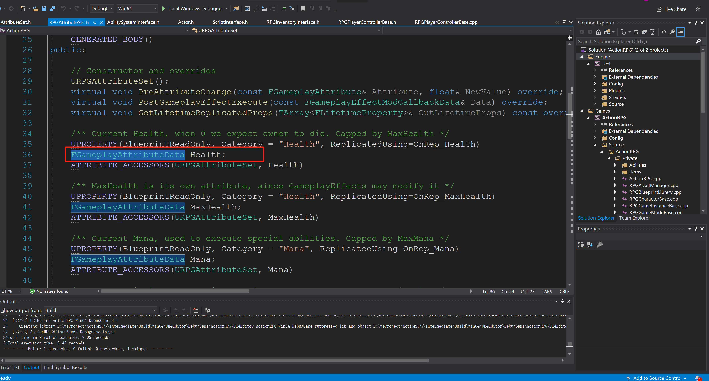
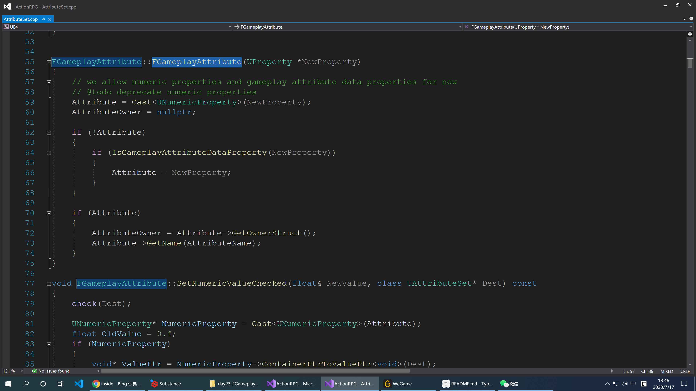

# FGameplayAttributeData和FGameplayAttribute

在我们的`URPGAttributeSet`中大量使用了`FGameplayAttributeData`的类型：



我们会在明天来研究这里面的每个属性，而今天我们先来研究一下`FGameplayAttributeData`

## 1 FGameplayAttributeData

```c++
/** 
* Place in an AttributeSet to create an attribute that can be accesed using FGameplayAttribute. It is strongly encouraged to use * this instead of raw float attributes 
* 
* 这个类型是被放在 `AttributeSet` 用来创建一些被FGameplayAttribute访问的属性。我们强烈建议去使用这个类型而不是原生的浮点类型(float)
*/
USTRUCT(BlueprintType)
struct GAMEPLAYABILITIES_API FGameplayAttributeData
{
	GENERATED_BODY()
    // 构造函数，均为0
	FGameplayAttributeData()
		: BaseValue(0.f)
		, CurrentValue(0.f)
	{}
	// 带默认值的构造函数
	FGameplayAttributeData(float DefaultValue)
		: BaseValue(DefaultValue)
		, CurrentValue(DefaultValue)
	{}

	virtual ~FGameplayAttributeData()
	{}

	/** 
	* Returns the current value, which includes temporary buffs 
	* 返回当前值，包含临时的缓存
	*/
	float GetCurrentValue() const;

	/** 
	* Modifies current value, normally only called by ability system or during initialization 
	* 修改当前值，正常情况下，此方法只会被技能系统调用或者在初始化的时候调用
	*/
	virtual void SetCurrentValue(float NewValue);

	/**
    * Returns the base value which only includes permanent changes
    * 返回只包含固定次数的基本值
    */
	float GetBaseValue() const;

	/** 
	* Modifies the permanent base value, normally only called by ability system or during initialization 
	* 修改固定的基本值，正常情况下，此方法只应该被技能系统调用或者初始化的时候调用
	*/
	virtual void SetBaseValue(float NewValue);

protected:
    /**基本值*/
	UPROPERTY(BlueprintReadOnly, Category = "Attribute")
	float BaseValue;
	
    /**当前值*/
	UPROPERTY(BlueprintReadOnly, Category = "Attribute")
	float CurrentValue;
};
```


## 2 FGameplayAttribute

```c++
/**
* Describes a FGameplayAttributeData or float property inside an attribute set. Using this provides editor UI and helper functions 
*
* 在一个属性内部用来描述一个 FGameplayAttributeData 或者一个浮点类型的属性。使用此结构体来提供一个可编辑的UI和帮助函数
*/
USTRUCT(BlueprintType)
struct GAMEPLAYABILITIES_API FGameplayAttribute
{
	GENERATED_USTRUCT_BODY()
	// 构造函数，默认将 Attribute 和 AttributeOwer 置为 null
	FGameplayAttribute()
		: Attribute(nullptr)
		, AttributeOwner(nullptr)
	{
	}
	// 带有属性的构造函数
	FGameplayAttribute(UProperty *NewProperty);
	// 判断是否合法，当 Attribute 不为空时即为合法
	bool IsValid() const
	{
		return Attribute != nullptr;
	}

	/** 
	* Set up from a UProperty inside a set 
	* 将一个属性设置到 Set 内部
	*/
	void SetUProperty(UProperty *NewProperty)
	{
		Attribute = NewProperty;
		if (NewProperty)
		{
			AttributeOwner = Attribute->GetOwnerStruct();
			Attribute->GetName(AttributeName);
		}
		else
		{
			AttributeOwner = nullptr;
			AttributeName.Empty();
		}
	}

	/** 
	* Returns raw property 
	* 返回原生属性
	*/
	UProperty* GetUProperty() const
	{
		return Attribute;
	}

	/** 
	* Returns the AttributeSet subclass holding this attribute 
	* 返回该属性的持有者
	*/
	UClass* GetAttributeSetClass() const
	{
		check(Attribute);
		return CastChecked<UClass>(Attribute->GetOuter());
	}

	/** 
	* Returns true if this is one of the special attributes defined on the bBilitySystemComponent itself 
	* 如果该属性被定义在 bBilitySystemComponent 里面，返回 true,否则返回 false
	*/
	bool IsSystemAttribute() const;

	/** 
	*Returns true if the variable associated with Property is of type FGameplayAttributeData or one of its subclasses
	* 如果一个属性的类型或者他的父类和 FGameplayAttributeData 有关系，返回 true，否则返回 false
    */
	static bool IsGameplayAttributeDataProperty(const UProperty* Property);

	/**
    * Modifies the current value of an attribute, will not modify base value if that is supported 
    * 修改一个属性的当前值，默认情况下不会修改基本值。
    */
	void SetNumericValueChecked(float& NewValue, class UAttributeSet* Dest) const;

	/** 
	* Returns the current value of an attribute 
	* 获取数值类型的属性值
	*/
	float GetNumericValue(const UAttributeSet* Src) const;
    // 检查是否是数字类型的属性
	float GetNumericValueChecked(const UAttributeSet* Src) const;

	/**
    * Returns the AttributeData, will fail if this is a float attribute
    * 获取 FGameplayAttributeData 类型的属性，如果失败，返回浮点类型
    */
	FGameplayAttributeData* GetGameplayAttributeData(UAttributeSet* Src) const;
    // 检查当前值是否是 FGameplayAttributeData 类型
	FGameplayAttributeData* GetGameplayAttributeDataChecked(UAttributeSet* Src) const;
	
	/**
    * Equality/Inequality operators
    * 比较判别
    */
	bool operator==(const FGameplayAttribute& Other) const;
	bool operator!=(const FGameplayAttribute& Other) const;

	friend uint32 GetTypeHash( const FGameplayAttribute& InAttribute )
	{
		// FIXME: Use ObjectID or something to get a better, less collision prone hash
		return PointerHash(InAttribute.Attribute);
	}

	/** Returns name of attribute, usually the same as the property */
	FString GetName() const
	{
		return AttributeName.IsEmpty() ? *GetNameSafe(Attribute) : AttributeName;
	}
// 在编辑器模式或者只读模式下才会定义的
#if WITH_EDITORONLY_DATA
	/** Custom serialization */
	void PostSerialize(const FArchive& Ar);
#endif

	/** 
	* Name of the attribute, usually the same as property name 
	* 属性的名字，通常情况下会和属性的名称相同
	*/
	UPROPERTY(Category = GameplayAttribute, VisibleAnywhere, BlueprintReadOnly)
	FString AttributeName;

	/** 
	* In editor, this will filter out properties with meta tag "HideInDetailsView" or equal to FilterMetaStr. In non editor, it returns all properties 
	* 在编辑器模式下，我们将会过滤出元标签为 HideInDetailsView 或者 FilterMetaStr 的属性，但是不在编辑器模式下，我们将会返回所有的属性
	*/
	static void GetAllAttributeProperties(TArray<UProperty*>& OutProperties, FString FilterMetaStr=FString(), bool UseEditorOnlyData=true);

private:
	friend class FAttributePropertyDetails;
	// 属性
	UPROPERTY(Category=GameplayAttribute, EditAnywhere)
	UProperty*	Attribute;
	// 属性拥有者
	UPROPERTY(Category = GameplayAttribute, VisibleAnywhere)
	UStruct* AttributeOwner;
};
```

上面的方法都在`AttributeSet.cpp`中有实现，这里我们就不再深究了，只要明白每个函数的意思即可：



