# URPGAttributeSet 细节研究

我们发现`URPGAttributeSet ` 有很多细节，在具体研究之前，我们先来研究一下`ReplicatedUsing`这个属性的含义

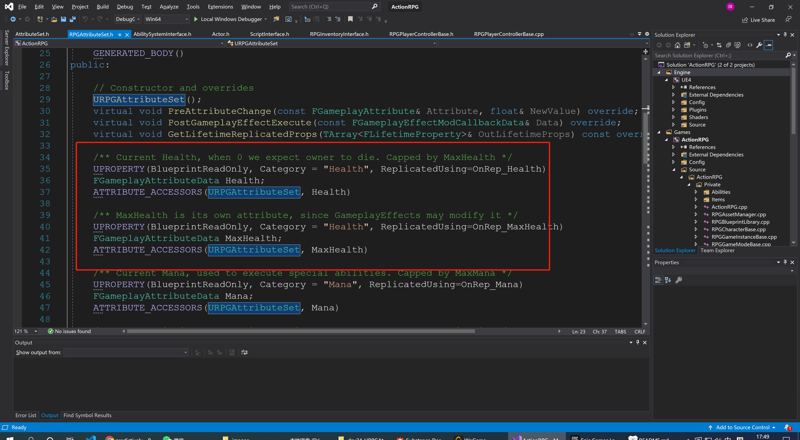


## 1 ReplicatedUsing

```c++
/// Property is relevant to network replication. Notify actors when a property is replicated (usage: ReplicatedUsing=FunctionName).
		ReplicatedUsing,
```

翻译一下：

```c++
需要网络复制属性，会提醒当前的 Actor 什么时候属性将会被复制。用法：ReplicatedUsing=函数名
```

然后再下方，我们看到很多类似`OnRep_xxx` 的声明，而他们的实现，也是非常的简单且类似：

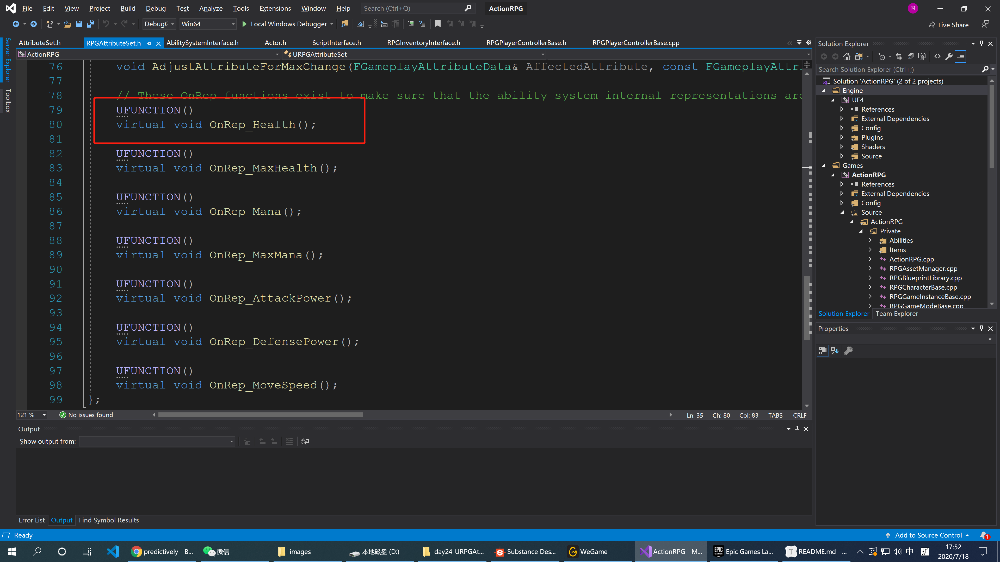

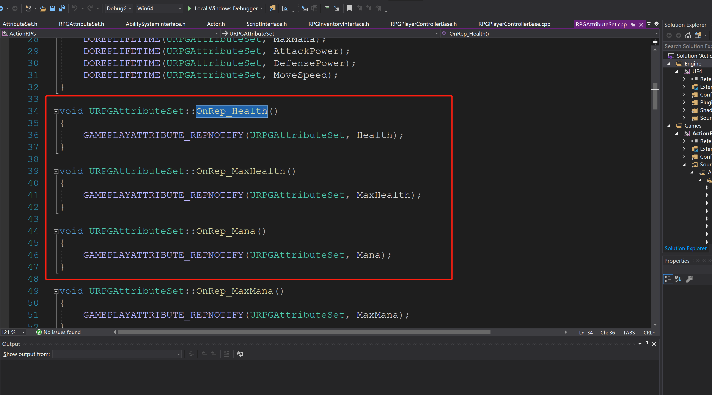

 ## 2 GAMEPLAYATTRIBUTE_REPNOTIFY

```c++
/**
 *	This is a helper macro that can be used in RepNotify functions to handle attributes that will be predictively modified by clients.
 *	
 *	void UMyHealthSet::OnRep_Health()
 *	{
 *		GAMEPLAYATTRIBUTE_REPNOTIFY(UMyHealthSet, Health);
 *	}
 */

#define GAMEPLAYATTRIBUTE_REPNOTIFY(C, P) \
{ \
	static UProperty* ThisProperty = FindFieldChecked<UProperty>(C::StaticClass(), GET_MEMBER_NAME_CHECKED(C, P)); \
	GetOwningAbilitySystemComponent()->SetBaseAttributeValueFromReplication(P, FGameplayAttribute(ThisProperty)); \
}

```

翻译一下：

```c++
这是帮助宏可以被用在网络复制提醒的函数中，用来处理那些可以被客户端预测修改的属性。
    用法示例：
    void UMyHealthSet::OnRep_Health()
 {
 		GAMEPLAYATTRIBUTE_REPNOTIFY(UMyHealthSet, Health);
 }
```

## 3 细究 URPGAttributeSet  属性

### 3.1 Health

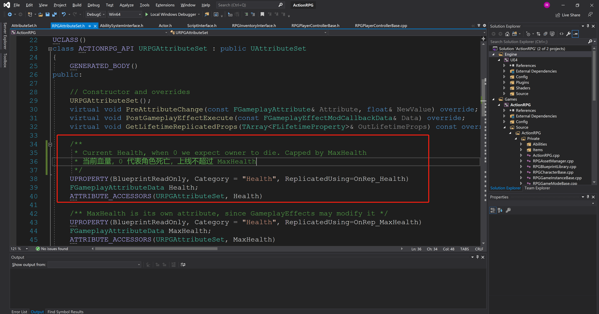

### 3.2 MaxHealth

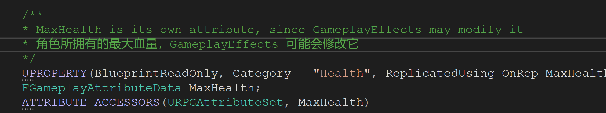

### 3.3 Mana

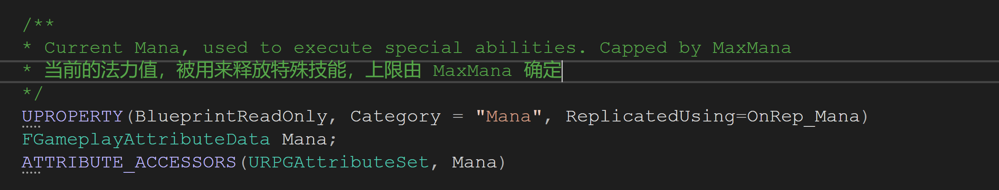

### 3.4 MaxMana

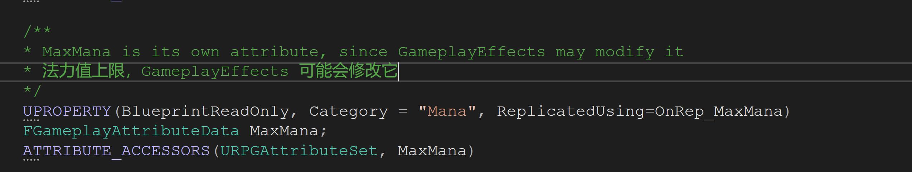

### 3.5 AttackPower

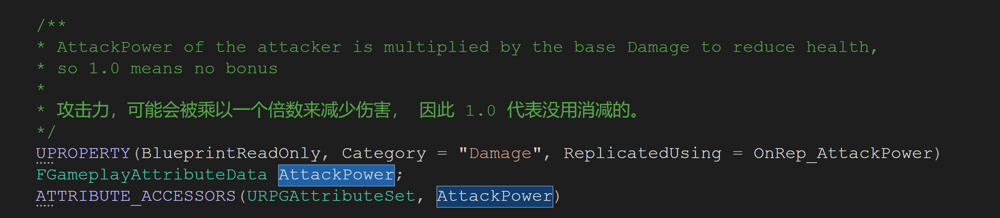

### 3.6 DefensePower

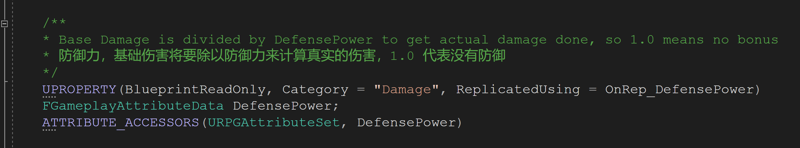

### 3.7 MoveSpeed

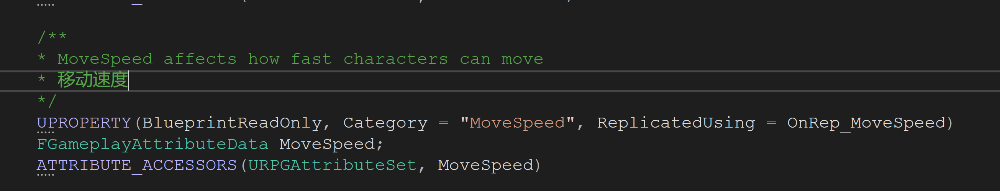

### 3.8 Damage

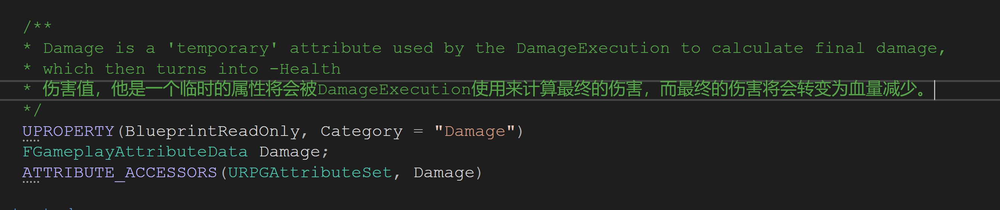

### 3.9 AdjustAttributeForMaxChange

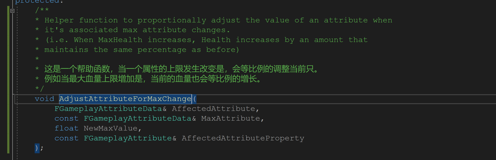