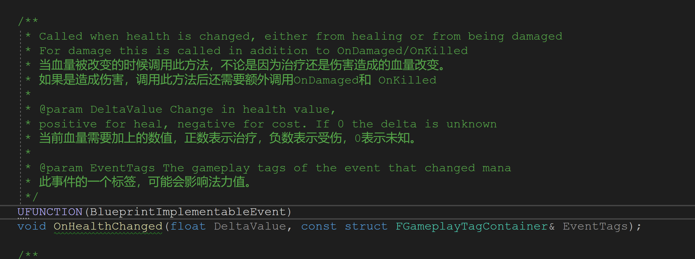
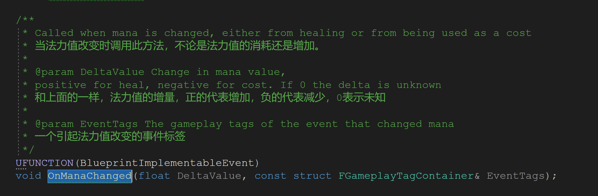
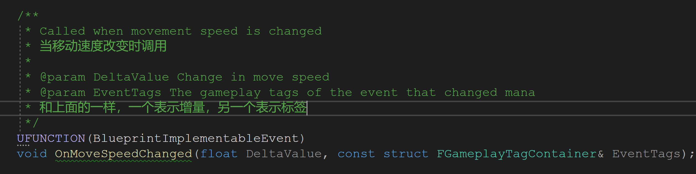
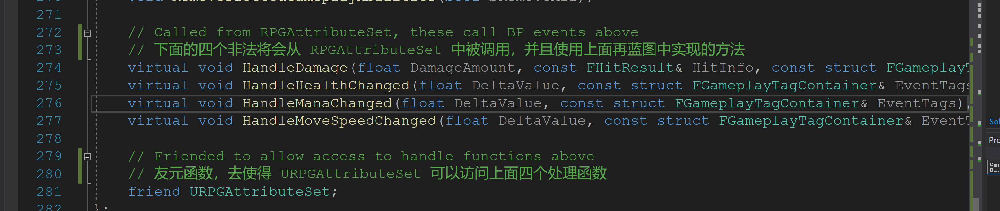
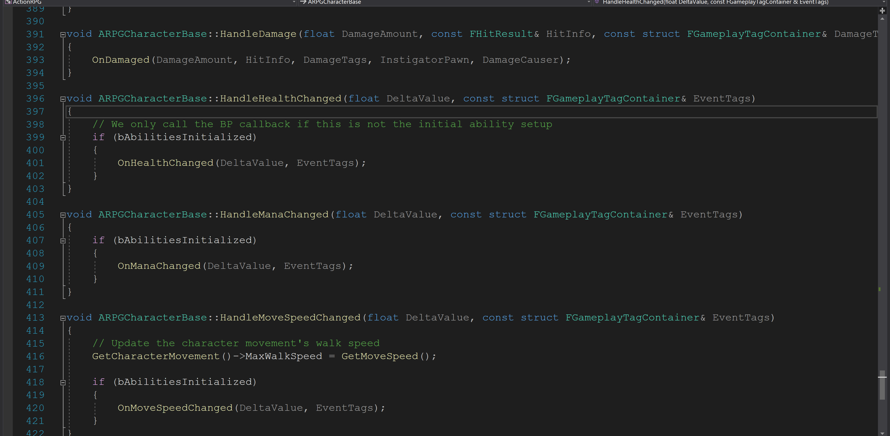

# 1 RPGCharacterBase 中一些简单方法注释翻译

## 1 OnDamaged

```c++
/**
	 * Called when character takes damage, which may have killed them
	 * 当角色受到伤害时调用此方法，角色可能会在调用该方法之后被杀死。
	 *
	 * @param DamageAmount Amount of damage that was done, not clamped based on current health
	 * 伤害值，不能超过角色当前的生命值
	 * 
	 * @param HitInfo The hit info that generated this damage
	 * 产生此次伤害的碰撞信息
	 *
	 * @param DamageTags The gameplay tags of the event that did the damage
	 * 一个 GamePlay 标签代表此次伤害的类型
	 * 
	 * @param InstigatorCharacter The character that initiated this damage
	 * 产生这个伤害的角色
	 * 
	 * @param DamageCauser The actual actor that did the damage, might be a weapon or projectile
	 * 产生此伤害的来源，可能是个武器或者是子弹
	 */
	UFUNCTION(BlueprintImplementableEvent)
	void OnDamaged(
		float DamageAmount, 
		const FHitResult& HitInfo, 
		const struct FGameplayTagContainer& DamageTags, 
		ARPGCharacterBase* InstigatorCharacter, 
		AActor* DamageCauser
	);
```

此方法将会被蓝图实现，再`RPGBaseCharacter`中只是声明了一下。

## 2 OnHealthChanged



同样的，此方法也应该由蓝图实现。

## 3 OnManaChanged



同理，此方法也应由蓝图实现

## 4 OnMoveSpeedChanged



蓝图中实现

## 5 一些常用的 Get方法

/** Returns current health, will be 0 if dead 
	* 获取当前角色的生命值，使用 AttributeSet 里面的 Health
	*/
	UFUNCTION(BlueprintCallable)
	virtual float GetHealth() const;

```C++
/**
* Returns maximum health, health will never be greater than this
* 获取角色最大的生命值，使用 AttributeSet 中的 Maximum 
*/
UFUNCTION(BlueprintCallable)
virtual float GetMaxHealth() const;

/** 
* Returns current mana
* 获取角色的当前法力值，使用 AttributeSet 中的 Mana
*/
UFUNCTION(BlueprintCallable)
virtual float GetMana() const;

/**
* Returns maximum mana, mana will never be greater than this 
* 获取角色的最大法力值，使用 AttributeSet 中的 MaxMana
*/
UFUNCTION(BlueprintCallable)
virtual float GetMaxMana() const;

/** Returns current movement speed 
* 获取角色的移动速度，使用 AttributeSet 中的 MoveSpeed
*/
UFUNCTION(BlueprintCallable)
virtual float GetMoveSpeed() const;

/** 
* Returns the character level that is passed to the ability system 
* 获取角色等级，该返回值将会被传递到技能系统中
*/
UFUNCTION(BlueprintCallable)
virtual int32 GetCharacterLevel() const;

/** 
* Modifies the character level, this may change abilities. Returns true on success 
* 修改角色等级，这里可能会相应的改变角色的技能，返回 true 代表修改成功
*/
UFUNCTION(BlueprintCallable)
virtual bool SetCharacterLevel(int32 NewLevel);
```
他们的实现也是非常简单的：

```C++
float ARPGCharacterBase::GetHealth() const
{
	if (!AttributeSet)
	return 1.f;

	return AttributeSet->GetHealth();
}

float ARPGCharacterBase::GetMaxHealth() const
{
	return AttributeSet->GetMaxHealth();
}

float ARPGCharacterBase::GetMana() const
{
	return AttributeSet->GetMana();
}

float ARPGCharacterBase::GetMaxMana() const
{
	return AttributeSet->GetMaxMana();
}

float ARPGCharacterBase::GetMoveSpeed() const
{
	return AttributeSet->GetMoveSpeed();
}

int32 ARPGCharacterBase::GetCharacterLevel() const
{
	return CharacterLevel;
}

bool ARPGCharacterBase::SetCharacterLevel(int32 NewLevel)
{
	if (CharacterLevel != NewLevel && NewLevel > 0)
	{
		// Our level changed so we need to refresh abilities
		// 当等级改变的时候，需要重新刷新技能系统
		RemoveStartupGameplayAbilities();
		CharacterLevel = NewLevel;
		AddStartupGameplayAbilities();

		return true;
	}
	return false;
}
```

## 6 还有一些不是很清楚他们功能的方法

```c++
/** 
	* Called when slotted items change, bound to delegate on interface 
	* 当插槽中的内容改变时调用，此方法会绑定一个会话到一个接口上
	*/
	void OnItemSlotChanged(FRPGItemSlot ItemSlot, URPGItem* Item);
	void RefreshSlottedGameplayAbilities();

	/** 
	* Apply the startup gameplay abilities and effects 
	* 将初始的技能和特效应用的角色身上
	*/
	void AddStartupGameplayAbilities();

	/** 
	* Attempts to remove any startup gameplay abilities
	* 尝试去移除角色身上初始的技能
	*/
	void RemoveStartupGameplayAbilities();

	/** 
	* Adds slotted item abilities if needed
	* 如果需要的话，添加插槽上已有的技能到角色身上
	*/
	void AddSlottedGameplayAbilities();

	/** 
	* Fills in with ability specs, based on defaults and inventory 
	* 将角色技能的插槽填满，根据默认值和背包系统来进行计算
	*/
	void FillSlottedAbilitySpecs(TMap<FRPGItemSlot, FGameplayAbilitySpec>& SlottedAbilitySpecs);

	/** 
	* Remove slotted gameplay abilities, if force is false it only removes invalid ones
	* 移除角色插槽上的某些技能，如果参数为 false,表示只移除那些非法的技能，否则就全部移除
	*/
	void RemoveSlottedGameplayAbilities(bool bRemoveAll);
```

通过这些注释，只能大概的判断这些方法的功能，而且他们的实现也比较复杂，等到后面具体用到哪个，再具体分析

## 7 一些简单的处理方法和友元类型



这些方法都通过简单的调用1~4的方法来实现，但是根据注释的意思，这些方法将会被`URPGAttributeSet` 调用，

