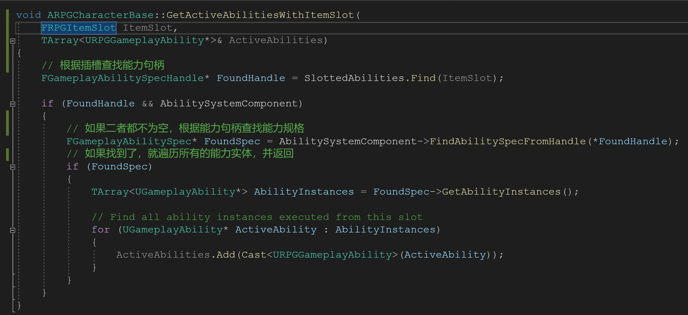

# RPGCharacterBase 中最后的一些方法

## 1 ActivateAbilitiesWithItemSlot


## 2 GetActiveAbilitiesWithItemSlot




## 3 ActivateAbilitiesWithTags


## 4 GetActiveAbilitiesWithTags


## 5 GetCooldownRemainingForTag


```c++
bool ARPGCharacterBase::GetCooldownRemainingForTag(
	FGameplayTagContainer CooldownTags, 
	float& TimeRemaining, 
	float& CooldownDuration)
{
	// 如果能力系统不为空且冷却标签数量大于0
	if (AbilitySystemComponent && CooldownTags.Num() > 0)
	{
		// 初始化返回值
		TimeRemaining = 0.f;
		CooldownDuration = 0.f;
		// 创建查询条件，这里的查询条件是 Any
		FGameplayEffectQuery const Query = FGameplayEffectQuery::
			MakeQuery_MatchAnyOwningTags(CooldownTags);
		// 执行查询
		TArray< TPair<float, float> > DurationAndTimeRemaining = AbilitySystemComponent->
			GetActiveEffectsTimeRemainingAndDuration(Query);
		if (DurationAndTimeRemaining.Num() > 0)
		{
			// 查找数组中持续时间最长的元素，并返回
			int32 BestIdx = 0;
			float LongestTime = DurationAndTimeRemaining[0].Key;
			for (int32 Idx = 1; Idx < DurationAndTimeRemaining.Num(); ++Idx)
			{
				if (DurationAndTimeRemaining[Idx].Key > LongestTime)
				{
					LongestTime = DurationAndTimeRemaining[Idx].Key;
					BestIdx = Idx;
				}
			}

			TimeRemaining = DurationAndTimeRemaining[BestIdx].Key;
			CooldownDuration = DurationAndTimeRemaining[BestIdx].Value;

			return true;
		}
	}
	return false;
}
```


## 6 FGameplayAbilitySpecHandle

能力系统自定义的结构体

```c++
/** 
* Handle that points to a specific granted ability. These are globally unique 
* 全局唯一的一个句柄指针，其实他就是一个 int32 位的整数
*/
USTRUCT(BlueprintType)
struct FGameplayAbilitySpecHandle
{
	GENERATED_USTRUCT_BODY()

	FGameplayAbilitySpecHandle()
		: Handle(INDEX_NONE)
	{
	}

	/** True if GenerateNewHandle was called on this handle */
	bool IsValid() const
	{
		return Handle != INDEX_NONE;
	}

	/** Sets this to a valid handle */
	void GenerateNewHandle();

	bool operator==(const FGameplayAbilitySpecHandle& Other) const
	{
		return Handle == Other.Handle;
	}

	bool operator!=(const FGameplayAbilitySpecHandle& Other) const
	{
		return Handle != Other.Handle;
	}

	friend uint32 GetTypeHash(const FGameplayAbilitySpecHandle& SpecHandle)
	{
		return ::GetTypeHash(SpecHandle.Handle);
	}

	FString ToString() const
	{
		return IsValid() ? FString::FromInt(Handle) : TEXT("Invalid");
	}

private:

	UPROPERTY()
	int32 Handle;
};
```

## 7 FGameplayAbilitySpec

能力系统自定义的结构体

```c++
/**
 * An activatable ability spec, hosted on the ability system component. This defines both what the ability is (what class, what level, input binding etc)
 * and also holds runtime state that must be kept outside of the ability being instanced/activated.
 * 一个被激活的能力系统，依托于能力系统组件，它定义了能力的类型，等级和绑定信息，并且也持有能力的运行状态，而这个状态是需要被外部保存，且需要被实例化或者激活的
 * 
 */
USTRUCT(BlueprintType)
struct GAMEPLAYABILITIES_API FGameplayAbilitySpec : public FFastArraySerializerItem
{
	GENERATED_USTRUCT_BODY()

	FGameplayAbilitySpec()
		: Ability(nullptr), Level(1), InputID(INDEX_NONE), SourceObject(nullptr), ActiveCount(0), InputPressed(false), RemoveAfterActivation(false), PendingRemove(false)
	{ }

	/** Version that takes an ability class */
	FGameplayAbilitySpec(TSubclassOf<UGameplayAbility> InAbilityClass, int32 InLevel = 1, int32 InInputID = INDEX_NONE, UObject* InSourceObject = nullptr);

	/** Version that takes an ability CDO, this exists for backward compatibility */
	FGameplayAbilitySpec(UGameplayAbility* InAbility, int32 InLevel = 1, int32 InInputID = INDEX_NONE, UObject* InSourceObject = nullptr);

	/** Version that takes an existing spec def */
	FGameplayAbilitySpec(FGameplayAbilitySpecDef& InDef, int32 InGameplayEffectLevel, FActiveGameplayEffectHandle InGameplayEffectHandle = FActiveGameplayEffectHandle());

	/** Handle for outside sources to refer to this spec by */
	UPROPERTY()
	FGameplayAbilitySpecHandle Handle;
	
	/** Ability of the spec (Always the CDO. This should be const but too many things modify it currently) */
	UPROPERTY()
	UGameplayAbility* Ability;
	
	/** Level of Ability */
	UPROPERTY()
	int32	Level;

	/** InputID, if bound */
	UPROPERTY()
	int32	InputID;

	/** Object this ability was created from, can be an actor or static object. Useful to bind an ability to a gameplay object */
	UPROPERTY()
	UObject* SourceObject;

	/** A count of the number of times this ability has been activated minus the number of times it has been ended. For instanced abilities this will be the number of currently active instances. Can't replicate until prediction accurately handles this.*/
	UPROPERTY(NotReplicated)
	uint8 ActiveCount;

	/** Is input currently pressed. Set to false when input is released */
	UPROPERTY(NotReplicated)
	uint8 InputPressed:1;

	/** If true, this ability should be removed as soon as it finishes executing */
	UPROPERTY(NotReplicated)
	uint8 RemoveAfterActivation:1;

	/** Pending removal due to scope lock */
	UPROPERTY(NotReplicated)
	uint8 PendingRemove:1;

	/** Activation state of this ability. This is not replicated since it needs to be overwritten locally on clients during prediction. */
	UPROPERTY(NotReplicated)
	FGameplayAbilityActivationInfo	ActivationInfo;

	/** Non replicating instances of this ability. */
	UPROPERTY(NotReplicated)
	TArray<UGameplayAbility*> NonReplicatedInstances;

	/** Replicated instances of this ability.. */
	UPROPERTY()
	TArray<UGameplayAbility*> ReplicatedInstances;

	/** Handle to GE that granted us (usually invalid) */
	UPROPERTY(NotReplicated)
	FActiveGameplayEffectHandle	GameplayEffectHandle;

	/** Passed on SetByCaller magnitudes if this ability was granted by a GE */
	TMap<FGameplayTag, float> SetByCallerTagMagnitudes;

	/** Returns the primary instance, used for instance once abilities */
	UGameplayAbility* GetPrimaryInstance() const;

	/** interface function to see if the ability should replicated the ability spec or not */
	bool ShouldReplicateAbilitySpec() const;

	/** Returns all instances, which can include instance per execution abilities */
	TArray<UGameplayAbility*> GetAbilityInstances() const
	{
		TArray<UGameplayAbility*> Abilities;
		Abilities.Append(ReplicatedInstances);
		Abilities.Append(NonReplicatedInstances);
		return Abilities;
	}

	/** Returns true if this ability is active in any way */
	bool IsActive() const;

	void PreReplicatedRemove(const struct FGameplayAbilitySpecContainer& InArraySerializer);
	void PostReplicatedAdd(const struct FGameplayAbilitySpecContainer& InArraySerializer);

	FString GetDebugString();
};
```

