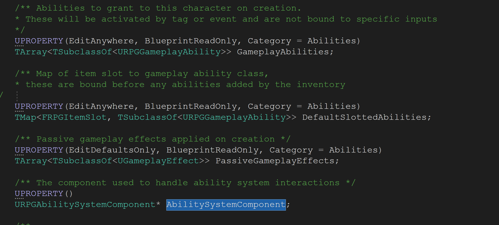
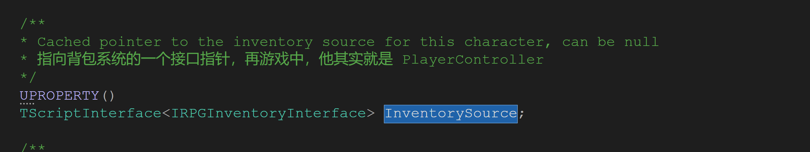

# RPGCharacterBase 总结

RPGCharacterBase  是系统中所有的角色和敌人的一个基类，它对角色的属性和操作做了最基本的定义。对角色本身来说，有控制时需要调用的`PossessedBy`方法和离开控制时需要调用的`UnPossessed`.

和技能系统相关的有技能系统组件：`AbilitySystemComponent`，已经其它的技能特效等：



其中`AttributeSet` 保存了角色的血量，攻击力，防御力‘移动速度等属性，这些属性也是会被外部修改的。

还有`InventorySource` 其实就算一个`PlayerController`,只是`PlayerController` 实现了 `IRPGInventoryInterface` 接口。




下面是我自己关于`RPGCharacterBase`的注释，有些注释由于方法现在还没有使用过，他的注释或许是不准确或者错误的，不过我们后面会修正它：

.h 文件

```C++
// Copyright 1998-2019 Epic Games, Inc. All Rights Reserved.

#pragma once

#include "ActionRPG.h"
#include "GameFramework/Character.h"
#include "UObject/ScriptInterface.h"
#include "RPGInventoryInterface.h"
#include "AbilitySystemInterface.h"
#include "Abilities/RPGAbilitySystemComponent.h"
#include "Abilities/RPGAttributeSet.h"
#include "RPGCharacterBase.generated.h"

class URPGGameplayAbility;
class UGameplayEffect;

/** Base class for Character, Designed to be blueprinted */
UCLASS()
class ACTIONRPG_API ARPGCharacterBase : public ACharacter, public IAbilitySystemInterface
{
	GENERATED_BODY()

public:
	// Constructor and overrides
	ARPGCharacterBase();
	/**
	* 当控制器控制玩家时执行
	*/
	virtual void PossessedBy(AController* NewController) override;
	/**
	* 当控制器，离开玩家控制时执行
	*/
	virtual void UnPossessed() override;
	/**
	* 该方法的声明是在pawn里面，当控制器被复制的时候调用
	*/
	virtual void OnRep_Controller() override;
	/**
	* 此方法返回被用于网络复制的属性，此方法应该被所有需要网络复制的Actor 所重写。
	* 在此 Actor 中， CharacterLevel 是一个需要被网络复制的对象
	*/
	virtual void GetLifetimeReplicatedProps(TArray<FLifetimeProperty>& OutLifetimeProps) const override;

	// Implement IAbilitySystemInterface
	UAbilitySystemComponent* GetAbilitySystemComponent() const override;

	/** Returns current health, will be 0 if dead 
	* 获取当前角色的生命值，使用 AttributeSet 里面的 Health
	*/
	UFUNCTION(BlueprintCallable)
	virtual float GetHealth() const;

	/**
	* Returns maximum health, health will never be greater than this
	* 获取角色最大的生命值，使用 AttributeSet 中的 Maximum 
	*/
	UFUNCTION(BlueprintCallable)
	virtual float GetMaxHealth() const;

	/** 
	* Returns current mana
	* 获取角色的当前法力值，使用 AttributeSet 中的 Mana
	*/
	UFUNCTION(BlueprintCallable)
	virtual float GetMana() const;

	/**
	* Returns maximum mana, mana will never be greater than this 
	* 获取角色的最大法力值，使用 AttributeSet 中的 MaxMana
	*/
	UFUNCTION(BlueprintCallable)
	virtual float GetMaxMana() const;

	/** Returns current movement speed 
	* 获取角色的移动速度，使用 AttributeSet 中的 MoveSpeed
	*/
	UFUNCTION(BlueprintCallable)
	virtual float GetMoveSpeed() const;

	/** 
	* Returns the character level that is passed to the ability system 
	* 获取角色等级，该返回值将会被传递到技能系统中
	*/
	UFUNCTION(BlueprintCallable)
	virtual int32 GetCharacterLevel() const;

	/** 
	* Modifies the character level, this may change abilities. Returns true on success 
	* 修改角色等级，这里可能会相应的改变角色的技能，返回 true 代表修改成功
	*/
	UFUNCTION(BlueprintCallable)
	virtual bool SetCharacterLevel(int32 NewLevel);

	/**
	 * Attempts to activate any ability in the specified item slot. 
	 * Will return false if no activatable ability found or activation fails.
	 * Returns true if it thinks it activated, but it may return false positives due to
	 * failure later in activation.
	 * If bAllowRemoteActivation is true, it will remotely activate local/server abilities, 
	 * if false it will only try to locally activate the ability
	 *
	 * 尝试去激活已经装备的能力系统。如果激活失败或者能力没用找到，此方法将会返回 false。返回 true 
	 * 将会代表能力激活成功，但也可能无奈的返回 false 当与之相关的能力激活失败。
	 * 
	 * 如果 bAllowRemoteActivation 为 true,此方法将会远程的激活本地/服务器的能力，否则将只会激活本来的能力
	 * @param ItemSlot 需要激活能力的插槽
	 * @param bAllowRemoteActivation 是否激活远程
	 *
	 */
	UFUNCTION(BlueprintCallable, Category = "Abilities")
	bool ActivateAbilitiesWithItemSlot(FRPGItemSlot ItemSlot, bool bAllowRemoteActivation = true);

	/** 
	* Returns a list of active abilities bound to the item slot. 
	* This only returns if the ability is currently running 
	* 返回该插槽对应已经激活能力列表，只有当该能力正在执行的时候，该函数才会有返回值
	* @param ItemSlot 插槽信息
	* @param ActiveAbilities 返回已经激活的能力系统
	*/
	UFUNCTION(BlueprintCallable, Category = "Abilities")
	void GetActiveAbilitiesWithItemSlot(
		FRPGItemSlot ItemSlot, 
		TArray<URPGGameplayAbility*>& ActiveAbilities
	);

	/**
	 * Attempts to activate all abilities that match the specified tags
	 * Returns true if it thinks it activated, but it may return false positives due to 
	 * failure later in activation.
	 * If bAllowRemoteActivation is true, it will remotely activate local/server abilities, 
	 * if false it will only try to locally activate the ability
	 *
	 * 尝试去根据标签来激活能力，激活成功返回 true,否则返回false
	 * @param AbilityTags 标签列表
	 * @param bAllowRemoteActivation 是否远程进行激活，
	 *   true,此方法将会远程的激活本地/服务器的能力，否则将只会激活本来的能力
	 */
	UFUNCTION(BlueprintCallable, Category = "Abilities")
	bool ActivateAbilitiesWithTags(FGameplayTagContainer AbilityTags, bool bAllowRemoteActivation = true);

	/** 
	* Returns a list of active abilities matching the specified tags. 
	* This only returns if the ability is currently running 
	* 根据标签来查找被激活的能力，只有当该能力正在执行的时候，该函数才会有返回值
	* @param AbilityTags 标签列表
	* @param ActiveAbilities 返回已经激活的能力系统
	*/
	UFUNCTION(BlueprintCallable, Category = "Abilities")
	void GetActiveAbilitiesWithTags(
		FGameplayTagContainer AbilityTags, 
		TArray<URPGGameplayAbility*>& ActiveAbilities
	);

	/** 
	* Returns total time and remaining time for cooldown tags. 
	* Returns false if no active cooldowns found 
	*  根据冷却标签来获取技能总时间和冷却剩余时间，返回 false 代表没有激活冷却
	*/
	UFUNCTION(BlueprintCallable, Category = "Abilities")
	bool GetCooldownRemainingForTag(
		FGameplayTagContainer CooldownTags, 
		float& TimeRemaining, 
		float& CooldownDuration
	);

protected:
	/** 
	* The level of this character, should not be modified directly once it has already spawned 
	* 角色等级，此变量不能直接被修改当角色出生后
	*/
	UPROPERTY(EditAnywhere, Replicated, Category = Abilities)
	int32 CharacterLevel;

	/** Abilities to grant to this character on creation. 
	* These will be activated by tag or event and are not bound to specific inputs 
	* 当角色被创建时，赋予角色的能力。这个将会在稍后被按照标签激活。但是这些能力不能绑定到输入上。
	*/
	UPROPERTY(EditAnywhere, BlueprintReadOnly, Category = Abilities)
	TArray<TSubclassOf<URPGGameplayAbility>> GameplayAbilities;

	/** Map of item slot to gameplay ability class, 
	* these are bound before any abilities added by the inventory 
	* 插槽到能力系统类型的一个映射，这个映射需要被绑定在能力被添加到背包之前。
	*/
	UPROPERTY(EditAnywhere, BlueprintReadOnly, Category = Abilities)
	TMap<FRPGItemSlot, TSubclassOf<URPGGameplayAbility>> DefaultSlottedAbilities;

	/** 
	* Passive gameplay effects applied on creation 
	* 角色身上负面的效果
	*/
	UPROPERTY(EditDefaultsOnly, BlueprintReadOnly, Category = Abilities)
	TArray<TSubclassOf<UGameplayEffect>> PassiveGameplayEffects;

	/** 
	* The component used to handle ability system interactions 
	* 能力系统组件
	*/
	UPROPERTY()
	URPGAbilitySystemComponent* AbilitySystemComponent;

	/** 
	* List of attributes modified by the ability system 
	* 一个列表，列出那些可以被能力系统修改的属性
	*/
	UPROPERTY()
	URPGAttributeSet* AttributeSet;

	/** 
	* Cached pointer to the inventory source for this character, can be null 
	* 指向背包系统的一个接口指针，再游戏中，他其实就是 PlayerController
	*/
	UPROPERTY()
	TScriptInterface<IRPGInventoryInterface> InventorySource;

	/** 
	* If true we have initialized our abilities
	* 是否初始化了能力系统
	*/
	UPROPERTY()
	int32 bAbilitiesInitialized;

	/** 
	* Map of slot to ability granted by that slot. I may refactor this later 
	* 一个关于插槽和能力映射，稍后它可能会被重构
	*/
	UPROPERTY(VisibleAnywhere, BlueprintReadOnly, Category = Inventory)
	TMap<FRPGItemSlot, FGameplayAbilitySpecHandle> SlottedAbilities;

	/** 
	* Delegate handles 
	* 背包变更和加载的会话
	*/
	FDelegateHandle InventoryUpdateHandle;
	FDelegateHandle InventoryLoadedHandle;

	/**
	 * Called when character takes damage, which may have killed them
	 * 当角色受到伤害时调用此方法，角色可能会在调用该方法之后被杀死。
	 *
	 * @param DamageAmount Amount of damage that was done, not clamped based on current health
	 * 伤害值，不能超过角色当前的生命值
	 * 
	 * @param HitInfo The hit info that generated this damage
	 * 产生此次伤害的碰撞信息
	 *
	 * @param DamageTags The gameplay tags of the event that did the damage
	 * 一个 GamePlay 标签代表此次伤害的类型
	 * 
	 * @param InstigatorCharacter The character that initiated this damage
	 * 产生这个伤害的角色
	 * 
	 * @param DamageCauser The actual actor that did the damage, might be a weapon or projectile
	 * 产生此伤害的来源，可能是个武器或者是子弹
	 */
	UFUNCTION(BlueprintImplementableEvent)
	void OnDamaged(
		float DamageAmount, 
		const FHitResult& HitInfo, 
		const struct FGameplayTagContainer& DamageTags, 
		ARPGCharacterBase* InstigatorCharacter, 
		AActor* DamageCauser
	);

	/**
	 * Called when health is changed, either from healing or from being damaged
	 * For damage this is called in addition to OnDamaged/OnKilled
	 * 当血量被改变的时候调用此方法，不论是因为治疗还是伤害造成的血量改变。
	 * 如果是造成伤害，调用此方法后还需要额外调用OnDamaged和 OnKilled
	 *
	 * @param DeltaValue Change in health value, 
	 * positive for heal, negative for cost. If 0 the delta is unknown
	 * 当前血量需要加上的数值，正数表示治疗，负数表示受伤，0表示未知。
	 *
	 * @param EventTags The gameplay tags of the event that changed mana
	 * 此事件的一个标签，可能会影响法力值。
	 */
	UFUNCTION(BlueprintImplementableEvent)
	void OnHealthChanged(float DeltaValue, const struct FGameplayTagContainer& EventTags);

	/**
	 * Called when mana is changed, either from healing or from being used as a cost
	 * 当法力值改变时调用此方法，不论是法力值的消耗还是增加。
	 *
	 * @param DeltaValue Change in mana value, 
	 * positive for heal, negative for cost. If 0 the delta is unknown
	 * 和上面的一样，法力值的增量，正的代表增加，负的代表减少，0表示未知
	 * 
	 * @param EventTags The gameplay tags of the event that changed mana
	 * 一个引起法力值改变的事件标签
	 */
	UFUNCTION(BlueprintImplementableEvent)
	void OnManaChanged(float DeltaValue, const struct FGameplayTagContainer& EventTags);

	/**
	 * Called when movement speed is changed
	 * 当移动速度改变时调用
	 *
	 * @param DeltaValue Change in move speed
	 * @param EventTags The gameplay tags of the event that changed mana
	 * 和上面的一样，一个表示增量，另一个表示标签
	 */
	UFUNCTION(BlueprintImplementableEvent)
	void OnMoveSpeedChanged(float DeltaValue, const struct FGameplayTagContainer& EventTags);

	/** 
	* Called when slotted items change, bound to delegate on interface 
	* 当插槽中的内容改变时调用，此方法会绑定一个会话到一个接口上
	*/
	void OnItemSlotChanged(FRPGItemSlot ItemSlot, URPGItem* Item);
	void RefreshSlottedGameplayAbilities();

	/** 
	* Apply the startup gameplay abilities and effects 
	* 将初始的技能和特效应用的角色身上
	*/
	void AddStartupGameplayAbilities();

	/** 
	* Attempts to remove any startup gameplay abilities
	* 尝试去移除角色身上初始的技能
	*/
	void RemoveStartupGameplayAbilities();

	/** 
	* Adds slotted item abilities if needed
	* 如果需要的话，添加插槽上已有的技能到角色身上
	*/
	void AddSlottedGameplayAbilities();

	/** 
	* Fills in with ability specs, based on defaults and inventory 
	* 将角色技能的插槽填满，根据默认值和背包系统来进行计算
	*/
	void FillSlottedAbilitySpecs(TMap<FRPGItemSlot, FGameplayAbilitySpec>& SlottedAbilitySpecs);

	/** 
	* Remove slotted gameplay abilities, if force is false it only removes invalid ones
	* 移除角色插槽上的某些技能，如果参数为 false,表示只移除那些非法的技能，否则就全部移除
	*/
	void RemoveSlottedGameplayAbilities(bool bRemoveAll);

	// Called from RPGAttributeSet, these call BP events above
	// 下面的四个非法将会从 RPGAttributeSet 中被调用，并且使用上面再蓝图中实现的方法
	virtual void HandleDamage(float DamageAmount, const FHitResult& HitInfo, const struct FGameplayTagContainer& DamageTags, ARPGCharacterBase* InstigatorCharacter, AActor* DamageCauser);
	virtual void HandleHealthChanged(float DeltaValue, const struct FGameplayTagContainer& EventTags);
	virtual void HandleManaChanged(float DeltaValue, const struct FGameplayTagContainer& EventTags);
	virtual void HandleMoveSpeedChanged(float DeltaValue, const struct FGameplayTagContainer& EventTags);

	// Friended to allow access to handle functions above
	// 友元函数，去使得 URPGAttributeSet 可以访问上面四个处理函数
	friend URPGAttributeSet;
};

```


.cpp 文件

```c++
// Copyright 1998-2019 Epic Games, Inc. All Rights Reserved.

#include "RPGCharacterBase.h"
#include "Items/RPGItem.h"
#include "AbilitySystemGlobals.h"
#include "Abilities/RPGGameplayAbility.h"

ARPGCharacterBase::ARPGCharacterBase()
{
	// Create ability system component, and set it to be explicitly replicated
	AbilitySystemComponent = CreateDefaultSubobject<URPGAbilitySystemComponent>(
		TEXT("AbilitySystemComponent")
	);
	AbilitySystemComponent->SetIsReplicated(true);

	// 创建默认的角色属性
	AttributeSet = CreateDefaultSubobject<URPGAttributeSet>(TEXT("AttributeSet"));

	CharacterLevel = 1;
	bAbilitiesInitialized = false;
}

UAbilitySystemComponent* ARPGCharacterBase::GetAbilitySystemComponent() const
{
	return AbilitySystemComponent;
}

void ARPGCharacterBase::AddStartupGameplayAbilities()
{
	// 断言技能系统
	check(AbilitySystemComponent);
	// 如果可以获取当前角色并且技能系统没有被初始化
	if (GetLocalRole() == ROLE_Authority && !bAbilitiesInitialized)
	{
		// 授予技能，但只在服务的运行	
		for (TSubclassOf<URPGGameplayAbility>& StartupAbility : GameplayAbilities)
		{
			AbilitySystemComponent->GiveAbility(FGameplayAbilitySpec(StartupAbility, GetCharacterLevel(), INDEX_NONE, this));
		}

		// 添加消极的效果
		for (TSubclassOf<UGameplayEffect>& GameplayEffect : PassiveGameplayEffects)
		{
			FGameplayEffectContextHandle EffectContext = AbilitySystemComponent->MakeEffectContext();
			EffectContext.AddSourceObject(this);

			FGameplayEffectSpecHandle NewHandle = AbilitySystemComponent->MakeOutgoingSpec(GameplayEffect, GetCharacterLevel(), EffectContext);
			if (NewHandle.IsValid())
			{
				FActiveGameplayEffectHandle ActiveGEHandle = AbilitySystemComponent->ApplyGameplayEffectSpecToTarget(*NewHandle.Data.Get(), AbilitySystemComponent);
			}
		}
		// 添加插槽中能力系统
		AddSlottedGameplayAbilities();

		bAbilitiesInitialized = true;
	}
}

void ARPGCharacterBase::RemoveStartupGameplayAbilities()
{
	check(AbilitySystemComponent);

	if (GetLocalRole() == ROLE_Authority && bAbilitiesInitialized)
	{
		// Remove any abilities added from a previous call
		TArray<FGameplayAbilitySpecHandle> AbilitiesToRemove;
		for (const FGameplayAbilitySpec& Spec : AbilitySystemComponent->GetActivatableAbilities())
		{
			if ((Spec.SourceObject == this) && GameplayAbilities.Contains(Spec.Ability->GetClass()))
			{
				AbilitiesToRemove.Add(Spec.Handle);
			}
		}

		// Do in two passes so the removal happens after we have the full list
		for (int32 i = 0; i < AbilitiesToRemove.Num(); i++)
		{
			AbilitySystemComponent->ClearAbility(AbilitiesToRemove[i]);
		}

		// Remove all of the passive gameplay effects that were applied by this character
		FGameplayEffectQuery Query;
		Query.EffectSource = this;
		AbilitySystemComponent->RemoveActiveEffects(Query);

		RemoveSlottedGameplayAbilities(true);

		bAbilitiesInitialized = false;
	}
}

void ARPGCharacterBase::OnItemSlotChanged(FRPGItemSlot ItemSlot, URPGItem* Item)
{
	RefreshSlottedGameplayAbilities();
}

void ARPGCharacterBase::RefreshSlottedGameplayAbilities()
{
	if (bAbilitiesInitialized)
	{
		// 将之前的能力移除并且添加新的能力
		RemoveSlottedGameplayAbilities(false);
		AddSlottedGameplayAbilities();
	}
}

void ARPGCharacterBase::FillSlottedAbilitySpecs(TMap<FRPGItemSlot, FGameplayAbilitySpec>& SlottedAbilitySpecs)
{
	// 添加默认的技能
	for (const TPair<FRPGItemSlot, TSubclassOf<URPGGameplayAbility>>& DefaultPair : DefaultSlottedAbilities)
	{
		if (DefaultPair.Value.Get())
		{
			SlottedAbilitySpecs.Add(DefaultPair.Key, FGameplayAbilitySpec(DefaultPair.Value, GetCharacterLevel(), INDEX_NONE, this));
		}
	}

	// 添加背包中潜在的技能
	if (InventorySource)
	{
		const TMap<FRPGItemSlot, URPGItem*>& SlottedItemMap = InventorySource->GetSlottedItemMap();

		for (const TPair<FRPGItemSlot, URPGItem*>& ItemPair : SlottedItemMap)
		{
			URPGItem* SlottedItem = ItemPair.Value;

			// 默认使用角色等级作为技能等级
			int32 AbilityLevel = GetCharacterLevel();

			if (SlottedItem && SlottedItem->ItemType.GetName() == FName(TEXT("Weapon")))
			{
				// 从插槽中复写技能等级
				AbilityLevel = SlottedItem->AbilityLevel;
			}

			if (SlottedItem && SlottedItem->GrantedAbility)
			{
				// 添加默认的技能
				SlottedAbilitySpecs.Add(ItemPair.Key, FGameplayAbilitySpec(SlottedItem->GrantedAbility, AbilityLevel, INDEX_NONE, SlottedItem));
			}
		}
	}
}

void ARPGCharacterBase::AddSlottedGameplayAbilities()
{
	TMap<FRPGItemSlot, FGameplayAbilitySpec> SlottedAbilitySpecs;
	FillSlottedAbilitySpecs(SlottedAbilitySpecs);
	
	// Now add abilities if needed
	for (const TPair<FRPGItemSlot, FGameplayAbilitySpec>& SpecPair : SlottedAbilitySpecs)
	{
		FGameplayAbilitySpecHandle& SpecHandle = SlottedAbilities.FindOrAdd(SpecPair.Key);

		if (!SpecHandle.IsValid())
		{
			SpecHandle = AbilitySystemComponent->GiveAbility(SpecPair.Value);
		}
	}
}

void ARPGCharacterBase::RemoveSlottedGameplayAbilities(bool bRemoveAll)
{
	TMap<FRPGItemSlot, FGameplayAbilitySpec> SlottedAbilitySpecs;

	if (!bRemoveAll)
	{
		// Fill in map so we can compare
		FillSlottedAbilitySpecs(SlottedAbilitySpecs);
	}

	for (TPair<FRPGItemSlot, FGameplayAbilitySpecHandle>& ExistingPair : SlottedAbilities)
	{
		FGameplayAbilitySpec* FoundSpec = AbilitySystemComponent->FindAbilitySpecFromHandle(ExistingPair.Value);
		bool bShouldRemove = bRemoveAll || !FoundSpec;

		if (!bShouldRemove)
		{
			// Need to check desired ability specs, if we got here FoundSpec is valid
			FGameplayAbilitySpec* DesiredSpec = SlottedAbilitySpecs.Find(ExistingPair.Key);

			if (!DesiredSpec || DesiredSpec->Ability != FoundSpec->Ability || DesiredSpec->SourceObject != FoundSpec->SourceObject)
			{
				bShouldRemove = true;
			}
		}
		
		if (bShouldRemove)
		{	
			if (FoundSpec)
			{
				// Need to remove registered ability
				AbilitySystemComponent->ClearAbility(ExistingPair.Value);
			}

			// Make sure handle is cleared even if ability wasn't found
			ExistingPair.Value = FGameplayAbilitySpecHandle();
		}
	}
}

void ARPGCharacterBase::PossessedBy(AController* NewController)
{
	Super::PossessedBy(NewController);

	// 设置背包指针源，其实这里就算RPG的 PlayerController，对于AI（敌人）此操作会失败
	InventorySource = NewController;

	// 如果是玩家，就绑定背包中的物品更新事件和背包加载事件
	if (InventorySource)
	{
		InventoryUpdateHandle = InventorySource->GetSlottedItemChangedDelegate()
			.AddUObject(this, &ARPGCharacterBase::OnItemSlotChanged);
		InventoryLoadedHandle = InventorySource->GetInventoryLoadedDelegate()
			.AddUObject(this, &ARPGCharacterBase::RefreshSlottedGameplayAbilities);
	}

	// 初始化角色技能
	if (AbilitySystemComponent)
	{
		AbilitySystemComponent->InitAbilityActorInfo(this, this);
		AddStartupGameplayAbilities();
	}
}

void ARPGCharacterBase::UnPossessed()
{
	// 如果绑定了背包和背包更新事件，在解除控制时分别做移除
	if (InventorySource && InventoryUpdateHandle.IsValid())
	{
		InventorySource->GetSlottedItemChangedDelegate().Remove(InventoryUpdateHandle);
		InventoryUpdateHandle.Reset();

		InventorySource->GetInventoryLoadedDelegate().Remove(InventoryLoadedHandle);
		InventoryLoadedHandle.Reset();
	}
	// 将InventorySource 置为 null
	InventorySource = nullptr;
}

void ARPGCharacterBase::OnRep_Controller()
{
	Super::OnRep_Controller();

	// Our controller changed, must update ActorInfo on AbilitySystemComponent
	// 但我们的控制器改变时，必须更新能力系统
	if (AbilitySystemComponent)
	{
		AbilitySystemComponent->RefreshAbilityActorInfo();
	}
}

void ARPGCharacterBase::GetLifetimeReplicatedProps(TArray<FLifetimeProperty>& OutLifetimeProps) const
{
	Super::GetLifetimeReplicatedProps(OutLifetimeProps);

	DOREPLIFETIME(ARPGCharacterBase, CharacterLevel);
}

float ARPGCharacterBase::GetHealth() const
{
	if (!AttributeSet)
	return 1.f;

	return AttributeSet->GetHealth();
}

float ARPGCharacterBase::GetMaxHealth() const
{
	return AttributeSet->GetMaxHealth();
}

float ARPGCharacterBase::GetMana() const
{
	return AttributeSet->GetMana();
}

float ARPGCharacterBase::GetMaxMana() const
{
	return AttributeSet->GetMaxMana();
}

float ARPGCharacterBase::GetMoveSpeed() const
{
	return AttributeSet->GetMoveSpeed();
}

int32 ARPGCharacterBase::GetCharacterLevel() const
{
	return CharacterLevel;
}

bool ARPGCharacterBase::SetCharacterLevel(int32 NewLevel)
{
	if (CharacterLevel != NewLevel && NewLevel > 0)
	{
		// Our level changed so we need to refresh abilities
		// 当等级改变的时候，需要重新刷新技能系统
		RemoveStartupGameplayAbilities();
		CharacterLevel = NewLevel;
		AddStartupGameplayAbilities();

		return true;
	}
	return false;
}

bool ARPGCharacterBase::ActivateAbilitiesWithItemSlot(FRPGItemSlot ItemSlot, bool bAllowRemoteActivation)
{
	// 获取插槽对应的句柄
	FGameplayAbilitySpecHandle* FoundHandle = SlottedAbilities.Find(ItemSlot);

	// 如果找到句柄，根据句柄尝试激活此能力
	if (FoundHandle && AbilitySystemComponent)
	{
		return AbilitySystemComponent->TryActivateAbility(*FoundHandle, bAllowRemoteActivation);
	}

	return false;
}

void ARPGCharacterBase::GetActiveAbilitiesWithItemSlot(
	FRPGItemSlot ItemSlot, 
	TArray<URPGGameplayAbility*>& ActiveAbilities)
{
	// 根据插槽查找能力句柄
	FGameplayAbilitySpecHandle* FoundHandle = SlottedAbilities.Find(ItemSlot);

	if (FoundHandle && AbilitySystemComponent)
	{
		// 如果二者都不为空，根据能力句柄查找能力规格
		FGameplayAbilitySpec* FoundSpec = AbilitySystemComponent->FindAbilitySpecFromHandle(*FoundHandle);
		// 如果找到了，就遍历所有的能力实体，并返回
		if (FoundSpec)
		{
			TArray<UGameplayAbility*> AbilityInstances = FoundSpec->GetAbilityInstances();

			// Find all ability instances executed from this slot
			for (UGameplayAbility* ActiveAbility : AbilityInstances)
			{
				ActiveAbilities.Add(Cast<URPGGameplayAbility>(ActiveAbility));
			}
		}
	}
}

bool ARPGCharacterBase::ActivateAbilitiesWithTags(
	FGameplayTagContainer AbilityTags, 
	bool bAllowRemoteActivation
)
{
	// 如果能力系统正常，直接调用激活的方法
	if (AbilitySystemComponent)
	{
		return AbilitySystemComponent->TryActivateAbilitiesByTag(AbilityTags, bAllowRemoteActivation);
	}

	return false;
}

void ARPGCharacterBase::GetActiveAbilitiesWithTags(
	FGameplayTagContainer AbilityTags, 
	TArray<URPGGameplayAbility*>& ActiveAbilities)
{
	// 如果能力系统合法，直接使用他的方法获取
	if (AbilitySystemComponent)
	{
		AbilitySystemComponent->GetActiveAbilitiesWithTags(AbilityTags, ActiveAbilities);
	}
}

bool ARPGCharacterBase::GetCooldownRemainingForTag(
	FGameplayTagContainer CooldownTags, 
	float& TimeRemaining, 
	float& CooldownDuration)
{
	// 如果能力系统不为空且冷却标签数量大于0
	if (AbilitySystemComponent && CooldownTags.Num() > 0)
	{
		// 初始化返回值
		TimeRemaining = 0.f;
		CooldownDuration = 0.f;
		// 创建查询条件，这里的查询条件是 Any
		FGameplayEffectQuery const Query = FGameplayEffectQuery::
			MakeQuery_MatchAnyOwningTags(CooldownTags);
		// 执行查询
		TArray< TPair<float, float> > DurationAndTimeRemaining = AbilitySystemComponent->
			GetActiveEffectsTimeRemainingAndDuration(Query);
		if (DurationAndTimeRemaining.Num() > 0)
		{
			// 查找数组中持续时间最长的元素，并返回
			int32 BestIdx = 0;
			float LongestTime = DurationAndTimeRemaining[0].Key;
			for (int32 Idx = 1; Idx < DurationAndTimeRemaining.Num(); ++Idx)
			{
				if (DurationAndTimeRemaining[Idx].Key > LongestTime)
				{
					LongestTime = DurationAndTimeRemaining[Idx].Key;
					BestIdx = Idx;
				}
			}

			TimeRemaining = DurationAndTimeRemaining[BestIdx].Key;
			CooldownDuration = DurationAndTimeRemaining[BestIdx].Value;

			return true;
		}
	}
	return false;
}

void ARPGCharacterBase::HandleDamage(float DamageAmount, const FHitResult& HitInfo, const struct FGameplayTagContainer& DamageTags, ARPGCharacterBase* InstigatorPawn, AActor* DamageCauser)
{
	OnDamaged(DamageAmount, HitInfo, DamageTags, InstigatorPawn, DamageCauser);	
}

void ARPGCharacterBase::HandleHealthChanged(float DeltaValue, const struct FGameplayTagContainer& EventTags)
{
	// We only call the BP callback if this is not the initial ability setup
	if (bAbilitiesInitialized)
	{
		OnHealthChanged(DeltaValue, EventTags);
	}
}

void ARPGCharacterBase::HandleManaChanged(float DeltaValue, const struct FGameplayTagContainer& EventTags)
{
	if (bAbilitiesInitialized)
	{
		OnManaChanged(DeltaValue, EventTags);
	}
}

void ARPGCharacterBase::HandleMoveSpeedChanged(float DeltaValue, const struct FGameplayTagContainer& EventTags)
{
	// Update the character movement's walk speed
	GetCharacterMovement()->MaxWalkSpeed = GetMoveSpeed();

	if (bAbilitiesInitialized)
	{
		OnMoveSpeedChanged(DeltaValue, EventTags);
	}
}
```

