# BP_Character

BP_Character 是在蓝图中继承`RPGCharacterBase`的一个子类，我们来看看他的属性和方法。

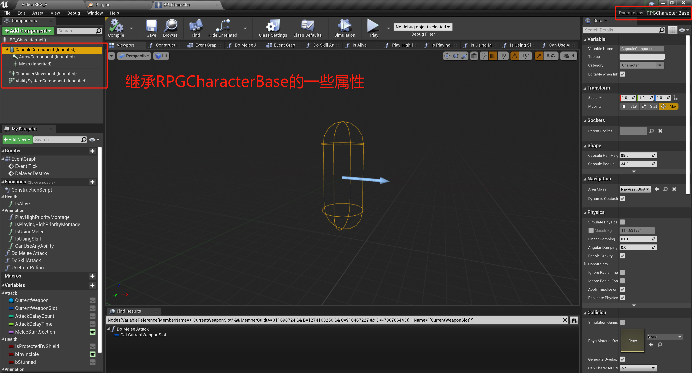

## 1 方法

### 1.1 DelayedDestroy

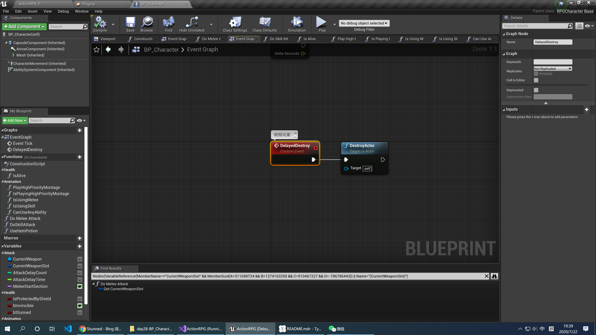

### 1.2 Is Alive

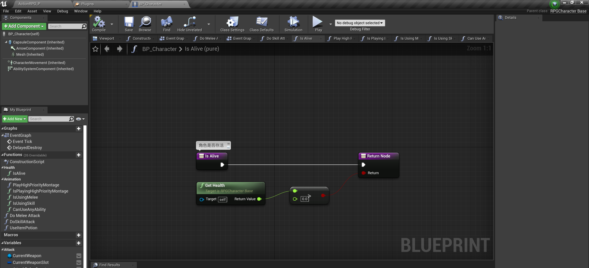

### 1.3 Play High Priority Montage

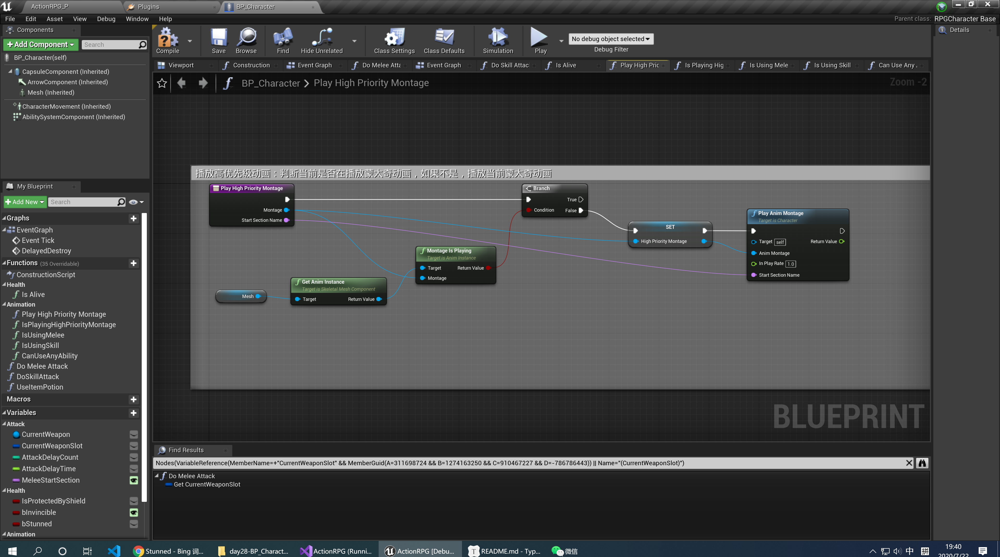

### 1.4 Is Playing High Priority Montage

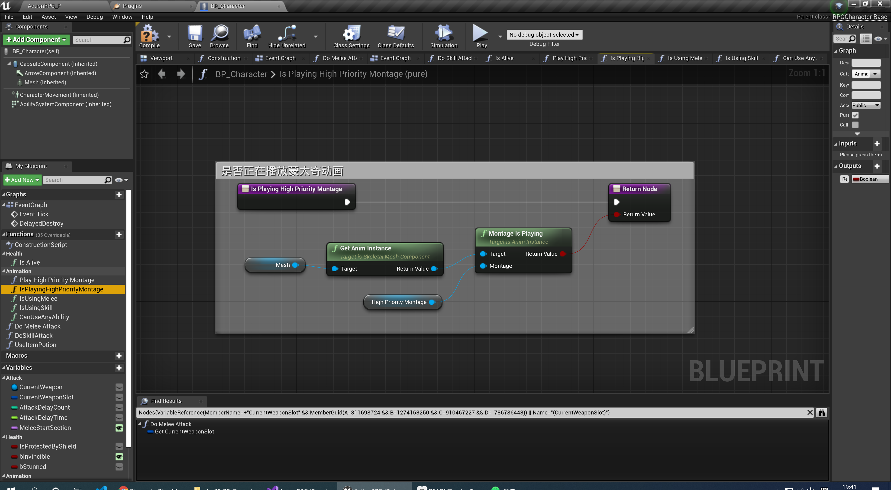

### 1.5 Is Using Melee

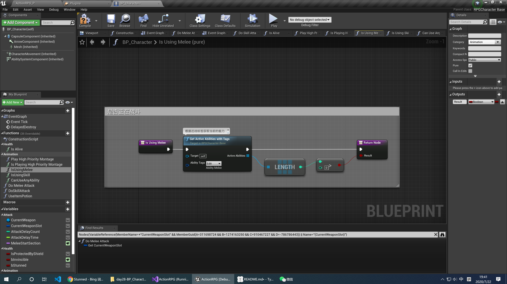

### 1.6 Is Using Melee

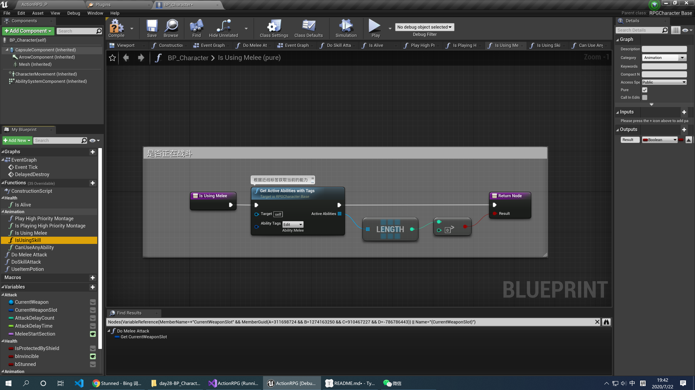

### 1.7 Can Use Any Ability

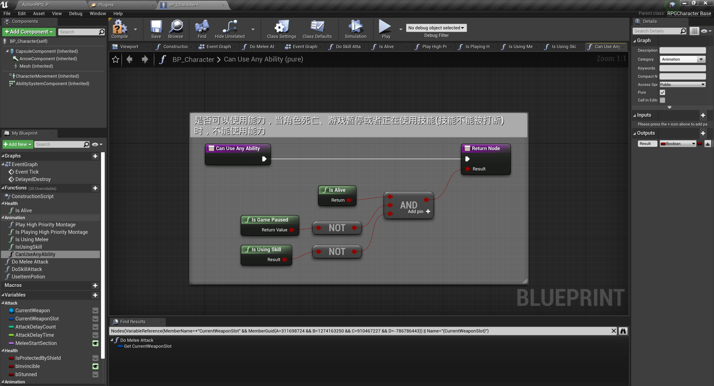

### 1.8 Do Melee Attack

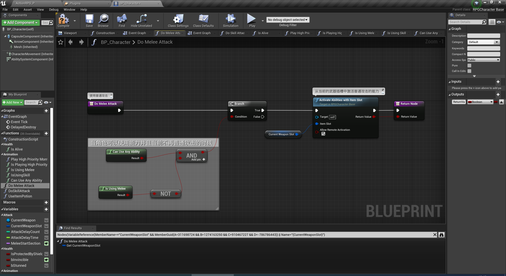

### 1.9 Do Skill Attack

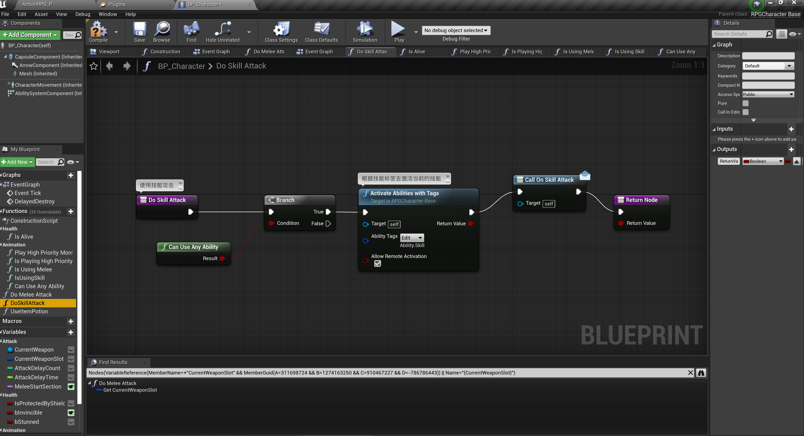

### 1.10 Use Item Potion

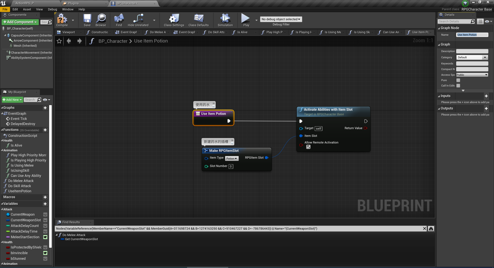

## 2 属性

### 2.1 CurrentWeapon

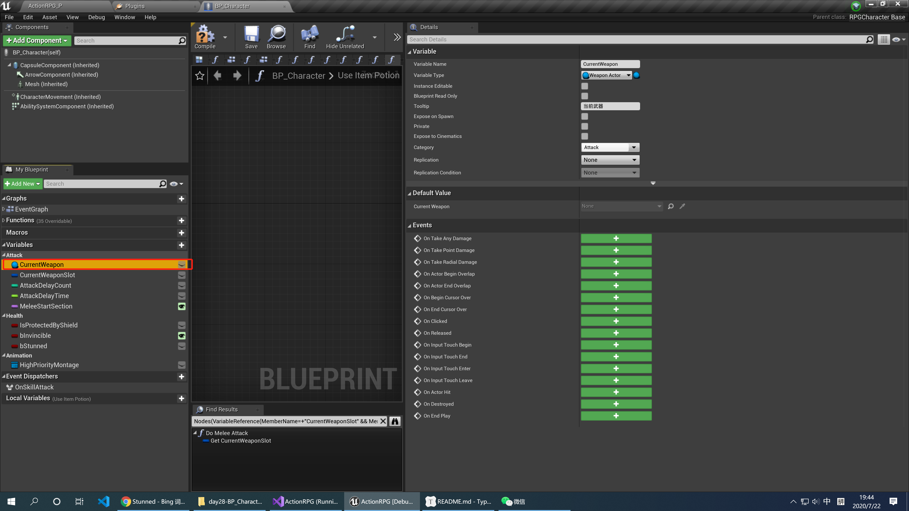

### 2.2 CurrentWeaponSlot

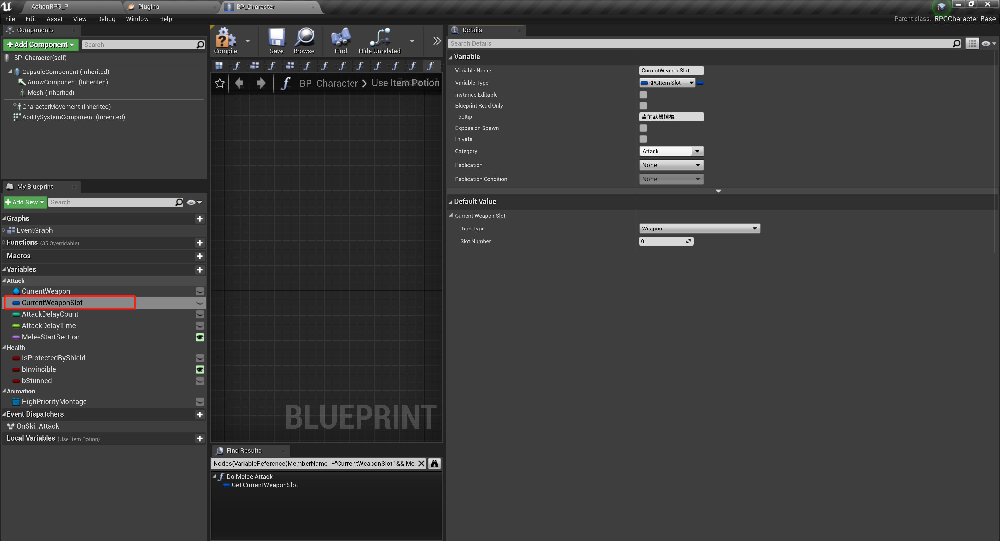

### 2.3 AttackDelayCount

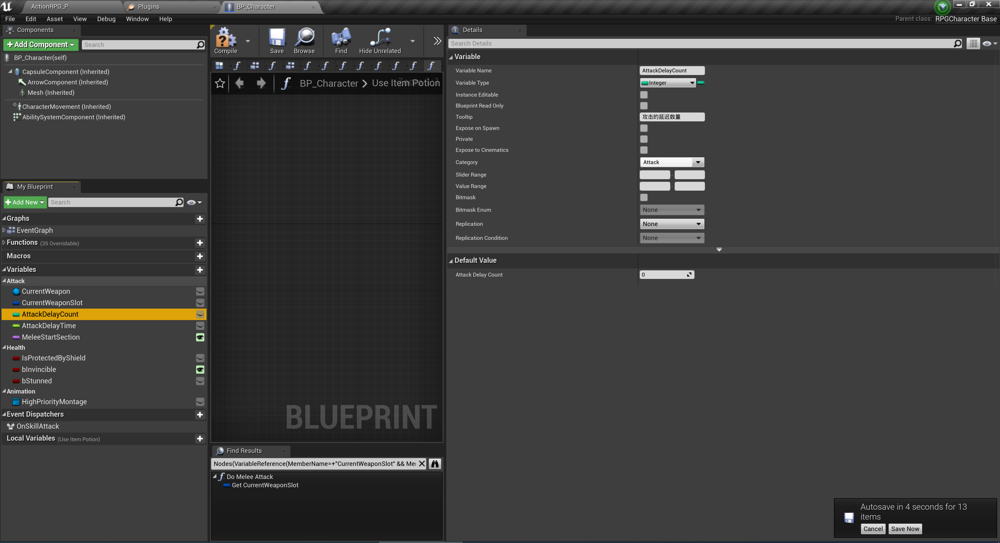

### 2.4 AttackDelayTime

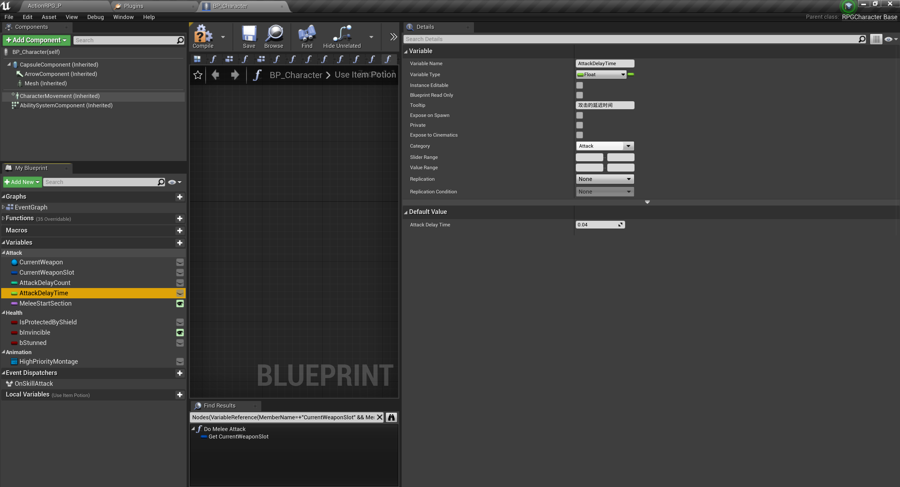

### 2.5 MeleeStartSection

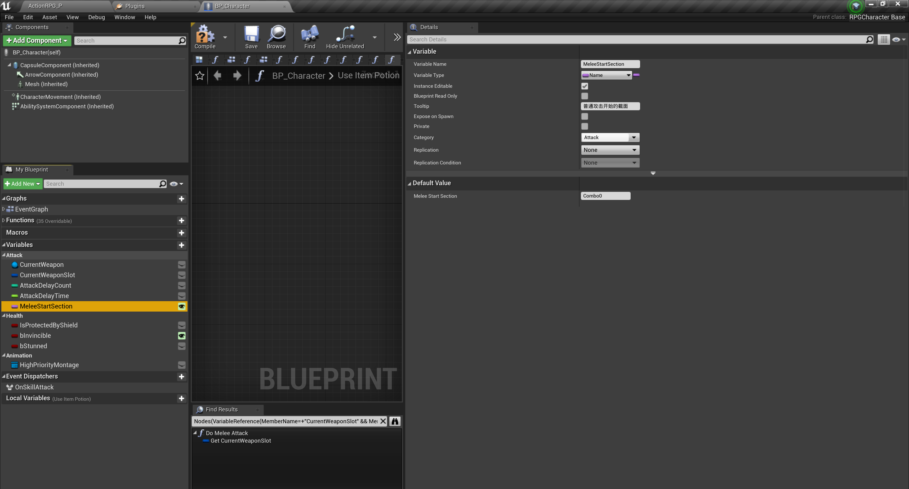

### 2.6 IsProtectedByShield

### 2.7 bInvincible

### 2.8 bStunned

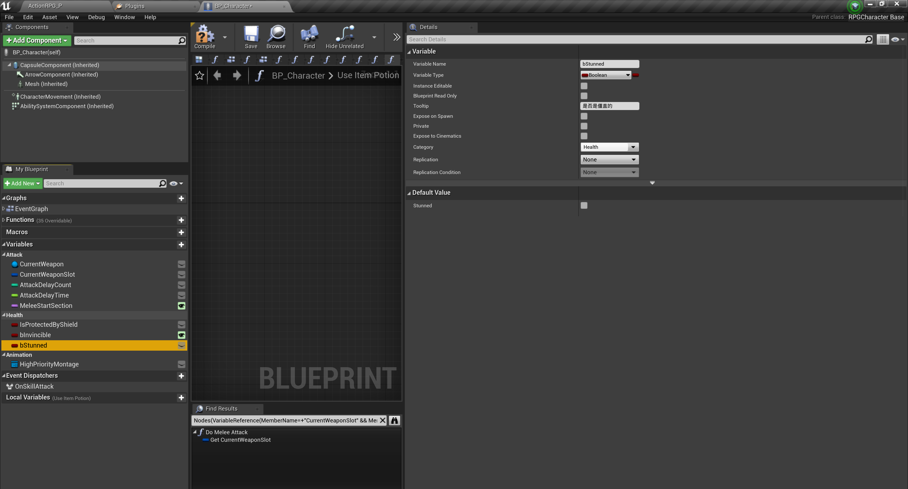

### 2.9 HighPriorityMontage

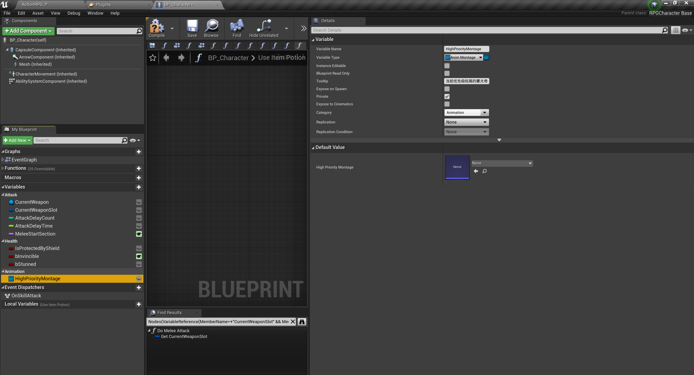