# BP_Character 初探（一）

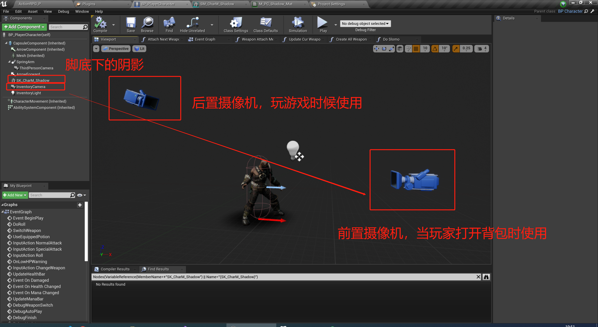

前置摄像机效果：

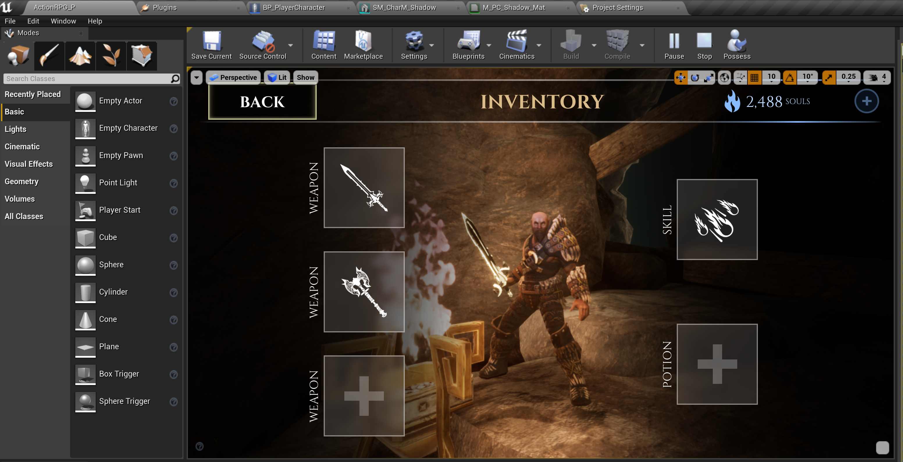

## 1 Event Begin Player

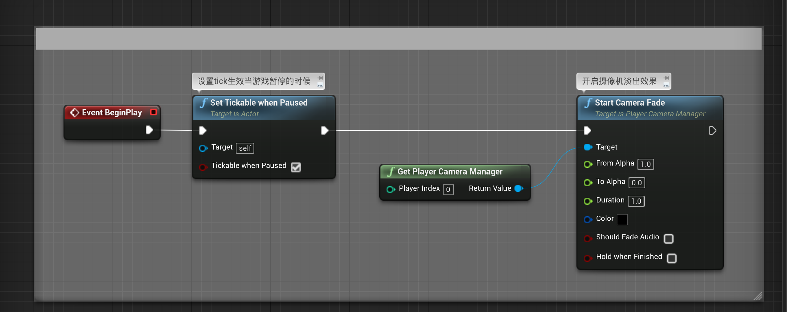

## 2 玩家输入事

### 2.1 InputAction Run

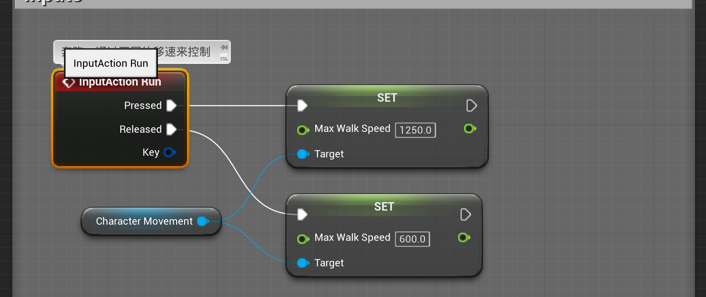

### 2.2 InputAction NormalAttack

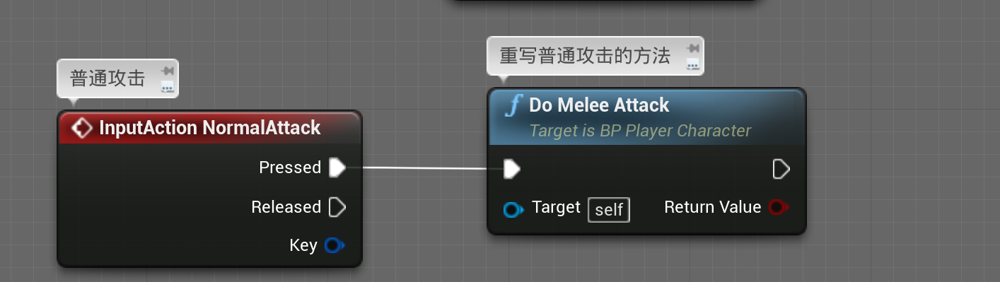

先有个概念，具体的实现我们下一次在研究

### 2.3 InputAction  SpecialAttack

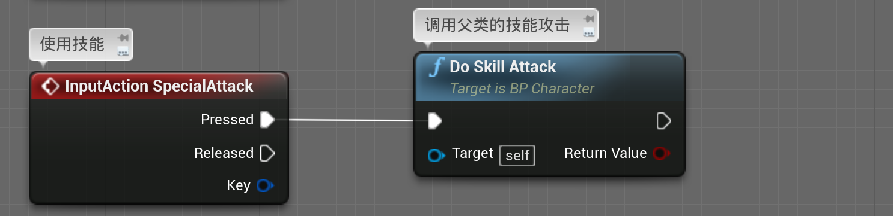

### 2.4 InputAction   UseItem

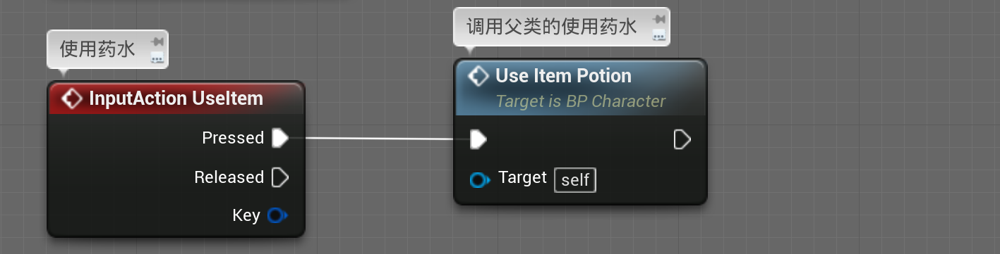

### 2.5 InputAction Roll

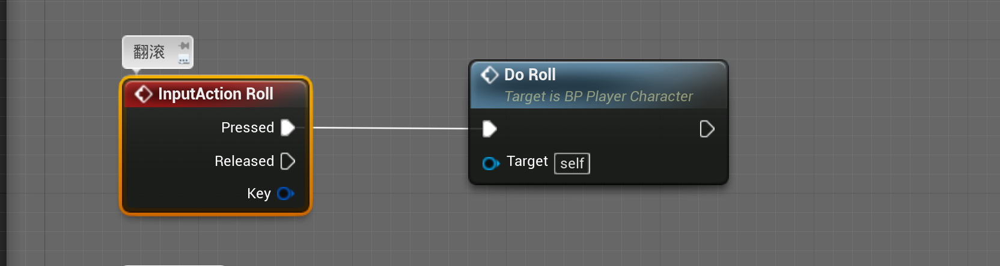

播放翻滚的动画函数：

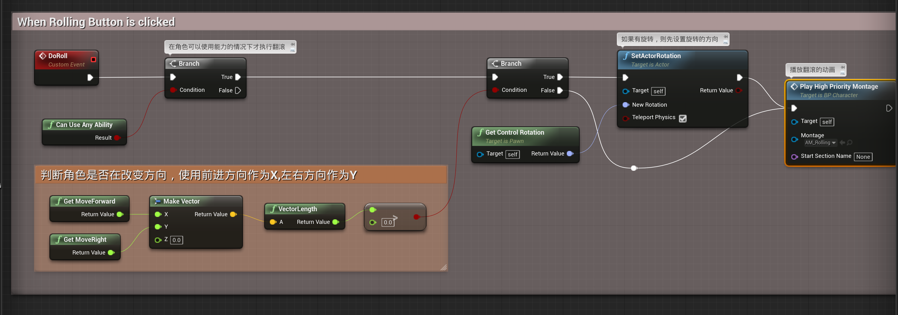

角色移动的蒙太奇动画：

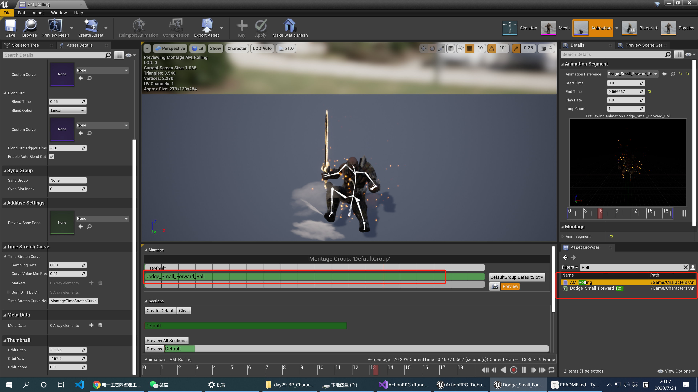

而实际上他使用了带位移的根骨骼动画：

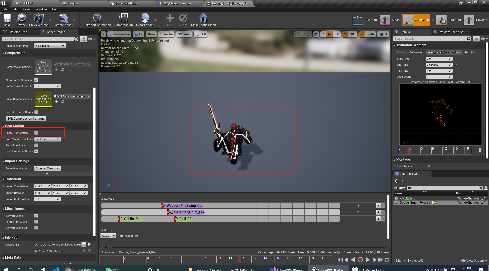

而在动画蓝图中做了这样的配置：

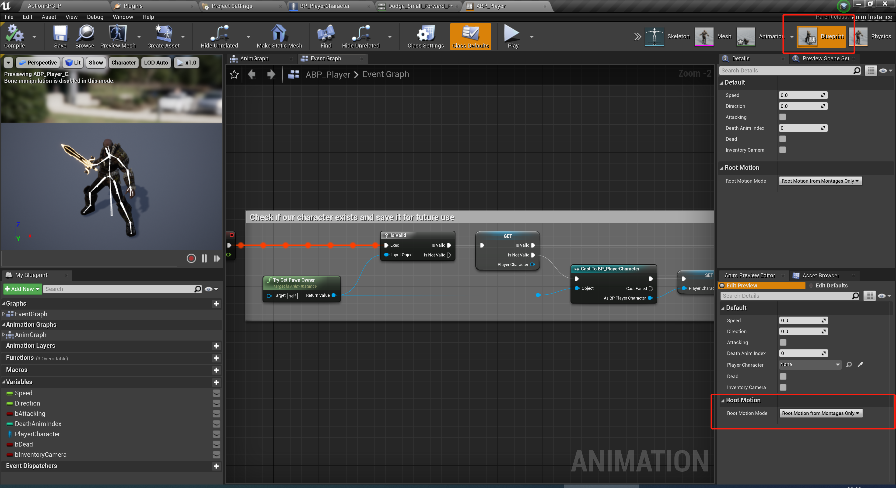

### 2.6 InputActioen ChangeWeapon

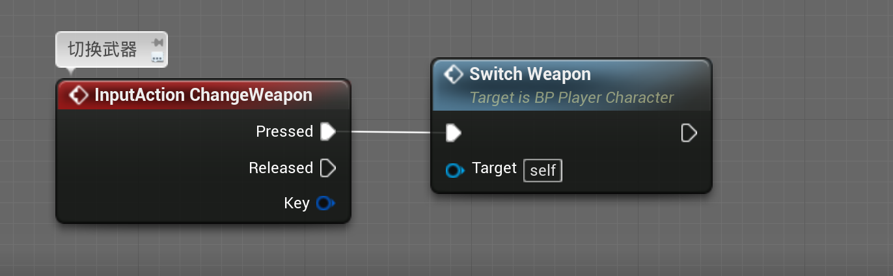

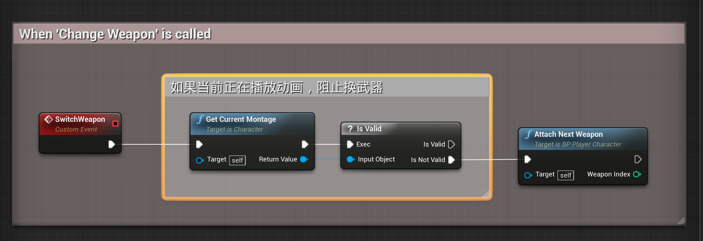

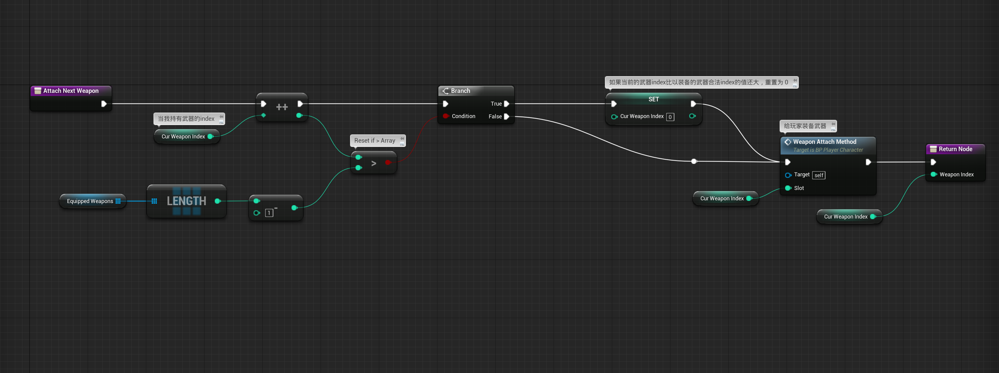