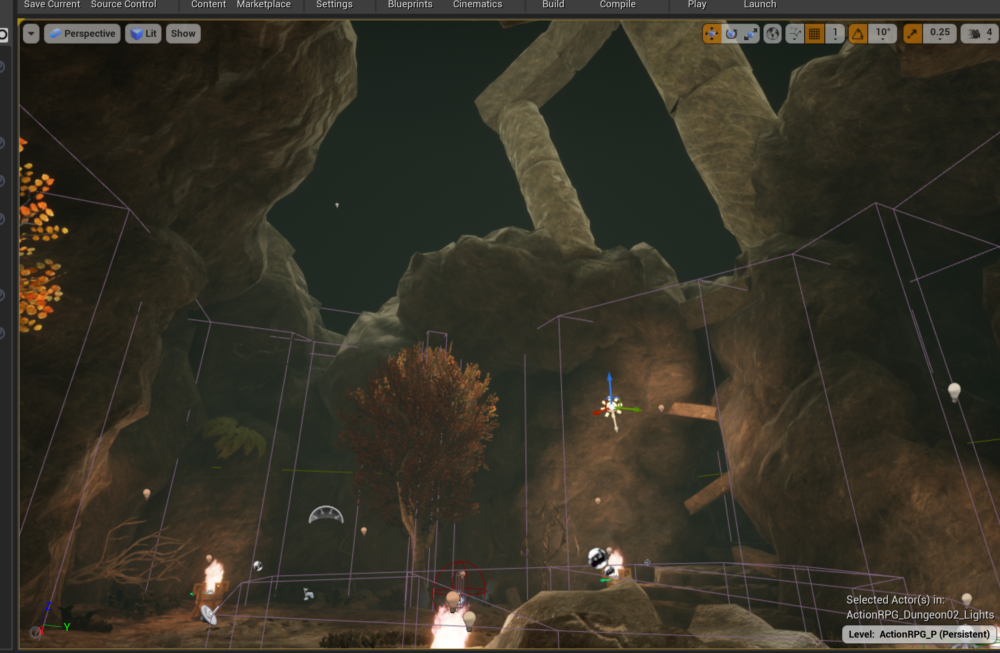

# 聊聊场景光照

在这个场景中，全部是静态光源，而角色和小怪的影子则依靠自带的黑色光圈。

## 1 篝火灯光

### 1.1 正常打光的效果

### 1.2 删除灯光后的效果

发现删除关照后，篝火就没有之前那么亮了，显得不是那么真实。

## 2 岩壁上的光斑

### 2.1 原本的光斑

### 2.1 删除之后就变得乌漆嘛黑的

### 2.3 其它的一些小案例

熠熠生辉的石柱

发光的岩壁：

上下交互打光：

## 3 灯管型打光

### 3.1 原生的样子

可以看到水面有一条非常清晰的反射

### 3.2 删除之后

在删除之后，就没有了

## 4 体积雾产生的朦胧感

删除之后就没有感觉了：

## 5 平行光

没有主光源之后，整个场景就暗了很多，只有辅助光源点缀：

## 6 反射球

利用反射球来实现倒影：

拿掉之后也就没有倒影了：

## 7 地形材质

可以看到这里有岩石、水、和泥土三种材质来来创建场景中所需要的地形材质

