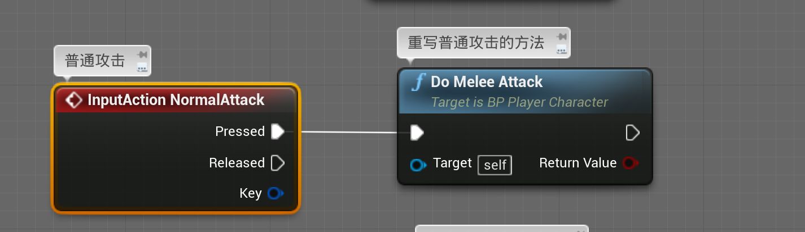
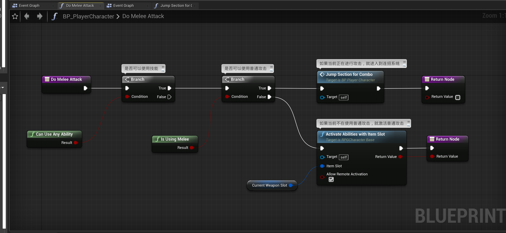
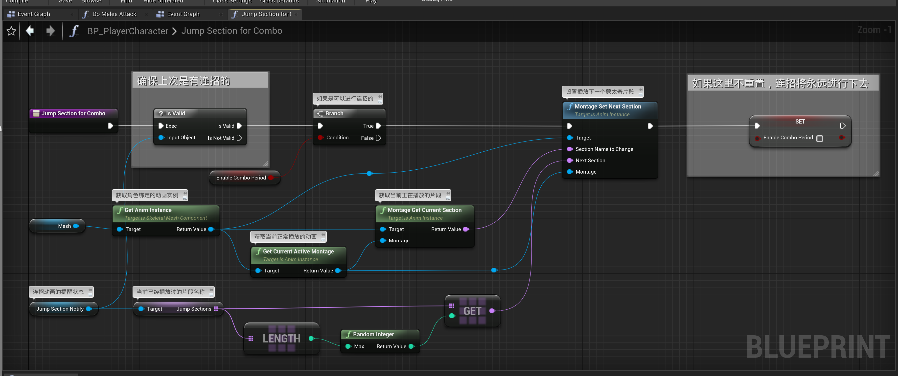
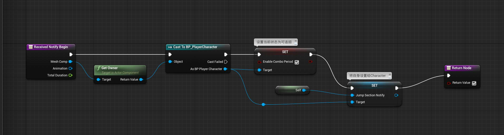
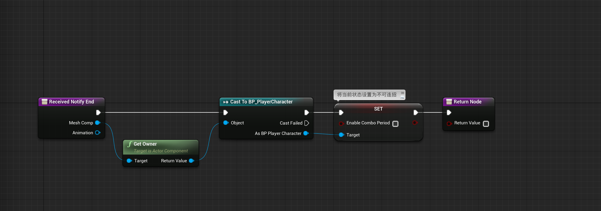
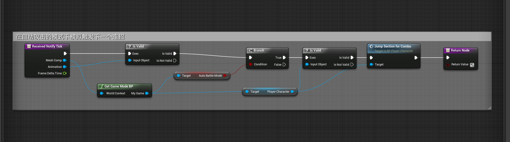
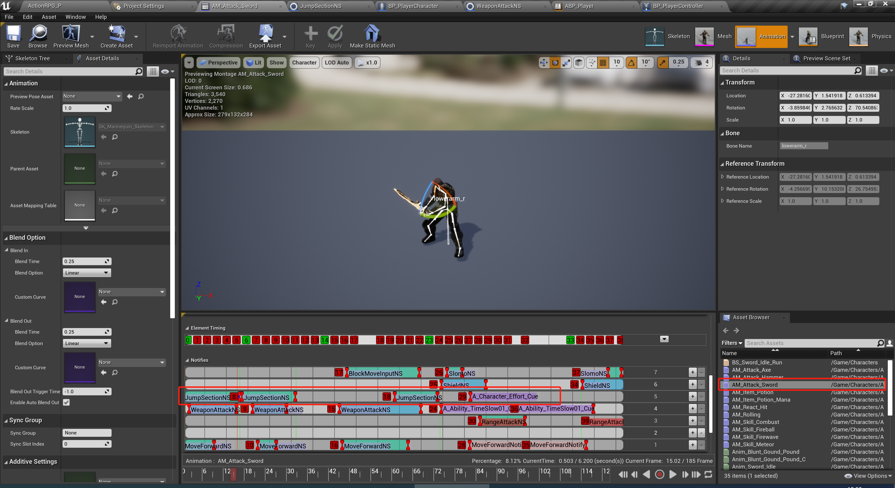

# 连招系统初探

在使用普通攻击的时候，会进行连招的判断

## 1 Do Melee Attack

## 2 Jump Section For Combo

## 3 Jump Section NS

### 3.1 Notify Begin

### 3.2 Notify End

### 3.3 Tick

在蒙太奇动画中，每一个连招动作，使用 Jump Section NS

