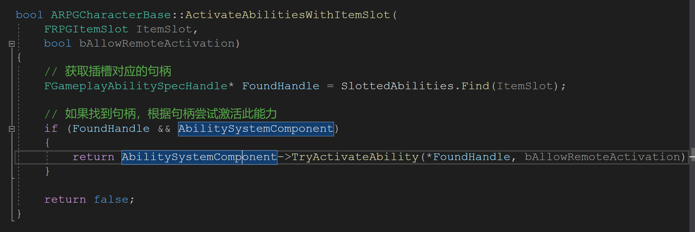
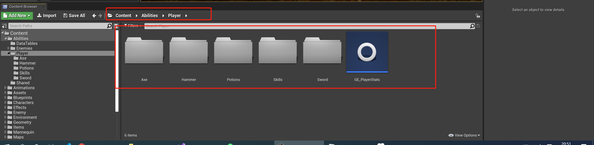
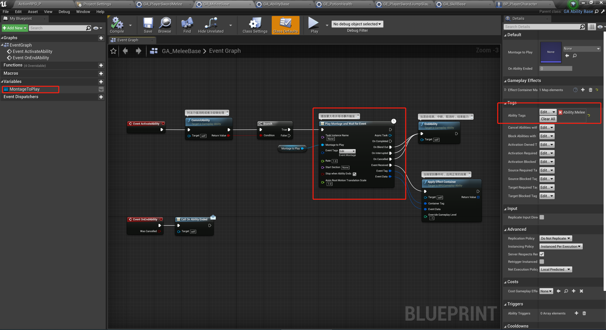

# 普通攻击技能Active(激活)

昨天我们初步探索了普通攻击的连招系统，发现第一个普通攻击时会调用`ActivateAbilitiesWithItemSlot`:

那么到底激活的是哪个技能呢？

C++ 代码似乎没有给出我们答案，于是我在蓝图中找了找，发现如下的东西：

这似乎是技能系统，有斧头（Axe）,锤子(Hammer),剑(Sword)等，难道这就算具体的技能？

随便点开一个，我们发现他们的`GamePlayerTag`竟然是`Ability.Melee`,更加坚定了我们的信念，而且还实现了`EventActivateAbility`的事件。我们再去`GA_Melee_Base`中看看。

这里果然有播放蒙太奇动画，而且还要对应的处理机制，看来在C++调用`ActivateAbilitiesWithItemSlot`最终会执行到这里，而且进行断点追踪也验证了我们猜测。

那么今天就到这里，明天我们来研究`GA_Ability_Base`和更底层的C++代码